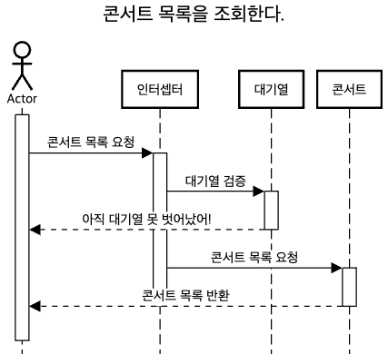
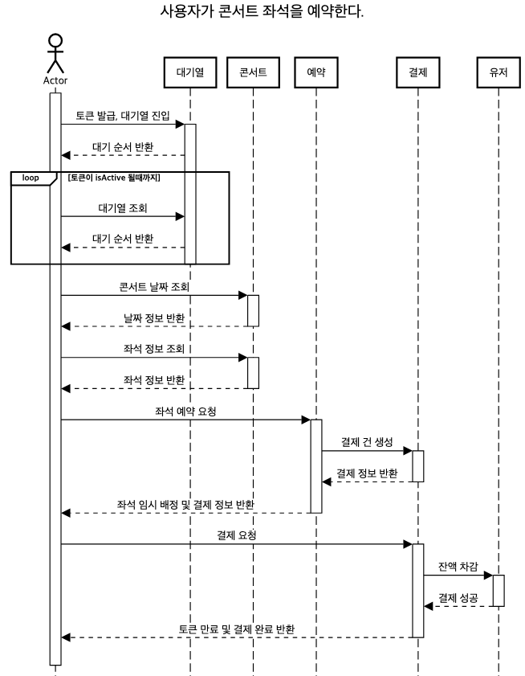
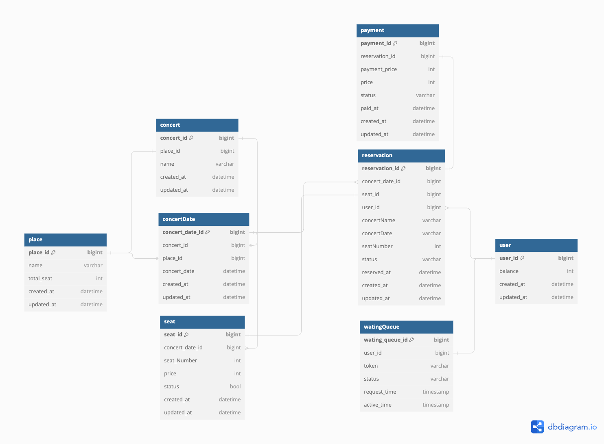
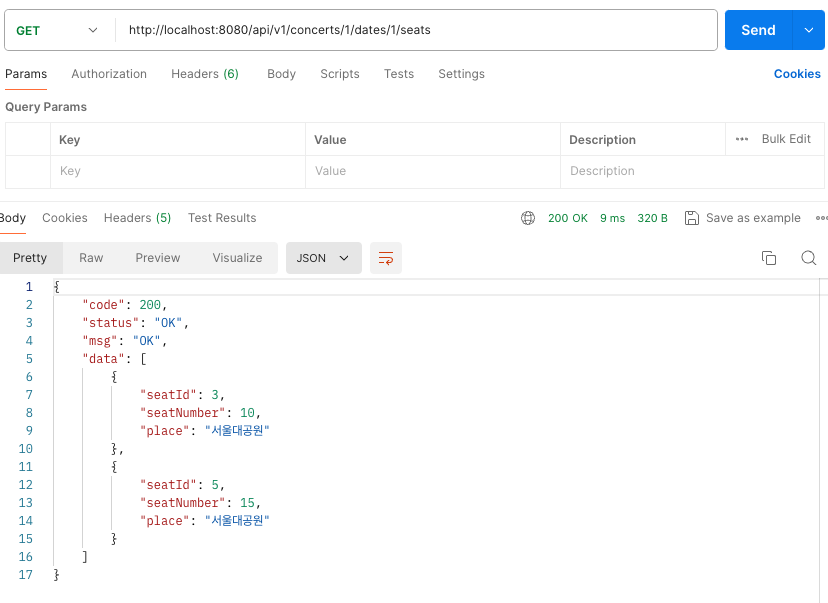
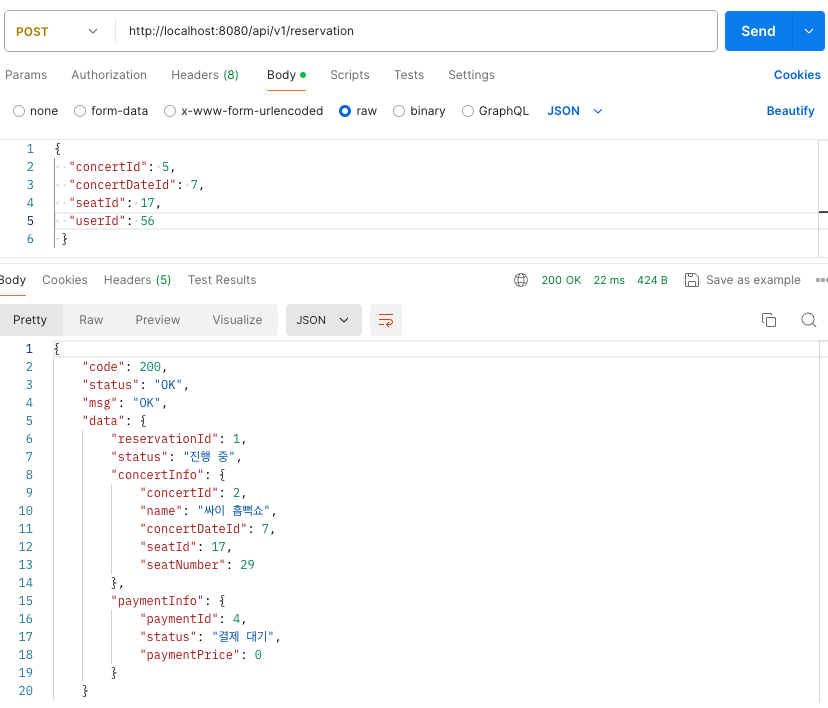
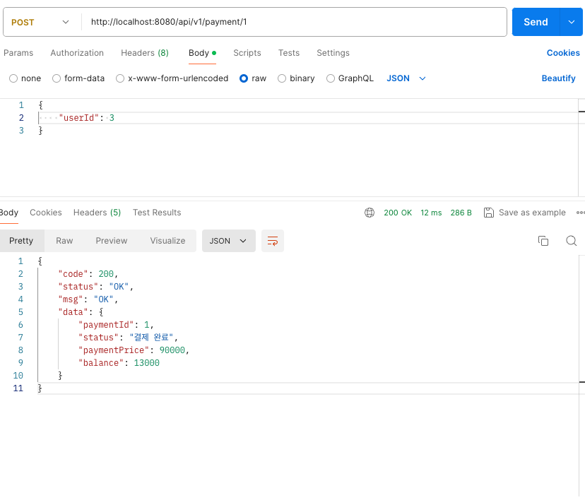
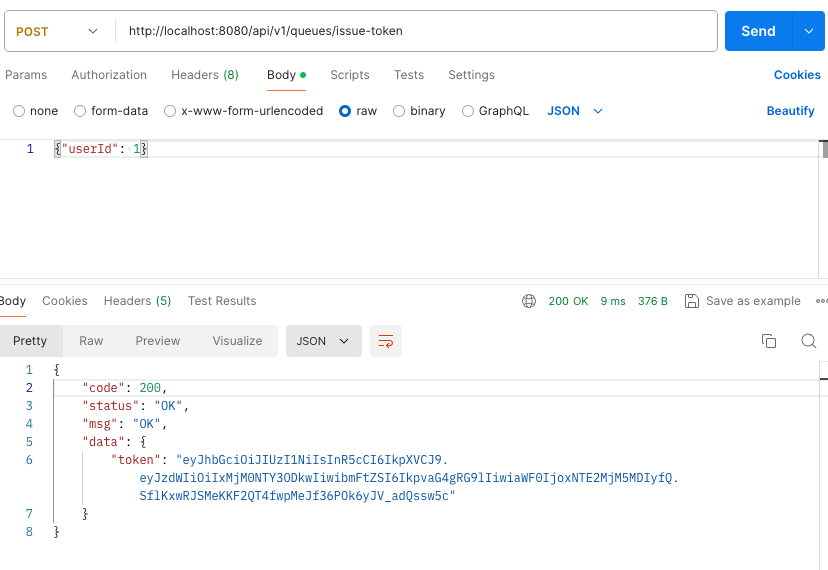
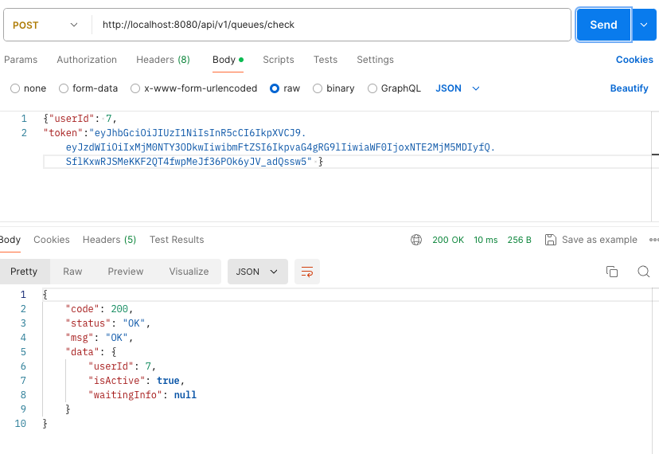
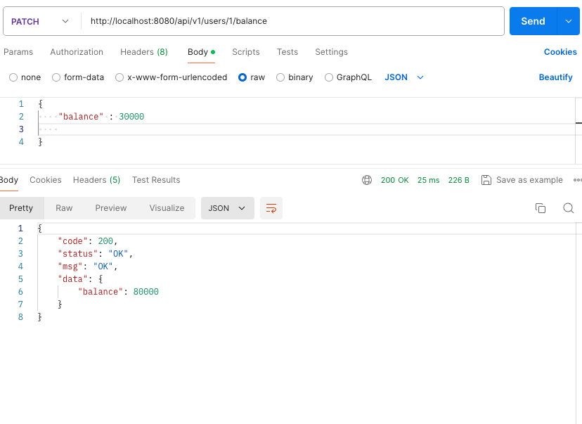
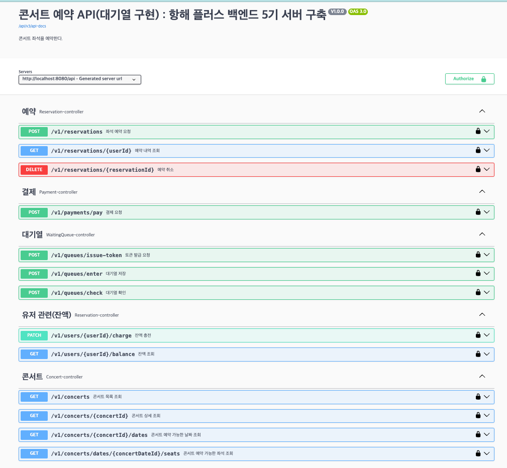

# [항해 플러스 백엔드 3주차] 서버 구축
### *시나리오 - 콘서트 예약 서비스*

### 목차

- [1. 요구사항 분석](##one)

---
<h2 id="one">1. 요구사항 분석</h2>

### Milestone & 요구사항 명세서 & API 명세서
[Google docs sheet ](https://docs.google.com/spreadsheets/d/1ARL1ZxmE_i0E6gUUF7H9PmBAEcioJcwOfM0VhmNDJx4/edit?gid=1675988926#gid=1675988926)

### 시퀀스 다이어그램
- ### 콘서트 목록 조회

- ### 포인트 충전

- ### 콘서트 좌석 예약 

### DB ERD

### Dummy Data - Postman
- **좌석 조회**

- **좌석 예약**

- **결제**

- **토큰 발급**

- **대기열 조회**

- **충전**

---
## Swagger

---
## Lock 비교
[Lock 비교 글](https://feel2.tistory.com/100)

## 회고

---
## 기술 스택
- Spring boot
- Jpa
- Mysql
