# [항해 플러스 백엔드 3주차] 서버 구축
### *시나리오 - 콘서트 예약 서비스*

## 📖 목차

1. [프로젝트 개요](#1-프로젝트-개요)
2. [프로젝트 동기](#2-프로젝트-동기)
3. [기술 스택](#3-기술-스택)
4. [주요 기능](#4-주요-기능)
5. [요구사항 분석](#5-요구사항-분석)
6. [개발 중 고민과 해결](#6-개발-중-고민과-해결)
7. [트러블 슈팅](#7-트러블-슈팅)

---

## 1. 프로젝트 개요
 

- **프로젝트명**: 콘서트 예약 서비스
- **기간**: 2024.07 ~ 08
- **목적**: 대용량 트레픽에 대비하여 콘서트 예약 서비스 개발

---
## 2. 프로젝트 동기
 

콘서트 예약 서비스를 바탕으로, 2,000 TPS의 대규모 트래픽을 처리할 수 있는 서버를 설계해보는 프로젝트입니다.

---
## 3. 기술 스택
 

### **Backend**

- **Language**: Java 17
- **Framework**: Spring Boot 3.4.1
- **Database**: MySQL 8.xx, Redis
- **ORM**: Spring Data JPA + QueryDSL
- **Authentication**: OAuth2 + JWT

### **Infra & DevOps**

- **CI/CD**: GitHub Actions + Docker + BeanStalk
- **Middleware:** AWS ElastiCache, AWS RDS(8.xx)
---

## 4. 주요 기능
 

| 기능 | 설명 |
|------|------|
| 유저 토큰 발급 | 사용자 인증을 위한 토큰 발급 |
| 예약 가능 조회 | 예약 가능한 날짜 및 좌석 목록 조회 |
| 좌석 예약 요청 | 좌석 예약 요청 처리 및 동시성 제어, 대기열 처리 |
| 잔액 충전/조회 | 유저의 잔액 충전 및 현재 잔액 확인 |
| 결제 처리 | 예약 확정 시 잔액 차감 및 결제 트랜잭션 처리 |

---

## 5. 요구사항 분석

### 5-1. Milestone & 요구사항 명세서 & API 명세서
[Google docs sheet ](https://docs.google.com/spreadsheets/d/1ARL1ZxmE_i0E6gUUF7H9PmBAEcioJcwOfM0VhmNDJx4/edit?gid=1675988926#gid=1675988926)

### 5-2. 시퀀스 다이어그램

- ### 콘서트 목록 조회
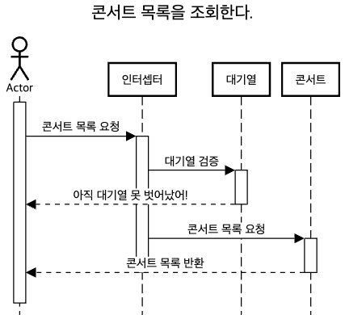
- ### 포인트 충전
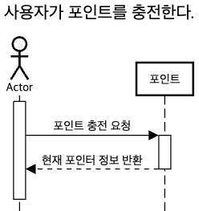
- ### 콘서트 좌석 예약 
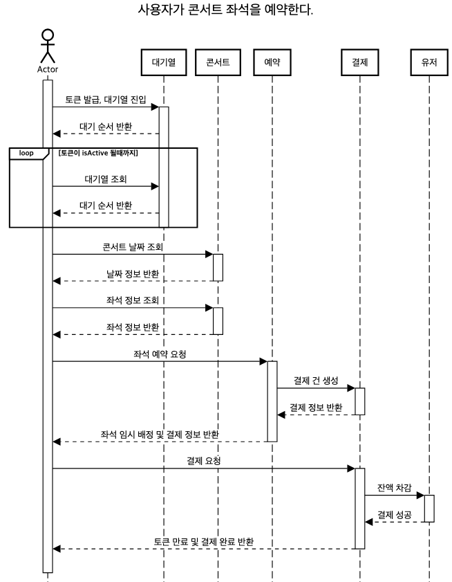

### 5-3. DB ERD
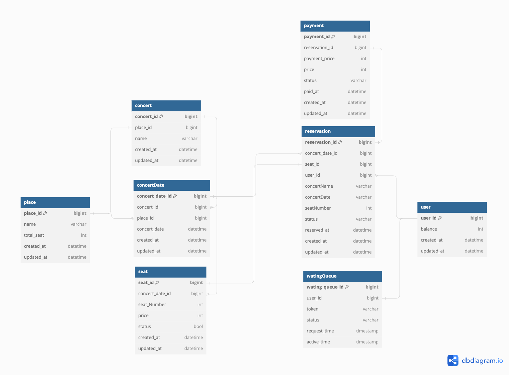

### 5-4. Dummy Data - Postman
- **좌석 조회**
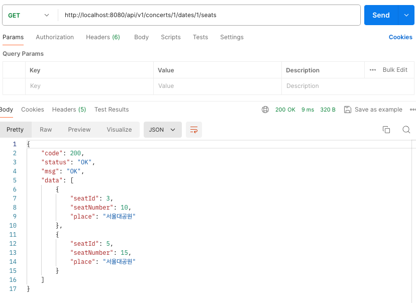
- **좌석 예약**
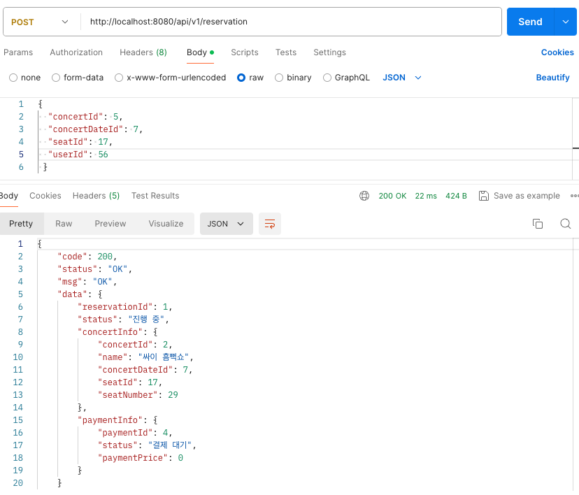
- **결제**
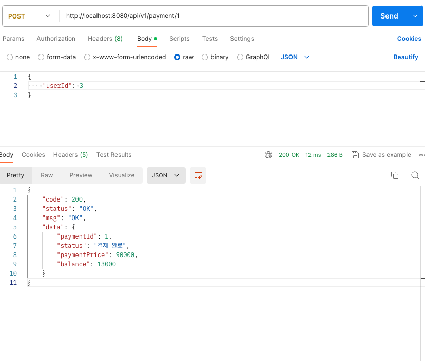
- **토큰 발급**
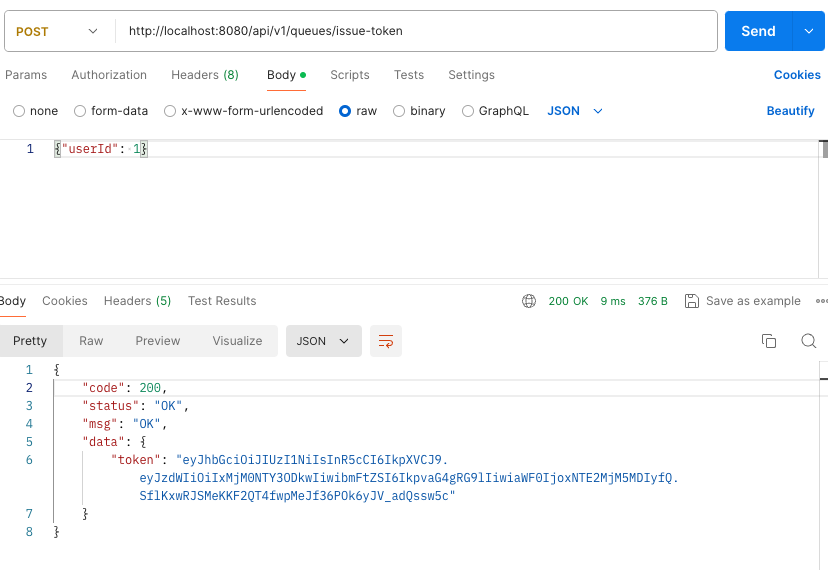
- **대기열 조회**
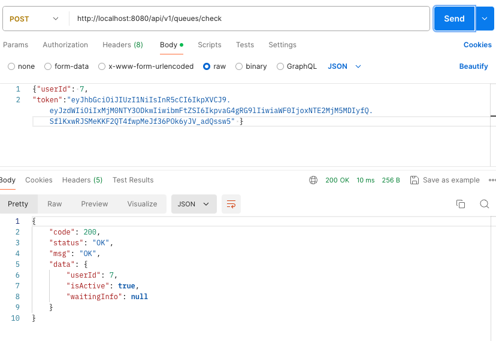
- **충전**
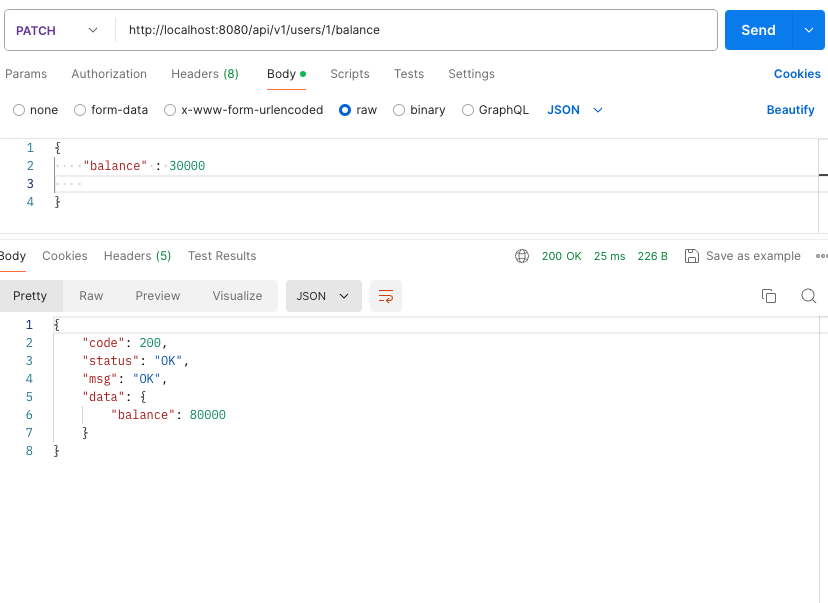
---
### 5-5. Swagger
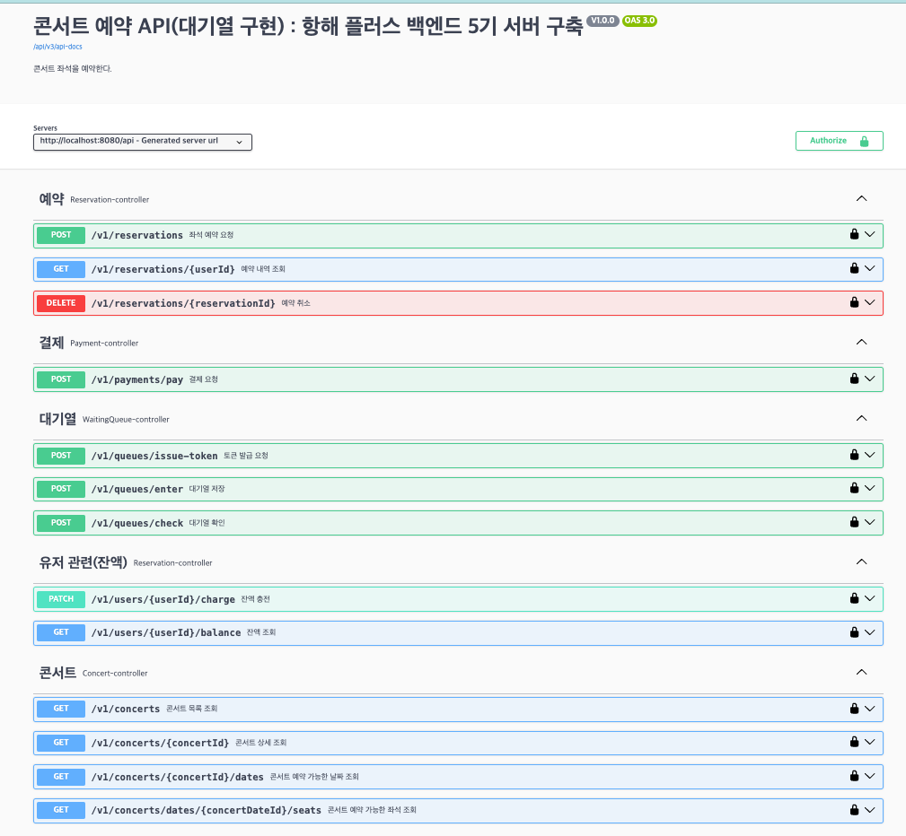

---

## 6. 개발 중 고민과 해결
 

### 6-1. Lock 비교
[Lock 비교 글](https://feel2.tistory.com/100)

### 6-2. 캐시
캐시 관련된 내용은 [여기](docs/cache.md) 확인해 주세요.

### 6-3. Redis를 통한 성능 개선

Redis를 통한 성능 개선 내용은 [여기](docs/redis.md) 확인해 주세요.

### 6-4. 대기열 구현

대기열 구현 내용은 [여기](docs/waiting.md) 확인해 주세요.

### 6-5. 장애 대응 문서

장애 대응에 대한 내용은 [여기](docs/failure.md) 확인해 주세요.

---

## 7. 트러블 슈팅
 

### 7-1. Query 분석 및 DB Index 설계

Query 분석 및 DB Index 설계 내용은 [여기](docs/query.md) 확인해 주세요.

### 7-2. 트랜잭션의 범위 및 내부 로직 융합에 따른 문제점 파악

트랜잭션의 범위 및 내부 로직 융합에 따른 문제점 파악에 대한 내용은 [여기](docs/transaction.md) 확인해 주세요.

### 7-3. MSA 형태로 서비스 분리 설계

MSA 형태로 서비스 분리 설계에 대한 내용은 [여기](docs/msa.md) 확인해 주세요.

### 7-4. 부하 테스트

부하 테스트에 대한 내용은 [여기](docs/load.md) 확인해 주세요.

