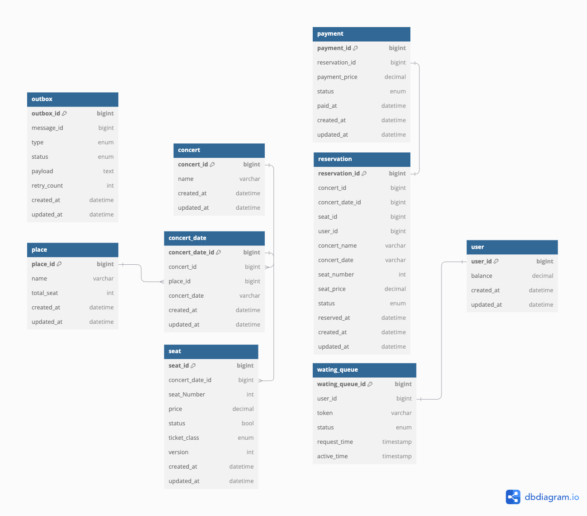

# [항해 플러스 백엔드 3주차] 서버 구축
### *시나리오 - 콘서트 예약 서비스*


### 목차

- [1. 요구사항 분석](##one)


---
<h2 id="one">1. 요구사항 분석</h2>

### Milestone & 요구사항 명세서 & API 명세서
[Google docs sheet ](https://docs.google.com/spreadsheets/d/1ARL1ZxmE_i0E6gUUF7H9PmBAEcioJcwOfM0VhmNDJx4/edit?gid=1675988926#gid=1675988926)

### 시퀀스 다이어그램
- ### 콘서트 목록 조회

- ### 포인트 충전

- ### 콘서트 좌석 예약 


### DB ERD


### Dummy Data - Postman
- **좌석 조회**

- **좌석 예약**

- **결제**

- **토큰 발급**

- **대기열 조회**

- **충전**

---
## Swagger

---
## Lock 비교
[Lock 비교 글](https://feel2.tistory.com/100)

---

## 캐시

### 캐시란?

캐시는 **자주 액세스하거나** **계산 비용이 많이 드는 데이터**를 일시적으로 저장하는 데 사용된다. 데이터에 액세스하는 데 걸리는 시간을 줄이고, 느린 리소스나 시스템의 로드를 줄여 **성능을 향상**시키는 데 도움이 된다.

그럼 캐시를 사용하기 위한 적절한 데이터의 판단 기준은 무엇일까?

- 데이터가 변경에 민감한지?
- 데이터의 연산에 드는 비용이 비싼지?
- 데이터의 변경이 전파가 되는지?

→ 요약하자면, “**잘 바뀌지 않으면서 접근할 일이 많은 데이터**, 변경되더라도 다른 서비스에 큰 영향을 미치지 않는 데이터” 가 캐시에 저장하여 활용하기 적절하다.

그럼 DB에서 계산 비용이 많이 드는(쿼리를 날렸을 때 시간이 오래 걸리는) 경우는 어떤 경우들이 있을까?

- **조인이 복잡할 경우**
  - 복잡한 조인 조건이 있는 여러 테이블과 관련된 쿼리, 특히 테이블에 컬럼이 많은 경우 상당한 시간이 오래 걸릴 수 있다.
- **적절한 인덱싱이 없는 경우**
  - 기본적으로 pk에 인덱싱이 걸려 있지만, 여러 테이블에 조인이 발생할 경우 적절한 인덱스가 안걸려 있다면 시간이 오래 걸릴 수 있다.
- **한번에 대량의 데이터를 가져오는 경우**
  - 가져오는 데이터가 수백만 데이터의 경우, 시간이 오래 걸릴 수 있다.

지금 나의 시나리오(콘서트 대기열)에서 조회가 오래 걸리는 부분은 어디서 발생할 수 있을까?

CASE1) **콘서트 정보 조회**
실제 콘서트 예약 페이지를 들어가서 확인해봤지만, 한번에 가져오는 콘서트 정보는 기껏해야 최대 50개 정도 밖에 안되는 것 같다. 다만 콘서트 예약을 위해서 자주 조회되며, **실시간으로 데이터 변동이 거의 없을 것 같다.**

CASE2) **예약 가능한 좌석 정보 조회**

이 경우에는 의미가 그래도 있을 것 같다. 올림픽 경기장만 해도 좌석이 5만건이 넘으니, 한번에 조회를 하려면 5만건 이상의 데이터를 한번에 조회를 해야한다. 다만, 실시간으로 좌석 정보가 변경이 되므로, 아까 처음에 얘기했던 ‘**잘 바뀌지 않으면서’** 라는 조건에는 해당하지는 않는다.

무엇보다 좌석 점유 상태의 경우 **중요한 정보**이다. 캐시의 경우 휘발성이기 때문에 날아가도 중요하지 않은 정보를 활용해야 한다.(ex) 인스타그램 좋아요 기능) 좌석 점유의 경우, 데이터의 정합성이 안 맞을  경우 여러 테이블에 영향이 가기 때문에(ex) 예약 테이블) 조심해야 한다.

그래서 나는 **콘서트 정보 조회**에 캐시를 한번 적용해 보기로 했다.

### Local Cache + Gloal Cache

먼저 `application level` 적용해 볼 수 있는 Local Cache를 알아보자. 스프링 진영에서는 크게 **Ehcache** 와 **Caffeine cache** 를 Local cache 로 활용할 수 있다.

두 캐시의 차이는

[https://medium.com/naverfinancial/니들이-caffeine-맛을-알아-f02f868a6192](https://medium.com/naverfinancial/%EB%8B%88%EB%93%A4%EC%9D%B4-caffeine-%EB%A7%9B%EC%9D%84-%EC%95%8C%EC%95%84-f02f868a6192)

여길 참조해보면 좋을 것 같다. 대략적으로 차이점을 살펴보자면

- Ehcache 가 Caffeine에 비해 제공되는 기능이 더 많다. (multi-level cache, distributed cache, cahce listener …)
- 단순 메모리 캐시 사용하고 높은 퍼포먼스를 원하면 Caffeine이 좋다. (Ehcache에 비해 제거 알고리즘이 우월함)
  - Window TinyLfu eviciton policy로 near-optimal hit rate
  - Caffeine이 ehcache에 비해 writing 퍼포먼스가 좋다고 함
- Eviction strategy
  - Caffeine (size-based, time-based, reference-based)
  - Ehcache (LRU, LFU, FIFO) — 메모리 관련만 가능
- ehcache는 메모리 + 디스크 용량까지 사용 가능
  - caffeine 도 post-eviction strategy로 커스텀 하게 구출할 수 있음
  - 최근 삭제 캐시를 잡아서 로드 시점에 다시 살리도록 가능(DB가 죽는것 같은 경우)

단순 캐시 용도의 경우, Caffeine 을 쓰는것이 성능적으로 우수하다고 하니, 한번 Caffeine 을 이용하여 캐시 기능을 써보자.

거기에 더해서 캐시도 계층형으로 구성이 가능하다는 것을 깨달았다. 따라서 Redis 활용하여 Global Cache까지 같이 적용해 볼 것이다.

클라이언트가 콘서트 목록을 조회하면

처음에는 L1 과 L2 모두 캐시가 없기 때문에 DB에서 데이터를 가져온 후, L1과 L2 에 캐시를 할 것이다.

그 다음 요청부터는 L1 캐시부터 hit 하여 정보를 가져오고, L1이 만료되면 L2를 hit하여 데이터를 가져올 것이다.

설정 정보와 적용 정보는 다음과 같다.

- CacheConfig

```java
@Configuration
public class CacheConfig {

    @Bean
    public List<CaffeineCache> caffeineCaches() {
        return Arrays.stream(CacheType.values())
                .map(cache -> new CaffeineCache(cache.getCacheName(), Caffeine.newBuilder().recordStats()
                        .expireAfterWrite(cache.getExpiredAfterWrite(), TimeUnit.SECONDS)
                        .maximumSize(cache.getMaximumSize())
                        .build()))
                .toList();
    }

    @Primary
    @Bean(name = "l1LocalCacheManager")
    public CacheManager caffeineCacheManager(List<CaffeineCache> caffeineCaches) {
        SimpleCacheManager cacheManager = new SimpleCacheManager();
        cacheManager.setCaches(caffeineCaches);
        return cacheManager;
    }

    @Bean(name = "l2RedisCacheManager")
    public RedisCacheManager redisCacheManager(RedisConnectionFactory redisConnectionFactory) {
        ObjectMapper objectMapper = new ObjectMapper();
        objectMapper.activateDefaultTyping(
                BasicPolymorphicTypeValidator.builder().allowIfBaseType(Object.class).build(),
                ObjectMapper.DefaultTyping.EVERYTHING,
                JsonTypeInfo.As.PROPERTY
        );

        RedisSerializationContext.SerializationPair<Object> serializer = RedisSerializationContext.SerializationPair
                .fromSerializer(new GenericJackson2JsonRedisSerializer(objectMapper));

        RedisCacheConfiguration cacheConfig = RedisCacheConfiguration.defaultCacheConfig()
                .serializeKeysWith(RedisSerializationContext.SerializationPair.fromSerializer(new StringRedisSerializer()))
                .serializeValuesWith(serializer)
                .entryTtl(Duration.ofSeconds(120)); // expiration time (sec)

        return RedisCacheManager.builder(redisConnectionFactory)
                .cacheDefaults(cacheConfig)
                .build();
    }

    @Bean
    public RedisTemplate<String, Object> redisTemplate(RedisConnectionFactory redisConnectionFactory) {
        RedisTemplate<String, Object> template = new RedisTemplate<>();
        template.setConnectionFactory(redisConnectionFactory);
        template.setKeySerializer(new StringRedisSerializer());
        template.setValueSerializer(new GenericJackson2JsonRedisSerializer());
        return template;
    }

    @Getter
    @RequiredArgsConstructor
    public enum CacheType {
        CONCERTS_PROFILE("concerts", 60, 10000); // Cache name, expiration time (sec), maximum entry size

        private final String cacheName;
        private final int expiredAfterWrite;
        private final int maximumSize;
    }
}

```


L1 의 TTL을 더 짧게 잡았기 때문에 L1이 먼저 캐시가 사라지고, L2가 다음으로 캐시 정보가 사라질 것이다. L1 캐시가 L2 캐시보다 성능이 더 좋기 때문에 이렇게 설정하였다.

- ConcertService

```java
@Service
@RequiredArgsConstructor
public class ConcertService {

		...
		
    /**
     * 콘서트 정보를 요청하면 콘서트 정보를 반환한다.
     *
     * @return 콘서트 정보를 반환한다.
     */
    @Caching(cacheable = {
            @Cacheable(cacheManager = "l1LocalCacheManager", cacheNames = "concerts", value = "concerts"),
            @Cacheable(cacheManager = "l2RedisCacheManager", cacheNames = "concerts", value = "concerts")
    })
    @Transactional(readOnly = true)
    public List<Concert> getConcerts() {
        List<Concert> concerts = concertRepository.getConcerts();

        return concerts.stream()
                .map(concert -> {
                    List<ConcertDate> concertDates = concertRepository.getConcertDates(concert.getConcertId());
                    return Concert.builder()
                            .concertId(concert.getConcertId())
                            .name(concert.getName())
                            .concertDates(concertDates)
                            .build();
                }).toList();
    }
    
    ...

```

실제로 처음에는 쿼리가 나가지만, 다음부터는 쿼리  없이 데이터를 조회하는 걸 볼 수 있다.

- 처음 캐시가 없을 경우

```java
2024-08-02 05:41:49.730 [http-nio-8080-exec-2]  INFO com.hhplus.hhplusconcert.support.aop.TraceLogAspect - [TRACE_LOG] Incoming request: [GET /api/v1/concerts] from [0:0:0:0:0:0:0:1]
Hibernate: 
    select
        ce1_0.concert_id,
        ce1_0.created_at,
        ce1_0.name,
        ce1_0.updated_at 
    from
        concert ce1_0
Hibernate: 
    select
        cde1_0.concert_date_id,
        cde1_0.concert_date,
        cde1_0.concert_id,
        ci1_0.concert_id,
        ci1_0.created_at,
        ci1_0.name,
        ci1_0.updated_at,
        cde1_0.created_at,
        cde1_0.place_id,
        pi1_0.place_id,
        pi1_0.created_at,
        pi1_0.name,
        pi1_0.total_seat,
        pi1_0.updated_at,
        cde1_0.updated_at 
    from
        concert_date cde1_0 
    join
        concert ci1_0 
            on ci1_0.concert_id=cde1_0.concert_id 
    join
        place pi1_0 
            on pi1_0.place_id=cde1_0.place_id 
    where
        cde1_0.concert_id=? 
        and cde1_0.concert_date>?
[TRACE_LOG] Outgoing response: [GET /api/v1/concerts] took [71] ms
```

- 캐시가 적용되면

```java
024-08-02 05:41:51.897 [http-nio-8080-exec-4]  INFO com.hhplus.hhplusconcert.support.aop.TraceLogAspect - [TRACE_LOG] Incoming request: [GET /api/v1/concerts] from [0:0:0:0:0:0:0:1]
[TRACE_LOG] Outgoing response: [GET /api/v1/concerts] took [1] ms
```

속도도  **71 ms → 1ms** 로 줄어든 것을 볼 수 있다.

실제로 redis에 접속하면 데이터가 value로 저장되있는걸 볼 수 있다.

간단하게 test 를 해보면 속도가 더 빠른 걸 볼 수 있다.

- 캐싱테스트

```java
		@Test
    @DisplayName("캐싱된 데이터를 가져오는게 더 속도가 빠르다.")
    void GetConcertsWithCache() {
        // given
        long startTimeWithoutCache = System.nanoTime();
        concertService.getConcerts();
        long endTimeWithoutCache = System.nanoTime();
        long durationWithoutCache = endTimeWithoutCache - startTimeWithoutCache;

        // when
        long startTimeWithCache = System.nanoTime();
        concertService.getConcerts();
        long endTimeWithCache = System.nanoTime();
        long durationWithCache = endTimeWithCache - startTimeWithCache;

        // then
        assertThat(durationWithCache).isLessThan(durationWithoutCache);
    }
```
---

## Redis를 통한 성능 개선

캐시 기능 말고 ‘**Redis 를 이용한 로직 이관을 통해 성능 개선할 수 있는 로직’** 할만한 게 있을까?

그중에 하나 생각해볼만한 것이 예약 후, 5분이 지나도록 결제를 안하면 좌석 점유가 해지되야 하는 부분이 생각이 났다.

지금은 스케줄러를 통해 5초마다 좌석을 점유한지 5분이 지났는지 확인 후, 좌석 점유를 해지하고 있다.이게 과연 맞는 로직일까? 정확히 좌석을 점유한지 5분이 됐을 때 좌석 점유를 해지할 수는 없을까?

- 기존 로직

```java
@Component
@RequiredArgsConstructor
@Slf4j
public class SeatScheduler { //좌석 관련 스케줄러

    private final ReservationFacade reservationFacade;

    /**
     * 5초마다 좌석 점유 여부 확인 후 점유 해제 하는 스케줄링 실행
     */
    @Scheduled(fixedRate = 5000)
    public void checkOccupiedSeat() {
        reservationFacade.checkOccupiedSeat();
    }
}
```

```java
@Component
@RequiredArgsConstructor
public class ReservationFacade {

    private final ConcertService concertService;
    private final PaymentService paymentService;
    private final UserService userService;

    ...
		
    /**
     * 좌석을 계속 점유할 수 있는지 확인하는 유즈케이스를 실행한다.
     */
    public void checkOccupiedSeat() {
        concertService.checkOccupiedSeat();
    }
}
```

```java
    
@Service
@RequiredArgsConstructor
public class ConcertService {
	
	...
	
    @Transactional
    public void cancelOccupiedSeat() {  
      // 임시 예약인 모든 예약 조회
      List<ConcertReservationInfo> allTempReservation = concertRepository.getAllTempReservation();

      allTempReservation.forEach(reservation -> {
          LocalDateTime createdAtTime = reservation.getCreatedAt();
          Duration duration = Duration.between(createdAtTime, LocalDateTime.now());

          if (duration.toSeconds() > 5 * 60) { //정해진 시간을 넘었는지 (default:5분)
              // 1. 예약 취소
              reservation.cancel();
              concertRepository.saveReservation(reservation);
              // 2. 좌석 점유 취소(다시 예약 가능 상태로 변경)
              Optional<Seat> seat = concertRepository.getSeat(reservation.getSeatId());
              Seat seatInfo = concertValidator.checkExistSeat(seat, "좌석 정보가 존재하지 않습니다");
              seatInfo.cancel();
              concertRepository.saveSeat(seatInfo);
          }
      });
    }
}
```

기존에는 스케줄러를 통해 5초 마다 예약 상태가 `*TEMPORARY_RESERVED`*  인 모든 예약을 조회하여 예약을 취소하고, 좌석 점유를 해지하였다.

이 방식에는 여러 문제가 있다.

- 5초 마다 스케줄러 실행
    - 만약 4분 59초에 스케줄러가 확인을 한다면, 다음 스케줄러가 돌 동안 이 좌석은 점유가 불가능하게 된다.
- 모든 임시 예약 조회
    - 만약 예약건의 데이터가 많다면 5초 마다 대량의 조회 쿼리가 발생한다….(임시 예약이 한건도 없더라도…)

이런 문제를 해결하기 위해 이것저것 찾아보다 Redisson Queue 중에 `RDelayedQueue`  와 `RBlockingQueue`  를 활용하면 이 문제를 해결할 수 있을 것 처럼 보였다.

먼저 `RDelayedQueue` 에 `destinationQueue` 를 설정해준다. 내가 설정해준 만큼의 시간이 지나면 `destinationQueue` 로 데이터를 넣어준다.

구현 코드는 다음과 같다.

```java
@Service
@RequiredArgsConstructor
public class ConcertService {
    
    private final ConcertRepository concertRepository;
    private final ConcertValidator concertValidator;
    private RBlockingQueue<ConcertReservationInfo> tempReservationQueue;
    private RDelayedQueue<ConcertReservationInfo> delayedReservationQueue;
    private final RedissonClient redissonClient;

    @PostConstruct
    public void init() {
        cancelOccupiedSeatListener();

        tempReservationQueue = redissonClient.getBlockingQueue("tempReservationQueue");
        delayedReservationQueue = redissonClient.getDelayedQueue(tempReservationQueue);
    }
    
     /**
     * 좌석 예약을 요청하면 예약 완료 정보를 반환한다.
     *
     * @param command concertId, concertDateId, seatNumber, userId 정보
     * @return 예약 완료 정보를 반환한다.
     */
    @Transactional
    public ConcertReservationInfo reserveSeat(ReservationCommand.Create command) {
	      
	      ...
	      
        // 4. 예약 테이블 저장
        ConcertReservationInfo reservationInfo = command.toReservationDomain(seat, concertDate);
        ConcertReservationInfo savedReservation = concertValidator.checkSavedReservation(concertRepository.saveReservation(reservationInfo), "예약에 실패하였습니다");
        
        // 5. 예약에 성공하면 delayedReservationQueue 에 임시 저장
        delayedReservationQueue.offer(savedReservation, 1, TimeUnit.MINUTES);

        return savedReservation;
    }
    
    ...
    
	  /**
     * 좌석을 계속 점유할 수 있는지 확인한다.
     */
    @Transactional
    public void checkOccupiedSeat(Long reservationId) {
        Optional<ConcertReservationInfo> reservation = concertRepository.getReservation(reservationId);
        //
        if ((reservation.isPresent() && reservation.get().getStatus().equals(TEMPORARY_RESERVED))) {
            // 예약 상태 취소로 변경
            reservation.get().cancel();
            concertRepository.saveReservation(reservation.get());
            // 좌석 점유 취소(다시 예약 가능 상태로 변경)
            Optional<Seat> seat = concertRepository.getSeat(reservation.get().getSeatId());
            Seat seatInfo = concertValidator.checkExistSeat(seat, "좌석 정보가 존재하지 않습니다");
            seatInfo.cancel();

            concertRepository.saveSeat(seatInfo);
        }
    }

  private void cancelOccupiedSeatListener() {
    new Thread(() -> {
      while (!Thread.currentThread().isInterrupted()) {
        try {
          // 내가 설정한 시간이 지나서 요소를 사용할 수 있을 때 까지 대기
          if (tempReservationQueue != null) {
            Object item = tempReservationQueue.take();
            if (item instanceof ConcertReservationInfo reservationInfo) {
              // 예약 상태가 임시 예약이면 예약 취소
              checkOccupiedSeat(reservationInfo.getReservationId());
            }
          }
        } catch (InterruptedException e) {
          Thread.currentThread().interrupt();
        }
      }
    }).start();
  }
}
```

이렇게 하면 내가 원하는 시간이 지난 순간 `tempReservationQueue`  활성화 되면서 예약 상태를 취소 하는 로직이 실행된다.

결과를 보면 다음과 같다.


### 결론


created_at 과 updated_at 의 시간 차이가 내가 설정한 1분인 것을 볼 수 있다. 기존의 스케줄러를 써서 하는 방식과 비교하면 계속해서 의미없는 조회 쿼리를 **주기적으로 날릴 필요도 없으며**, 딱 **내가 원하는 시간 뒤에 취소가 되는 것**을 알 수 있다.

---
### 대기열 구현

대기열에 부하를 통해 최대 몇명까지 들어올 수 있는지 테스트 해보았다.

부하테스트를 통해 **N초당 M명**의 유저를 active 할 것인지를 구할 것이다.

일단 Locust 을 통해 부하테스트를 진행해보았다.

매초 100명씩 1000명까지 증가하게 설정해두었다.


이 이상으로 증가하는 사람 수를 늘리면 fail 횟수가 계속해서 증가하는 것 같아 적정선을 위와 같이 정하였다.


redis나 db 가 받는 부하도 합쳐서 60 % 넘지 않는 것으로 보였다.

결과는 다음과 같다.


위 결과를 요약하면 다음과 같다.

- **총 요청 수:** 299,518
- **총 실패 수:** 39
- **중앙값 응답 시간 (Median):** 380 ms
- **95th 백분위수 응답 시간 (95th Percentile):** 560 ms
- **99th 백분위수 응답 시간 (99th Percentile):** 680 ms
- **평균 응답 시간 (Average):** 393.94 ms
- **최소 응답 시간 (Min):** 3 ms
- **최대 응답 시간 (Max):** 10,009 ms
- **응답 크기 평균 (Average Size):** 291.23 bytes
- **현재 초당 요청 수 (RPS):** 2,577.1
- **현재 초당 실패 수 (Failures/s):** 0

실패율이  0.01%로 낮은편이며, 최소 응답 시간과 최대 응답 시간의 차이가 엄청 크다. 그래도 RPS 2500 에도 거뜬히 버텨내는 것을 볼 수 있다. 또한 95 퍼센트 정도가 0.5 초만에 응답을 받으니 대부분이 빠르게 응답을 받는편이다.

위의 부하테스트 결과를 바탕으로 한번 N과 M을 구해보자!

- 적절한 동시 접속자를 유지하기 위해서는?
  1. 한 유저가 콘서트 조회를 시작한 이후에 하나의 예약을 완료할 때까지 걸리는 시간을 파악
    - 평균 1분정도
  2. DB에 동시에 접근할 수 있는 트래픽의 최대치를 계산
    - 약 2,000(보정해서) TPS(초당 트랜잭션 수) ⇒ 1분당 120,000
  3. 1분간 유저가 호출하는 API
    - 2(콘서트 좌석을 조회하는 API, 예약 API) * 1.5 ( 동시성 이슈에 의해 예약에 실패하는 케이스를 위한 재시도 계수(예측치)) = 3
  4. 분당 처리할 수 있는 동시접속자 수 = 12,0000/3 = 40,000명
    - N = **10**초마다 M = **6,000**명씩 유효한 토큰으로 전환
    - 나의 대기열 순번이 180,000 번이라면 잔여 예상대기시간은 5분!!

→ 위 내용을 바탕으로 나는 10초에 6,000명씩 대기열 유저를 활성화시키기로 했다!

---
## Query 분석 및 DB Index 설계

조회를 할 때 데이터가 얼마 없을 때는 상관없지만, 데이터가 수천, 수만 건의 경우 인덱스가 있냐 없냐의 따라 성능 차이가 엄청 크다고 한다.

보통 인덱스는 카디널리티가 높은(중복도가 낮은) 컬럼으로 설정한다고 한다. (참고로 **pk는 기본으로 인덱스로 설정되어 있음**)

예를 들어 주민등록번호의 경우 카디널리티가 높다고 할 수 있다.(Unique 하기 때문에)

지금 나의 시나리오(콘서트 대기열)에서 인덱스 추가를 통해 성능을 개선할 수 있는 부분이 있는지 알아보자.

### 문제

`콘서트 예약 가능한 좌석을 조회하는 API` 의 경우, 실제로 하나의 콘서트장에 5만명이 앉을 수 있는 대형 장소에서 하는 경우가 많다. 콘서트가 1만개만 있어도, 콘서트 좌석 조회하는 데이터는 5억개의 자리의 데이터가 들어가 있을 것이다.

### 원인

테스트로 좌석 데이터를 1000만건을 넣어서 조회를 했을 때, 원하는 날짜의 좌석을 조회하는데 응답속도가 **3~3.5s** 정도 나왔다.(하나의 콘서트가 **5만~10만** 개의 좌석을 가진다고 했을 때)

```sql
select COUNT(*) from seat
```


postman을 통해서 API 조회를 해보면


약 **3~3.5s** 사이로 응답시간이 나온다.

이렇게 응답 지연이 생기는 이유는 따로 인덱스를 추가 안했기 때문에 DB에 풀스캔이 발생하여 그렇다.


### 해결 방법

인덱스를 추가함으로써 문제를 해결해 볼 수 있을 것이다. 실제 예약 가능한 좌석 조회의 쿼리는 다음과 같다.

```java
Hibernate: 
    select
        se1_0.seat_id,
        se1_0.concert_date_id,
        cdi1_0.concert_date_id,
        cdi1_0.concert_date,
        cdi1_0.concert_id,
        ci1_0.concert_id,
        ci1_0.created_at,
        ci1_0.name,
        ci1_0.updated_at,
        cdi1_0.created_at,
        cdi1_0.place_id,
        pi1_0.place_id,
        pi1_0.created_at,
        pi1_0.name,
        pi1_0.total_seat,
        pi1_0.updated_at,
        cdi1_0.updated_at,
        se1_0.created_at,
        se1_0.price,
        se1_0.seat_number,
        se1_0.status,
        se1_0.ticket_class,
        se1_0.updated_at,
        se1_0.version 
    from
        seat se1_0 
    join
        concert_date cdi1_0 
            on cdi1_0.concert_date_id=se1_0.concert_date_id 
    join
        concert ci1_0 
            on ci1_0.concert_id=cdi1_0.concert_id 
    join
        place pi1_0 
            on pi1_0.place_id=cdi1_0.place_id 
    where
        se1_0.concert_date_id=? 
        and se1_0.status=?
```

여기서 where 절에 `concert_date_id` 와 `status`  조건을 거는 걸 볼 수 있다.

그래서 저 컬럼들을 인덱스로 걸면서 테스트를 진행해 볼 예정이다.

1) **(status) 인덱스 설정 했을 경우**

다음 쿼리를 실행하여 `status` 에 대한 인덱스 설정을 하였다.

```sql
CREATE INDEX IDX_SEAT_STATUS ON seat (status);
```

그리고 API를 조회해보니


50~55s 결과가 나왔다.

2) **(concert_date_id) 를 인덱스 설정 했을 경우**

```sql
CREATE INDEX IDX_SEAT_STATUS ON seat (concert_date_id);
```

결과는


190 ~ 210 ms 정도 나온다.

3) **(concert_date_id, status) 를 인덱스 설정 했을 경우**

```sql
CREATE INDEX IDX_SEAT_STATUS ON seat (concert_date_id, status);
```

- 결과는


150 ~ 170 ms 가 나왔다!!!

4) **(status, concert_date_id) 를 인덱스 설정 했을 경우**

```sql
CREATE INDEX IDX_SEAT_STATUS ON seat (status, concert_date_id);
```

- 결과


160 ~ 180 ms

결과를 정리하면 다음과 같다.

| idx | x | (status) | (concert_date_id) | (concert_date_id, status) | (status, concert_date_id) |
| --- | --- | --- | --- | --- | --- |
| 속도(sec) | 3.2~3.5s | 50~55s | 0.19~0.21s | 0.15~0.17s | 0.16~0.18s |
| 증가율 |  | -16배 | +17배 | +21배 | +20배 |

이걸 통해서 알 수 있는 점은

- 잘못된 인덱스 설정은 오히려 **성능을 떨어트릴 수 있다.**
- 인덱스 설정을 통해 최대 **약 20배 이상**의 성능 향상을 경험할 수 있다.
- 보통은 **카디널리티가 높은**(중복도가 낮은) 인덱스부터 인덱스를 걸어주는 것이 좋다.

복합 인덱스의 카디널리티는 다음과 같다.

SHOW 명령어를 사용하면 해당 테이블의 카디널리티를 구할 수 있다.

```sql
SHOW index from seat;
```


### 커버링 인덱스

**커버링 인덱스(Covering Index)**는 쿼리에 필요한 모든 컬럼을 포함하는 인덱스로, 데이터베이스가 실제 테이블 데이터를 조회할 필요 없이 인덱스만으로 쿼리를 효과적으로 조회가 가능하다.

커버링 인덱스를 잘 쓰면(특히, 대용량 데이터 처리 시), **조회 성능을 상당 부분 높일 수 있다.**

성능 향상을 위해 한번 커버링 인덱스를 생성해 보았다.

```sql
CREATE INDEX IDX_SEAT_COVERING ON seat (concert_date_id, status, seat_id, seat_number, price, created_at, updated_at, ticket_class, version)
```

이걸 실행하면 제대로 커버링 인덱스를 사용하고 있는지 알 수 있다.

```sql
EXPLAIN SELECT se.seat_id,
       se.concert_date_id,
       cdi.concert_date_id,
       cdi.concert_date,
       cdi.concert_id,
       ci.concert_id,
       ci.created_at,
       ci.name,
       ci.updated_at,
       cdi.created_at,
       cdi.place_id,
       pi.place_id,
       pi.created_at,
       pi.name,
       pi.total_seat,
       pi.updated_at,
       cdi.updated_at,
       se.created_at,
       se.price,
       se.seat_number,
       se.status,
       se.ticket_class,
       se.updated_at,
       se.version
FROM seat se
         JOIN
     concert_date cdi ON cdi.concert_date_id = se.concert_date_id
         JOIN
     concert ci ON ci.concert_id = cdi.concert_id
         JOIN
     place pi ON pi.place_id = cdi.place_id
WHERE se.concert_date_id = 100
  AND se.status = 'AVAILABLE';
```

결과를 보면


Extra컬럼의 값이 `Using index` 가 있는 걸 알 수있다.

제일 성능이 좋았던 때랑 비교해보면


**0.14~0.15** s 로, 0.01초 정도 더 단축된 것을 볼 수 있다!

혹시 조인 되는 테이블에도 커버링 인덱스를 걸면 성능 향상이 있을 것같아서 다음과 같이 걸어보았다.

```sql
CREATE INDEX IDX_PLACE_COVERING ON place (place_id, name, created_at, updated_at, total_seat);
CREATE INDEX IDX_CONCERT_COVERING ON concert (concert_id, name, created_at, updated_at);
CREATE INDEX IDX_CONCERT_DATE_COVERING ON concert_date (concert_date_id, concert_date, created_at, updated_at);
```

하지만 결과는 Extra에 null로 위의 실행결과와 같았다.


커버링 인덱스를 걸었을 때 카디널리티를 보면 다음과 같다.


결과로 봤을때도 커버링 인덱스를 사용했을 때 카디널리티가 더 높아서, 쿼리 성능이 더 좋아질 수 있다는 것을 볼 수 있다.


---
## 트랜잭션의 범위 및 내부 로직 융합에 따른 문제점 파악

### 문제

결제 API 쪽 비즈니스 로직의 트랜잭션 생명주기가 길다.

결제 API 쪽을 한번 살펴보자.

```java

@Component
@RequiredArgsConstructor
public class PaymentFacade {

    private final PaymentService paymentService;
    private final UserService userService;
    private final ConcertService concertService;
    private final WaitingQueueService waitingQueueService;

    /**
     * 결제 요청하는 유즈케이스를 실행한다.
     *
     * @param command reservationId, userId 정보
     * @return PaymentResponse 결제 결과를 반환한다.
     */
    @Transactional
    @DistributedLock(key = "'userLock'.concat(':').concat(#command.userId())")
    public Payment pay(PaymentCommand.Create command) {
        // 1. 예약 완료
        ConcertReservationInfo completeReservation = concertService.completeReservation(command);

        // 2. 결제 내역 생성
        Payment payment = paymentService.createPayment(completeReservation);

        // 3. 잔액 차감
        User user = userService.usePoint(completeReservation.getUserId(),
                completeReservation.getSeatPrice());

        // 4. 토큰 만료
        waitingQueueService.forceExpireToken(command.token());
				
				// 5. 결제 정보 반환
        return Payment.builder()
                .paymentId(payment.getPaymentId())
                .paymentPrice(payment.getPaymentPrice())
                .status(payment.getStatus())
                .balance(user.getBalance())
                .paidAt(payment.getPaidAt())
                .build();
    }
}
```

비즈니스 로직은 흐름은 다음과 같다.

```java
1. 예약 완료 -> 2. 결제 내역 생성 -> 3. 잔액 차감 -> 4. 토큰 만료 -> 5. 결제 정보 반환
```

### 원인

그럼 이렇게 트랜잭션의 범위가 큰 이유는 무엇일까?

하나의 트랜잭션에서 **여러가지 비즈니스 로직을 처리하려고 하기 때문**이다.

그럼 이렇게 트랜잭션의 범위가 클 경우 어떤 문제들이 발생할 수 있을까?

- 긴 생명 주기의 Transaction 의 경우, 오랜 시간은 소요되나 후속 작업에 의해 전체 트랜잭션이 실패할 수 있음
- 혹은 트랜잭션 범위 내에서 DB 와 무관한 작업을 수행하고 있는 경우(외부 API 호출), 외부 API 로직이 실패한다면 우리 로직이 성공했어도 롤백 처리가 될 수 있다.

### 해결방법

다양한 해결방법이 있겠지만, **관점 지향적**으로 문제를 살펴보면 문제를 쉽게 해결할 수 있다.

즉, **애플리케이션 이벤트를 통해 관심사를 분리한다면** 트랜잭션 범위도 작아지고, 각 `Event` 에 의해 `본인의 관심사만 수행하도록 하여` 비즈니스 로직간의 의존을 줄일 수 있다!

여기서 주의할 점은, 이벤트를 나눌 때 **각 작업의 관계나 의존**이 어떻게 되는지를 잘 고려해야 한다.

→ `보상 트랜잭션`이나 `SAGA` 패턴을 도입 가능하다.

### 적용

우선 `주요 로직`과 `부가 로직`을 생각해 보았다.

- 주요 로직
  - 예약 완료
  - 결제 내역 생성
  - 포인트 차감
  - 토큰 만료


- 부가 로직
  - 푸쉬 이벤트
  - 결제 정보 전달

**부가 로직**은 결제의 **주요 로직**에 영향을 끼치면 안된다.

이를 토대로 이벤트를 나누면 다음과 같이 나눌 수 있다.

```sql
원래 로직(1. 예약 완료 -> 2. 결제 내역 생성) -> event publish!
 
-> 3. 잔액 차감 (event listen, before commit)
-> 4. 토큰 만료 (event listen, before commit)
-> 5. 푸쉬 이벤트 (event listen, after commit, @async)
-> 6. 결제 정보 전달 (event listen, after commit, @async)
```

여기서 트랜잭션 event listener 로 `@TransactionalEventListener` 사용할 수 있는데, 주요 로직의 문제가 생겼을 때 함께 Rollback이 발생해야함으로 *`TransactionPhase.BEFORE_COMMIT`* 옵션으로 설정하였다.

실제 코드로 적용된 걸 보면 다음과 같다.

- PaymentFacade

```java
@Component
@RequiredArgsConstructor
public class PaymentFacade {

    private final PaymentService paymentService;
    private final ConcertService concertService;

    /**
     * 결제 요청하는 유즈케이스를 실행한다.
     *
     * @param command reservationId, userId 정보
     * @return PaymentResponse 결제 결과를 반환한다.
     */
    @Transactional
    @DistributedLock(key = "'userLock'.concat(':').concat(#command.userId())")
    public Payment pay(PaymentCommand.Create command) {
        // 1. 예약 완료
        ConcertReservationInfo reservation = concertService.completeReservation(command);
        // 2. 결제 진행 및 결제 정보 반환
        return paymentService.pay(reservation, command.token());
    }
    
    ...
    
  }
```

- PaymentService

```java
@Service
@RequiredArgsConstructor
public class PaymentService {

    private final PaymentRepository paymentRepository;
    private final ApplicationEventPublisher publisher;

    /**
     * 결제를 요청하면 결제 정보를 반환한다.
     *
     * @param reservationInfo 결제 요청 정보
     * @return PaymentResponse 결제 정보를 반환한다.
     */
    @Transactional
    public Payment pay(ConcertReservationInfo reservationInfo, String token) {

        Payment payment = Payment.builder()
                .concertReservationInfo(reservationInfo)
                .paymentPrice(reservationInfo.getSeatPrice())
                .paidAt(now())
                .status(Payment.PaymentStatus.COMPLETE).build();

        // 1. 결제 내역 생성
        Optional<Payment> completePayment = paymentRepository.savePayment(payment);

        if (completePayment.isEmpty()) {
            throw new CustomException(PAYMENT_IS_FAILED, "결제 완료 내역 생성에 실패하였습니다");
        }
        // 2. 결제 완료 이벤트 발행
        publisher.publishEvent(new PaymentEvent(this, reservationInfo, payment, token));

        return completePayment.get();
    }
    
    ...
}
```

이렇게 이벤트를 발행하면 `PaymentEvent` 를 수신하는 모든 Listener들이 동작을 한다.(브로드캐스팅 방식이라고도 함)

- UserEventListener

```java
@Component
@RequiredArgsConstructor
public class UserEventListener {

    private final UserService userService;

    @TransactionalEventListener(phase = TransactionPhase.BEFORE_COMMIT)
    public void onPaymentEvent(PaymentEvent event) {
        // 잔액 차감
        userService.usePoint(event.getReservationInfo().getUserId(),
                event.getReservationInfo().getSeatPrice());
    }
}
```

- QueueEventListener

```java
@Component
@RequiredArgsConstructor
public class QueueEventListener {

    private final WaitingQueueService waitingQueueService;

    @TransactionalEventListener(phase = TransactionPhase.BEFORE_COMMIT)
    public void onPaymentEvent(PaymentEvent event) {
        waitingQueueService.forceExpireToken(event.getToken());
    }
}
```

- PaymentEventListener

```java
@Component
@RequiredArgsConstructor
public class PaymentEventListener {

    private final DataPlatformClient dataPlatformClient;

    private final PushClient pushClient;

    @Async
    @TransactionalEventListener(phase = TransactionPhase.AFTER_COMMIT)
    public void onPaymentEvent(PaymentEvent event) {
        // 결제 정보 전달
        dataPlatformClient.sendPaymentResult(event.getPayment());
        // kakaotalk 알람 전달
        pushClient.pushKakaotalk();
    }
}
```

이렇게 이벤트를 나눠서 관리함으로써 **코드의 모듈성을 높이고,** **각 클래스가 특정 작업에만 집중하도록 도와줍니다.(응집력을 높여줌)**

---

## MSA 형태로 서비스 분리 설계

만약 지금의 서비스를 MSA로 분리한다면 어떻게 설계가 되어야 할까?

### 서비스 분리

일단 지금의 서비스가 MSA로 분리된다면, 4개의 서비스와 하나의 부가 모듈로 총 5개로 나눠질 것이다.

- **Payment Service**: 결제 처리와 관련된 처리
- **User Service**: 사용자 관리 및 포인트 처리
- **Concert Service**: 공연, 좌석 예약 관리
- **Waiting Queue Service**: 대기열 관리 및 토큰 처리
- **Client Module** : 외부 서비스와의 통신을 위한 모듈


### 분산 트랜잭션의 한계

이렇게 MSA로 서비스로 분리하면 트랜잭션도 하나로 관리되는 것이 아니라 분산되어 관리가 된다. 그럼 어떤 문제점들이 발생할까?

- MSA에서 트랜잭션이 여러 서비스에 걸쳐 있을 때, ACID 트랜잭션 보장이 어렵다. 특히, 데이터 일관성과 원자성 유지에 문제가 발생할 수 있다.
- 서비스 간 통신에 네트워크 지연이 발생할 수 있으며, 이는 전체 트랜잭션 생명 주기를 늘릴 수 있다.
- 한 서비스에서 실패가 발생할 경우, 다른 서비스에 대한 롤백 처리 또는 보상 트랜잭션 구현이 필요하다.

### 해결 방안

여러가지 해결방안이 있지만, `Saga`  패턴을 활용하면 분산 트랜잭션을 관리할 수 있다고 한다.

### Saga 패턴

그럼 Saga 패턴이란 무엇일까?

- Saga Pattern은 마이크로 서비스에서 데이터 일관성을 관리하는 방법이다.
- 각 서비스는 **로컬** **트랜잭션을** 가지고 있으며, 해당 서비스 데이터를 업데이트하며 **메시지 또는 이벤트를 발행**해서, 다음 단계 트랜잭션을 호출하게 된다.
- 만약, 해당 프로세스가 실패하게 되면 데이터 정합성을 맞추기 위해 이전 트랜잭션에 대해 **보상 트랜잭션**을 실행한다.
- NoSQL 같이 분산 트랜잭션 처리를 지원하지 않거나, 각기 다른 서비스에서 다른 DB 밴더사를 이용할 경우에도 Saga Pattenrn을 이용해서 데이터 일관성을 보장 받을 수 있다.

→ 결국 정리하자면, Saga 패턴을 이용하면 각기 다른 분산 서베에 다른 DB 벤더사를 이용하고 있더라도 **데이터 일관성**을 보장받을 수 있다. 또한 트랜잭션 실패 시, 보상 트랜잭션을 통해 데이터 정합성을 보장할 수 있다.

Saga 패턴은 크게 `Choreography` 방식과 `Orchestration`  방식이 있다고 한다.

`Orchestration`  방식의 경우, 따로 트랜잭션을 관리하는 Saga 인스턴스가 별도로 존재해야 하기 때문에 좀 더 구현이 간단한 `Choreography`  방식으로 설계를 해보려고 한다.

Choreography 방식이란?

- Choreography 방식은 서비스끼리 직접적으로 통신하지 않고, 이벤트 **Pub/Sub을 활용해서** 통신하는 방식을 말한다.
- 프로세스를 진행하다가 여러 서비스를 거쳐 서비스(Payment, User)에서 실패(예외처리 혹은 장애)가 난다면 **보상 트랜잭션 이벤트**를 발행한다.
- 장점으론, 간단한 workflow에 적합하며 추가 서비스 구현 및 유지관리가 필요하지 않다.
- 단점으론, 트랜잭션을 시뮬레이션하기 위해 모든 서비스를 실행해야하기 때문에 통합테스트와 디버깅이 어려운 점이 있다.

**Kafka**를 도입하여 결제 프로세스를 진행한다면 아마 이런식으로 진행 될 것이다.

- **정상적인 분산 트랜잭션 프로세스**


1. 사용자가 결제 요청
2. 결제 내역 생성
3. 결제 완료 이벤트 발행
4. 결제 완료 이벤트 리슨
5. 콘서트 예약 완료
6. 유저 포인트 차감
7. Active 토큰 만료

- **실패 분산 트랜잭션 프로세스**


만약 포인트 차감에서 실패가 발생한다면

- 생성된 결제 내역 삭제
- 콘서트 상태 변경
- 토큰 상태 변경

이렇게 하면 보상 트랜잭션을 통해 주요로직에 문제가 발생하더라도, 모두 롤백이 되어 **데이터의 일관성**을 보장할 수 있다.

---

## 부하 테스트

### 목적

서비스의 기본적인 성능 테스트 및 예상치 못한 병목 현상이나 장애 상황에 대비하기 위해서 진행한다.

### 대상 API

`콘서트 대기열 시나리오` 에 있는 **모든 API를** 대상으로 테스트를 진행한다.

- GET
  - api/v1/concerts
  - api/v1/concerts/{concertId}
  - api/v1/concerts/{concertId}/dates
  - api/v1/concerts/dates/{concertDateId}/seats
  - api/v1/users/{userId}/balance
  - api/v1/reservations/{userId}

- POST
  - api/v1/payments/pay
  - api/v1/reservations
  - api/v1/queues/token

- PATCH
  - api/v1/{userId}/charge

- DELETE
  - api/v1/reservations/{reservationId}

→ 여기서 11개를 부하테스트 대상으로 선정하였다.

### 목표

- 레이턴시 평균 **500ms** 이하를 보장한다.
- p99기준으로 **1000ms** 이하를 보장한다.
- **DAU**(Daily Active Users) 를 **10만명**을 목표로 한다.
  - 콘서트 좌석이 평균 5만좌석이라고 가정했을 때, 2배정도 보정값을 뒀다.
  - **10시간** 정도에 **10만명** 정도 콘서트 예약을 위해 들어온다고 가정
    1시간에 1만명 → 1분당 166 → **2.8/s** TPS → 3배 보정 → **8.4/s** TPS로 결정!!
  - 진짜 인기 있는 콘서트다!
    1시간에 10만명! → 1분당 1666 → **27.78/s** TPS → 3배 보정 → **83.33/s** TPS로 결정!
- 평시 TPS : **8.4/s**
- 피크 TPS:  **83.33/s**

- **GET:api/v1/concerts**

지금 그냥 한번 조회해보니 36s 나왔다.(mock 데이터로 concert 1만건, concertData 1만건, place 1만건, seat 1000만건을 넣어둔 상태)


데이터를 1만건 조회하는데 응답속도가 너무 느리다.

해당 서비스 코드를 보면

```java
    @Caching(cacheable = {
            @Cacheable(cacheManager = "l1LocalCacheManager", cacheNames = "concerts", value = "concerts"),
            @Cacheable(cacheManager = "l2RedisCacheManager", cacheNames = "concerts", value = "concerts")
    })
    @Transactional(readOnly = true)
    public List<Concert> getConcerts() {
        List<Concert> concerts = concertRepository.getConcerts();

        return concerts.stream()
                .map(concert -> {
                    List<ConcertDate> concertDates = concertRepository.getConcertDates(concert.getConcertId());
                    return Concert.builder()
                            .concertId(concert.getConcertId())
                            .name(concert.getName())
                            .concertDates(concertDates)
                            .build();
                }).toList();
    }
```

콘서트 목록을 조회한 후, map을 돌면서 콘서트 날짜를 조회해서 결과를 리턴하고 있다.

캐시를 설정해두었기 때문에 첫 조회 이후로는 빠르게 데이터를 가져온다.


### 개선

우선 `index`가 concert_date에 없는 것을 알았다.

그래서 `index`부터 걸기로 했다.

```sql
CREATE INDEX IDX_CONCERT_DATE ON concert_date (concert_id, concert_date);
```

`index` 만 걸었는데 조회 속도 차이가 **3.4s**로,  **10배**나 증가하였다.


이제 한번 부하테스트를 진행해보겠다.

- 테스트 스크립트

```jsx
import http from 'k6/http';
import {check, sleep} from 'k6';

export const options = {
    summaryTrendStats: ["avg", "min", "med", "max", "p(90)", "p(95)", "p(99)", "p(99.50)"],
    max_vus: 1000, // 최대 가상 유저 수
    stages: [
        {duration: '10s', target: 200},  // Ramp up
        {duration: '30s', target: 1000},  // Stay
        {duration: '10s', target: 0},   // Ramp down
    ],
};

// Global variable to store the token
let token;

function getToken() {
    const url = 'http://host.docker.internal:8080/api/v1/queues/token';
    const payload = JSON.stringify({ userId: 1 });

    const params = {
        headers: {
            'Content-Type': 'application/json',
        },
    };

    // Perform the HTTP POST request to fetch the token
    const res = http.post(url, payload, params);

    // Check if the status is 200
    check(res, {
        'status is 200': (r) => r.status === 200,
    });

    // Extract the token from the JSON response
    token = JSON.parse(res.body).data.token;
}

// Setup function to run before the test execution
export function setup() {
    getToken();
    return { token };  // Return the token to be used in default function
}

export default function(data) {
    // Get the token
    const token = data.token;  // Use the token from setup()

    // Use the token in your test scenarios
    getConcerts(token);

    sleep(1);
}

function getConcerts(token) {
    const url = 'http://host.docker.internal:8080/api/v1/concerts';
    const params = {
        headers: {
            'Authorization': `Bearer ${token}`,
        },
    };

    const res = http.get(url, params);

    check(res, {
        'status is 200': (r) => r.status === 200,
    });
}

```

- 결과

```sql
k6-1  |      checks.........................: 100.00% ✓ 9795       ✗ 0     
k6-1  |      data_received..................: 6.7 GB  131 MB/s
k6-1  |      data_sent......................: 2.5 MB  49 kB/s
k6-1  |      http_req_blocked...............: avg=867.68µs min=500ns   med=2.58µs   max=1s     p(90)=658.83µs p(95)=2.73ms   p(99)=7.17ms   p(99.50)=9.16ms  
k6-1  |      http_req_connecting............: avg=856.79µs min=0s      med=0s       max=1s     p(90)=588.28µs p(95)=2.66ms   p(99)=7.1ms    p(99.50)=9.07ms  
k6-1  |      http_req_duration..............: avg=1.59s    min=10.88ms med=1.53s    max=9.74s  p(90)=2.88s    p(95)=3.04s    p(99)=3.71s    p(99.50)=5.89s   
**k6-1  |        { expected_response:true }...: avg=1.59s    min=10.88ms med=1.53s    max=9.74s  p(90)=2.88s    p(95)=3.04s    p(99)=3.71s    p(99.50)=5.89s**   
k6-1  |      http_req_failed................: 0.00%   ✓ 0          ✗ 9795  
k6-1  |      http_req_receiving.............: avg=152.77ms min=104.2µs med=162.44ms max=3.28s  p(90)=267.45ms p(95)=294.01ms p(99)=414.87ms p(99.50)=451.26ms
k6-1  |      http_req_sending...............: avg=20.08µs  min=2.25µs  med=10.04µs  max=2.78ms p(90)=34.2µs   p(95)=51.26µs  p(99)=116.5µs  p(99.50)=192.72µs
k6-1  |      http_req_tls_handshaking.......: avg=0s       min=0s      med=0s       max=0s     p(90)=0s       p(95)=0s       p(99)=0s       p(99.50)=0s      
k6-1  |      http_req_waiting...............: avg=1.43s    min=8.48ms  med=1.35s    max=9.73s  p(90)=2.69s    p(95)=2.82s    p(99)=3.65s    p(99.50)=5.88s   
**k6-1  |      http_reqs......................: 9795    192.234148/s**
k6-1  |      iteration_duration.............: avg=2.59s    min=16.55ms med=2.53s    max=10.74s p(90)=3.89s    p(95)=4.04s    p(99)=4.76s    p(99.50)=6.9s    
k6-1  |      iterations.....................: 9794    192.214522/s
k6-1  |      vus............................: 1       min=1        max=997 
k6-1  |      vus_max........................: 1000    min=1000     max=1000
k6-1  | 
k6-1  | 
k6-1  | running (0m51.0s), 0000/1000 VUs, 9794 complete and 0 interrupted iterations
k6-1  | default ✓ [ 100% ] 0000/1000 VUs  50s
k6-1 exited with code 0

```

`TPS` 가 **192.234148/s**

`http_req_duration`의 p(99)도 5.88s

- **GET:api/v1/concerts/{concertId}**


- 테스트 스크립트

```jsx
import http from 'k6/http';
import {check, sleep} from 'k6';
import {randomIntBetween} from 'https://jslib.k6.io/k6-utils/1.2.0/index.js';

export const options = {
    summaryTrendStats: ["avg", "min", "med", "max", "p(90)", "p(95)", "p(99)", "p(99.50)"],
    stages: [
        {duration: '10s', target: 200},  // Ramp up
        {duration: '30s', target: 1000},  // Stay
        {duration: '10s', target: 0},   // Ramp down
    ],
};

// Global variable to store the token
let token;

function getToken() {
    const url = 'http://host.docker.internal:8080/api/v1/queues/token';
    const payload = JSON.stringify({ userId: 1 });

    const params = {
        headers: {
            'Content-Type': 'application/json',
        },
    };

    // Perform the HTTP POST request to fetch the token
    const res = http.post(url, payload, params);

    // Check if the status is 200
    check(res, {
        'status is 200': (r) => r.status === 200,
    });

    // Extract the token from the JSON response
    token = JSON.parse(res.body).data.token;
}

// Setup function to run before the test execution
export function setup() {
    getToken();
    return { token };  // Return the token to be used in default function
}

export default function(data) {
    // Get the token
    const token = data.token;  // Use the token from setup()

    // Use the token in your test scenarios
    getConcertDetail(token);

    sleep(1);
}

function getConcertDetail(token) {
    // concertId를 1부터 10000 사이에서 랜덤으로 생성
    let concertId = randomIntBetween(1, 10000);

    const url = `http://host.docker.internal:8080/api/v1/concerts/${concertId}`;
    const params = {
        headers: {
            'Authorization': `Bearer ${token}`,
        },
    };

    const res = http.get(url, params);

    check(res, {
        'status is 200': (r) => r.status === 200,
    });
}
```

- 결과

```jsx
k6-1  |      checks.........................: 100.00% ✓ 24195      ✗ 0     
k6-1  |      data_received..................: 6.4 MB  125 kB/s
k6-1  |      data_sent......................: 6.3 MB  124 kB/s
k6-1  |      http_req_blocked...............: avg=35.65µs min=541ns  med=1.45µs  max=11.44ms  p(90)=3.75µs  p(95)=10.16µs  p(99)=882.77µs p(99.50)=1.3ms   
k6-1  |      http_req_connecting............: avg=31.35µs min=0s     med=0s      max=11.31ms  p(90)=0s      p(95)=0s       p(99)=819.03µs p(99.50)=1.21ms  
k6-1  |      http_req_duration..............: avg=11.25ms min=2.72ms med=6.78ms  max=260.98ms p(90)=21.04ms p(95)=36.26ms  p(99)=83.45ms  p(99.50)=104.83ms
**k6-1  |        { expected_response:true }...: avg=11.25ms min=2.72ms med=6.78ms  max=260.98ms p(90)=21.04ms p(95)=36.26ms  p(99)=83.45ms  p(99.50)=104.83ms**
k6-1  |      http_req_failed................: 0.00%   ✓ 0          ✗ 24195 
k6-1  |      http_req_receiving.............: avg=34.66µs min=4.29µs med=19.95µs max=7.27ms   p(90)=64.79µs p(95)=108.51µs p(99)=273.58µs p(99.50)=384.03µs
k6-1  |      http_req_sending...............: avg=9.41µs  min=2.16µs med=5.91µs  max=1.83ms   p(90)=15.2µs  p(95)=23.91µs  p(99)=65.59µs  p(99.50)=100.92µs
k6-1  |      http_req_tls_handshaking.......: avg=0s      min=0s     med=0s      max=0s       p(90)=0s      p(95)=0s       p(99)=0s       p(99.50)=0s      
k6-1  |      http_req_waiting...............: avg=11.21ms min=2.69ms med=6.73ms  max=260.91ms p(90)=20.96ms p(95)=36.2ms   p(99)=83.44ms  p(99.50)=104.79ms
**k6-1  |      http_reqs......................: 24195   475.610189/s**
k6-1  |      iteration_duration.............: avg=1.01s   min=9.84ms med=1s      max=1.26s    p(90)=1.02s   p(95)=1.03s    p(99)=1.08s    p(99.50)=1.1s    
k6-1  |      iterations.....................: 24194   475.590532/s
k6-1  |      vus............................: 60      min=19       max=998 
k6-1  |      vus_max........................: 1000    min=1000     max=1000
k6-1  | 
k6-1  | 
k6-1  | running (0m50.9s), 0000/1000 VUs, 24194 complete and 0 interrupted iterations
k6-1  | default ✓ [ 100% ] 0000/1000 VUs  50s
k6-1 exited with code 0

```

`TPS` 가 475.610189/s

`http_req_duration`의 p(99)도 104.79ms

- **GET:api/v1/concerts/{concertId}/dates**

- 테스트 스크립트

```jsx
import http from 'k6/http';
import {check, sleep} from 'k6';
import {randomIntBetween} from 'https://jslib.k6.io/k6-utils/1.2.0/index.js';

export const options = {
    summaryTrendStats: ["avg", "min", "med", "max", "p(90)", "p(95)", "p(99)", "p(99.50)"],
    stages: [
        {duration: '10s', target: 200},  // Ramp up
        {duration: '30s', target: 1000},  // Stay
        {duration: '10s', target: 0},   // Ramp down
    ],
};

// Global variable to store the token
let token;

function getToken() {
    const url = 'http://host.docker.internal:8080/api/v1/queues/token';
    const payload = JSON.stringify({ userId: 1 });

    const params = {
        headers: {
            'Content-Type': 'application/json',
        },
    };

    // Perform the HTTP POST request to fetch the token
    const res = http.post(url, payload, params);

    // Check if the status is 200
    check(res, {
        'status is 200': (r) => r.status === 200,
    });

    // Extract the token from the JSON response
    token = JSON.parse(res.body).data.token;
}

// Setup function to run before the test execution
export function setup() {
    getToken();
    return { token };  // Return the token to be used in default function
}

export default function(data) {
    // Get the token
    const token = data.token;  // Use the token from setup()

    // Use the token in your test scenarios
    getConcertDates(token);

    sleep(1);
}

function getConcertDates(token) {
    // concertId를 1부터 10000 사이에서 랜덤으로 생성
    let concertId = randomIntBetween(1, 10000);

    const url = `http://host.docker.internal:8080/api/v1/concerts/${concertId}/dates`;
    const params = {
        headers: {
            'Authorization': `Bearer ${token}`,
        },
    };

    const res = http.get(url, params);

    check(res, {
        'status is 200': (r) => r.status === 200,
    });
}
```

- 결과

```jsx
k6-1  |      checks.........................: 100.00% ✓ 24277      ✗ 0     
k6-1  |      data_received..................: 7.7 MB  151 kB/s
k6-1  |      data_sent......................: 6.5 MB  127 kB/s
k6-1  |      http_req_blocked...............: avg=33.32µs min=500ns   med=1.45µs max=9.11ms   p(90)=3.16µs  p(95)=10.66µs p(99)=776.35µs p(99.50)=1.01ms  
k6-1  |      http_req_connecting............: avg=29.09µs min=0s      med=0s     max=9.06ms   p(90)=0s      p(95)=0s      p(99)=722.65µs p(99.50)=966.42µs
k6-1  |      http_req_duration..............: avg=8.21ms  min=2.47ms  med=6.41ms max=126.14ms p(90)=13.58ms p(95)=18.86ms p(99)=38.19ms  p(99.50)=46.79ms 
**k6-1  |        { expected_response:true }...: avg=8.21ms  min=2.47ms  med=6.41ms max=126.14ms p(90)=13.58ms p(95)=18.86ms p(99)=38.19ms  p(99.50)=46.79ms** 
k6-1  |      http_req_failed................: 0.00%   ✓ 0          ✗ 24277 
k6-1  |      http_req_receiving.............: avg=31.98µs min=4.33µs  med=20µs   max=1.78ms   p(90)=61.53µs p(95)=94.99µs p(99)=218.25µs p(99.50)=300.41µs
k6-1  |      http_req_sending...............: avg=8.99µs  min=2.12µs  med=5.75µs max=1.61ms   p(90)=14.08µs p(95)=23.25µs p(99)=62.83µs  p(99.50)=98.24µs 
k6-1  |      http_req_tls_handshaking.......: avg=0s      min=0s      med=0s     max=0s       p(90)=0s      p(95)=0s      p(99)=0s       p(99.50)=0s      
k6-1  |      http_req_waiting...............: avg=8.17ms  min=2.45ms  med=6.36ms max=126.12ms p(90)=13.54ms p(95)=18.82ms p(99)=38.15ms  p(99.50)=46.73ms 
**k6-1  |      http_reqs......................: 24277   476.895181/s**
k6-1  |      iteration_duration.............: avg=1s      min=11.54ms med=1s     max=1.12s    p(90)=1.01s   p(95)=1.01s   p(99)=1.03s    p(99.50)=1.04s   
k6-1  |      iterations.....................: 24276   476.875537/s
k6-1  |      vus............................: 61      min=19       max=997 
k6-1  |      vus_max........................: 1000    min=1000     max=1000
k6-1  | 
k6-1  | 
k6-1  | running (0m50.9s), 0000/1000 VUs, 24276 complete and 0 interrupted iterations
k6-1  | default ✓ [ 100% ] 0000/1000 VUs  50s
k6-1 exited with code 0

```

`TPS` 가 476.895181/s

`http_req_duration`의 p(99)도 46.73ms

- **GET:api/v1/concerts/dates/{concertDateId}/seats**

- 테스트 스크립트

```jsx
import http from 'k6/http';
import {check, sleep} from 'k6';
import {randomIntBetween} from 'https://jslib.k6.io/k6-utils/1.2.0/index.js';

export const options = {
    summaryTrendStats: ["avg", "min", "med", "max", "p(90)", "p(95)", "p(99)", "p(99.50)"],
    stages: [
        {duration: '10s', target: 200},  // Ramp up
        {duration: '30s', target: 1000},  // Stay
        {duration: '10s', target: 0},   // Ramp down
    ],
};

let token;

function getToken() {
    const url = 'http://host.docker.internal:8080/api/v1/queues/token';
    const payload = JSON.stringify({ userId: 1 });

    const params = {
        headers: {
            'Content-Type': 'application/json',
        },
    };

    // Perform the HTTP POST request to fetch the token
    const res = http.post(url, payload, params);

    // Check if the status is 200
    check(res, {
        'status is 200': (r) => r.status === 200,
    });

    // Extract the token from the JSON response
    token = JSON.parse(res.body).data.token;
}

// Setup function to run before the test execution
export function setup() {
    getToken();
    return { token };  // Return the token to be used in default function
}

export default function(data) {
    // Get the token
    const token = data.token;  // Use the token from setup()

    // Use the token in your test scenarios
    getAvailableSeats(token);

    sleep(1);
}

function getAvailableSeats(token) {
    // concertId를 1부터 10000 사이에서 랜덤으로 생성
    let concertDateId = randomIntBetween(1, 10000);

    const url = `http://host.docker.internal:8080/api/v1/concerts/dates/${concertDateId}/seats`;
    const params = {
        headers: {
            'Authorization': `Bearer ${token}`,
        },
    };

    const res = http.get(url, params);

    check(res, {
        'status is 200': (r) => r.status === 200,
    });

}
```

- 결과

```jsx
k6-1  |      checks.........................: 100.00% ✓ 16237      ✗ 0     
k6-1  |      data_received..................: 621 MB  12 MB/s
k6-1  |      data_sent......................: 4.4 MB  84 kB/s
k6-1  |      http_req_blocked...............: avg=93.52µs  min=500ns   med=2.33µs   max=23.38ms p(90)=6.08µs  p(95)=669.78µs p(99)=2.11ms  p(99.50)=2.89ms 
k6-1  |      http_req_connecting............: avg=86.44µs  min=0s      med=0s       max=23.11ms p(90)=0s      p(95)=622.69µs p(99)=2.03ms  p(99.50)=2.83ms 
k6-1  |      http_req_duration..............: avg=550.06ms min=2.96ms  med=422.78ms max=3.09s   p(90)=1.24s   p(95)=1.4s     p(99)=2.39s   p(99.50)=2.55s  
**k6-1  |        { expected_response:true }...: avg=550.06ms min=2.96ms  med=422.78ms max=3.09s   p(90)=1.24s   p(95)=1.4s     p(99)=2.39s   p(99.50)=2.55s**  
k6-1  |      http_req_failed................: 0.00%   ✓ 0          ✗ 16237 
k6-1  |      http_req_receiving.............: avg=585.11µs min=4.87µs  med=38.79µs  max=28.34ms p(90)=1.7ms   p(95)=4.64ms   p(99)=8.69ms  p(99.50)=10.14ms
k6-1  |      http_req_sending...............: avg=15.31µs  min=2.25µs  med=9.54µs   max=1.51ms  p(90)=25.12µs p(95)=40.11µs  p(99)=98.49µs p(99.50)=146.1µs
k6-1  |      http_req_tls_handshaking.......: avg=0s       min=0s      med=0s       max=0s      p(90)=0s      p(95)=0s       p(99)=0s      p(99.50)=0s     
k6-1  |      http_req_waiting...............: avg=549.46ms min=2.94ms  med=422.27ms max=3.09s   p(90)=1.24s   p(95)=1.4s     p(99)=2.38s   p(99.50)=2.55s  
**k6-1  |      http_reqs......................: 16237   307.178413/s**
k6-1  |      iteration_duration.............: avg=1.52s    min=11.74ms med=1.41s    max=3.48s   p(90)=2.21s   p(95)=2.35s    p(99)=2.64s   p(99.50)=2.73s  
k6-1  |      iterations.....................: 16236   307.159495/s
k6-1  |      vus............................: 56      min=19       max=997 
k6-1  |      vus_max........................: 1000    min=1000     max=1000
k6-1  | 
k6-1  | 
k6-1  | running (0m52.9s), 0000/1000 VUs, 16236 complete and 0 interrupted iterations
k6-1  | default ✓ [ 100% ] 0000/1000 VUs  50s
k6-1 exited with code 0

```

`TPS` 가 307.178413/s

`http_req_duration`의 p(99) 2.55s

- **GET:api/v1/users/{userId}/balance**

- 테스트 스크립트

```jsx
import http from 'k6/http';
import {check, sleep} from 'k6';
import {randomIntBetween} from 'https://jslib.k6.io/k6-utils/1.2.0/index.js';

export const options = {
    summaryTrendStats: ["avg", "min", "med", "max", "p(90)", "p(95)", "p(99)", "p(99.50)"],
    stages: [
        {duration: '10s', target: 200},  // Ramp up
        {duration: '30s', target: 1000},  // Stay
        {duration: '10s', target: 0},   // Ramp down
    ],
};

export default function() {
    // Use the token in your test scenarios
    getBalance();

    sleep(1);
}

function getBalance() {
    // userId를 1부터 30 사이에서 랜덤으로 생성
    let userId = randomIntBetween(1, 30);

    const url = `http://host.docker.internal:8080/api/v1/users/${userId}/balance`;
    const res = http.get(url);

    check(res, {
        'status is 200': (r) => r.status === 200,
    });
}
```

- 결과

```jsx
k6-1  |      checks.........................: 100.00% ✓ 24393      ✗ 0     
k6-1  |      data_received..................: 4.9 MB  97 kB/s
k6-1  |      data_sent......................: 2.8 MB  55 kB/s
k6-1  |      http_req_blocked...............: avg=43.25µs min=500ns    med=1.29µs max=21.3ms  p(90)=4.91µs  p(95)=13.39µs  p(99)=1.12ms   p(99.50)=1.88ms  
k6-1  |      http_req_connecting............: avg=38.05µs min=0s       med=0s     max=21.15ms p(90)=0s      p(95)=0s       p(99)=1.03ms   p(99.50)=1.74ms  
k6-1  |      http_req_duration..............: avg=3.16ms  min=978.61µs med=2.86ms max=30.8ms  p(90)=4.91ms  p(95)=5.98ms   p(99)=9.24ms   p(99.50)=11.19ms 
**k6-1  |        { expected_response:true }...: avg=3.16ms  min=978.61µs med=2.86ms max=30.8ms  p(90)=4.91ms  p(95)=5.98ms   p(99)=9.24ms   p(99.50)=11.19ms** 
k6-1  |      http_req_failed................: 0.00%   ✓ 0          ✗ 24393 
k6-1  |      http_req_receiving.............: avg=37.25µs min=3.79µs   med=16µs   max=2.54ms  p(90)=79.91µs p(95)=135.25µs p(99)=334.04µs p(99.50)=456.63µs
k6-1  |      http_req_sending...............: avg=9.7µs   min=1.7µs    med=4.75µs max=1.57ms  p(90)=18.7µs  p(95)=29.18µs  p(99)=89.96µs  p(99.50)=119.13µs
k6-1  |      http_req_tls_handshaking.......: avg=0s      min=0s       med=0s     max=0s      p(90)=0s      p(95)=0s       p(99)=0s       p(99.50)=0s      
k6-1  |      http_req_waiting...............: avg=3.12ms  min=954.4µs  med=2.82ms max=30.73ms p(90)=4.82ms  p(95)=5.88ms   p(99)=9.14ms   p(99.50)=11.1ms  
**k6-1  |      http_reqs......................: 24393   479.542621/s**
k6-1  |      iteration_duration.............: avg=1s      min=1s       med=1s     max=1.04s   p(90)=1s      p(95)=1s       p(99)=1.01s    p(99.50)=1.01s   
k6-1  |      iterations.....................: 24393   479.542621/s
k6-1  |      vus............................: 53      min=20       max=998 
k6-1  |      vus_max........................: 1000    min=1000     max=1000
k6-1  | 
k6-1  | 
k6-1  | running (0m50.9s), 0000/1000 VUs, 24393 complete and 0 interrupted iterations
k6-1  | default ✓ [ 100% ] 0000/1000 VUs  50s
k6-1 exited with code 0

```

`TPS` 가 479.542621/s

`http_req_duration`의 p(99) 11.1ms

- **GET:api/v1/reservations/{userId}**

- 테스트 스크립트

```jsx
import http from 'k6/http';
import {check, sleep} from 'k6';
import {randomIntBetween} from 'https://jslib.k6.io/k6-utils/1.2.0/index.js';
import getAvailableSeats from "./test4";

export const options = {
    summaryTrendStats: ["avg", "min", "med", "max", "p(90)", "p(95)", "p(99)", "p(99.50)"],
    stages: [
        {duration: '10s', target: 200},  // Ramp up
        {duration: '30s', target: 1000},  // Stay
        {duration: '10s', target: 0},   // Ramp down
    ],
};

let token;

function getToken() {
    const url = 'http://host.docker.internal:8080/api/v1/queues/token';
    const payload = JSON.stringify({ userId: 1 });

    const params = {
        headers: {
            'Content-Type': 'application/json',
        },
    };

    // Perform the HTTP POST request to fetch the token
    const res = http.post(url, payload, params);

    // Check if the status is 200
    check(res, {
        'status is 200': (r) => r.status === 200,
    });

    // Extract the token from the JSON response
    token = JSON.parse(res.body).data.token;
}

// Setup function to run before the test execution
export function setup() {
    getToken();
    return { token };  // Return the token to be used in default function
}

export default function(data) {
    // Get the token
    const token = data.token;  // Use the token from setup()

    // Use the token in your test scenarios
    getMyReservations(token);

    sleep(1);
}

function getMyReservations(token) {
    // userId를 1부터 30 사이에서 랜덤으로 생성
    let userId = randomIntBetween(1, 30);

    const url = `http://host.docker.internal:8080/api/v1/reservations/${userId}`;
    const params = {
        headers: {
            'Authorization': `Bearer ${token}`,
        },
    };

    const res = http.get(url, params);

    check(res, {
        'status is 200': (r) => r.status === 200,
    });
}
```

- 결과

```jsx
k6-1  |      checks.........................: 100.00% ✓ 24029      ✗ 0     
k6-1  |      data_received..................: 4.2 MB  83 kB/s
k6-1  |      data_sent......................: 6.3 MB  123 kB/s
k6-1  |      http_req_blocked...............: avg=37.04µs min=500ns  med=1.5µs   max=10.34ms  p(90)=3.58µs  p(95)=13.19µs p(99)=873.52µs p(99.50)=1.34ms  
k6-1  |      http_req_connecting............: avg=32.41µs min=0s     med=0s      max=10.26ms  p(90)=0s      p(95)=0s      p(99)=829.6µs  p(99.50)=1.24ms  
k6-1  |      http_req_duration..............: avg=18.82ms min=2.71ms med=6.51ms  max=475.45ms p(90)=46.93ms p(95)=82.35ms p(99)=193.64ms p(99.50)=249.17ms
**k6-1  |        { expected_response:true }...: avg=18.82ms min=2.71ms med=6.51ms  max=475.45ms p(90)=46.93ms p(95)=82.35ms p(99)=193.64ms p(99.50)=249.17ms**
k6-1  |      http_req_failed................: 0.00%   ✓ 0          ✗ 24029 
k6-1  |      http_req_receiving.............: avg=32.2µs  min=4.75µs med=19.79µs max=2.52ms   p(90)=61.66µs p(95)=95.61µs p(99)=226.72µs p(99.50)=308.68µs
k6-1  |      http_req_sending...............: avg=9.71µs  min=2.25µs med=5.95µs  max=2.35ms   p(90)=15.91µs p(95)=25.25µs p(99)=70.5µs   p(99.50)=103.79µs
k6-1  |      http_req_tls_handshaking.......: avg=0s      min=0s     med=0s      max=0s       p(90)=0s      p(95)=0s      p(99)=0s       p(99.50)=0s      
k6-1  |      http_req_waiting...............: avg=18.78ms min=2.68ms med=6.47ms  max=475.31ms p(90)=46.86ms p(95)=82.21ms p(99)=193.6ms  p(99.50)=249.15ms
**k6-1  |      http_reqs......................: 24029   469.066538/s**
k6-1  |      iteration_duration.............: avg=1.01s   min=1s     med=1s      max=1.47s    p(90)=1.04s   p(95)=1.08s   p(99)=1.18s    p(99.50)=1.22s   
k6-1  |      iterations.....................: 24029   469.066538/s
k6-1  |      vus............................: 1       min=1        max=998 
k6-1  |      vus_max........................: 1000    min=1000     max=1000
k6-1  | 
k6-1  | 
k6-1  | running (0m51.2s), 0000/1000 VUs, 24029 complete and 0 interrupted iterations
k6-1  | default ✓ [ 100% ] 0000/1000 VUs  50s
k6-1 exited with code 0

```

`TPS` 가 469.066538/s

`http_req_duration`의 p(99) 249.15ms

- **POST:api/v1/reservations**

- 테스트 스크립트

```jsx
import http from 'k6/http';
import {check, sleep} from 'k6';
import {randomIntBetween} from 'https://jslib.k6.io/k6-utils/1.2.0/index.js';
export const options = {
    summaryTrendStats: ["avg", "min", "med", "max", "p(90)", "p(95)", "p(99)", "p(99.50)"],
    stages: [
        {duration: '10s', target: 200},  // Ramp up
        {duration: '30s', target: 1000},  // Stay
        {duration: '10s', target: 0},   // Ramp down
    ],
};

// Global variable to store the token
let token;

function getToken() {
    const url = 'http://host.docker.internal:8080/api/v1/queues/token';
    const payload = JSON.stringify({ userId: 1 });

    const params = {
        headers: {
            'Content-Type': 'application/json',
        },
    };

    // Perform the HTTP POST request to fetch the token
    const res = http.post(url, payload, params);

    // Check if the status is 200
    check(res, {
        'status is 200': (r) => r.status === 200,
    });

    // Extract the token from the JSON response
    token = JSON.parse(res.body).data.token;
}

// Setup function to run before the test execution
export function setup() {
    getToken();
    return { token };  // Return the token to be used in default function
}

export default function(data) {
    // Get the token
    const token = data.token;  // Use the token from setup()

    // Use the token in your test scenarios
    reserveSeat(token);

    sleep(1);
}

function reserveSeat(token) {
    let concertId = randomIntBetween(1, 10) * 10;
    let concertDateId = randomIntBetween(1, 40);
    let seatNumber = randomIntBetween(1, 50000);

    const url = 'http://host.docker.internal:8080/api/v1/reservations';
    const payload = JSON.stringify({
        "concertId" : concertId,
        "concertDateId" : concertDateId,
        "seatNumber" : seatNumber,
        "userId" : 1

    });
    const params = {
        headers: {
            'Authorization': `Bearer ${token}`,
            'Content-Type': 'application/json'

        },
    };

    const res = http.post(url, payload, params);

    check(res, {
        'status is 200': (r) => r.status === 200,
    });
}

```

- 결과

```jsx
k6-k6-1  |      checks.........................: 90.82% ✓ 12480      ✗ 1261  
k6-k6-1  |      data_received..................: 3.8 MB 53 kB/s
k6-k6-1  |      data_sent......................: 5.1 MB 71 kB/s
k6-k6-1  |      http_req_blocked...............: avg=187.24µs min=0s      med=2.83µs   max=19.6ms  p(90)=943.58µs p(95)=1.22ms   p(99)=2.03ms   p(99.50)=2.51ms  
k6-k6-1  |      http_req_connecting............: avg=171.31µs min=0s      med=0s       max=19.3ms  p(90)=867.37µs p(95)=1.14ms   p(99)=1.89ms   p(99.50)=2.38ms  
k6-k6-1  |      http_req_duration..............: avg=761.06ms min=0s      med=647.35ms max=3.09s   p(90)=1.67s    p(95)=1.84s    p(99)=2.17s    p(99.50)=2.28s   
**k6-k6-1  |        { expected_response:true }...: avg=750.3ms  min=6.8ms   med=640.87ms max=3.09s   p(90)=1.65s    p(95)=1.83s    p(99)=2.13s    p(99.50)=2.27s**   
k6-k6-1  |      http_req_failed................: 9.17%  ✓ 1261       ✗ 12480 
k6-k6-1  |      http_req_receiving.............: avg=76.97µs  min=0s      med=45.33µs  max=7.12ms  p(90)=159.12µs p(95)=243.12µs p(99)=501.47µs p(99.50)=654.59µs
k6-k6-1  |      http_req_sending...............: avg=29.85µs  min=0s      med=15.87µs  max=11.78ms p(90)=53.12µs  p(95)=83.79µs  p(99)=242.83µs p(99.50)=340.68µs
k6-k6-1  |      http_req_tls_handshaking.......: avg=0s       min=0s      med=0s       max=0s      p(90)=0s       p(95)=0s       p(99)=0s       p(99.50)=0s      
k6-k6-1  |      http_req_waiting...............: avg=760.96ms min=0s      med=647.29ms max=3.09s   p(90)=1.67s    p(95)=1.84s    p(99)=2.17s    p(99.50)=2.28s   
**k6-k6-1  |      http_reqs......................: 13741  188.411717/s**
k6-k6-1  |      iteration_duration.............: avg=1.95s    min=26.51ms med=1.65s    max=31.01s  p(90)=2.69s    p(95)=2.87s    p(99)=3.36s    p(99.50)=31s     
k6-k6-1  |      iterations.....................: 13739  188.384293/s
k6-k6-1  |      vus............................: 1      min=1        max=997 
k6-k6-1  |      vus_max........................: 1000   min=1000     max=1000
k6-k6-1  | 
k6-k6-1  | 
k6-k6-1  | running (1m12.9s), 0000/1000 VUs, 13739 complete and 1 interrupted iterations
k6-k6-1  | default ✓ [ 100% ] 0000/1000 VUs  50s
k6-k6-1 exited with code 0

```

`TPS` 가 188.384293/s

`http_req_duration`의 p(99) 2.28s

- **POST:api/v1/payments/pay**

- 테스트 스크립트

```jsx
import http from 'k6/http';
import {check, sleep} from 'k6';
import {randomIntBetween} from 'https://jslib.k6.io/k6-utils/1.2.0/index.js';

export const options = {
    summaryTrendStats: ["avg", "min", "med", "max", "p(90)", "p(95)", "p(99)", "p(99.50)"],
    stages: [
        {duration: '10s', target: 200},  // Ramp up
        {duration: '30s', target: 1000},  // Stay
        {duration: '10s', target: 0},   // Ramp down
    ],
};

function getToken() {
    const url = 'http://host.docker.internal:8080/api/v1/queues/token';
    const payload = JSON.stringify({ userId: 1 });

    const params = {
        headers: {
            'Content-Type': 'application/json',
        },
    };

    // Perform the HTTP POST request to fetch the token
    const res = http.post(url, payload, params);

    // Check if the status is 200
    check(res, {
        'status is 200': (r) => r.status === 200,
    });

    // Extract the token from the JSON response
    const token = JSON.parse(res.body).data.token;

    return token;
}

export default function(data) {
    // Get the token
    const token = getToken();

    // Use the token in your test scenarios
    pay(token);

    sleep(1);
}

function pay(token) {
    // concertId를 1부터 10000 사이에서 랜덤으로 생성
    let concertId = randomIntBetween(1, 10000);

    const url = `http://host.docker.internal:8080/api/v1/payments/pay`;
    const payload = JSON.stringify({
        "token" : token,
        "reservationId" : randomIntBetween(1,100),
        "userId" : 1

    });
    const params = {
        headers: {
            'Authorization': `Bearer ${token}`,
            'Content-Type': 'application/json'
        },
    };

    const res = http.post(url, payload, params);

    check(res, {
        'status is 200': (r) => r.status === 200,
    });
}
```

- 결과

```jsx
k6-k6-1  |      checks.........................: 99.89% ✓ 12525      ✗ 13    
k6-k6-1  |      data_received..................: 3.8 MB 75 kB/s
k6-k6-1  |      data_sent......................: 4.1 MB 81 kB/s
k6-k6-1  |      http_req_blocked...............: avg=92.15µs min=583ns  med=2.58µs  max=7.98ms   p(90)=8.47µs   p(95)=906.46µs p(99)=1.3ms    p(99.50)=1.56ms  
k6-k6-1  |      http_req_connecting............: avg=83.91µs min=0s     med=0s      max=7.92ms   p(90)=0s       p(95)=842.01µs p(99)=1.22ms   p(99.50)=1.5ms   
k6-k6-1  |      http_req_duration..............: avg=1.59s   min=6.22ms med=1.57s   max=7.41s    p(90)=3.26s    p(95)=3.67s    p(99)=4.8s     p(99.50)=5.46s   
**k6-k6-1  |        { expected_response:true }...: avg=1.58s   min=6.22ms med=1.57s   max=7.2s     p(90)=3.25s    p(95)=3.66s    p(99)=4.71s    p(99.50)=5.37s**   
k6-k6-1  |      http_req_failed................: 0.10%  ✓ 13         ✗ 12525 
k6-k6-1  |      http_req_receiving.............: avg=66.87µs min=8.7µs  med=52.75µs max=1.1ms    p(90)=114.76µs p(95)=164.77µs p(99)=284.52µs p(99.50)=345.5µs 
k6-k6-1  |      http_req_sending...............: avg=21.33µs min=4.2µs  med=15.87µs max=483.08µs p(90)=38.04µs  p(95)=55.41µs  p(99)=97.44µs  p(99.50)=128.34µs
k6-k6-1  |      http_req_tls_handshaking.......: avg=0s      min=0s     med=0s      max=0s       p(90)=0s       p(95)=0s       p(99)=0s       p(99.50)=0s      
k6-k6-1  |      http_req_waiting...............: avg=1.59s   min=6.15ms med=1.57s   max=7.41s    p(90)=3.26s    p(95)=3.67s    p(99)=4.8s     p(99.50)=5.46s   
**k6-k6-1  |      http_reqs......................: 12538  245.901889/s**
k6-k6-1  |      iteration_duration.............: avg=4.18s   min=1.01s  med=4.23s   max=10.59s   p(90)=6.5s     p(95)=6.9s     p(99)=8.1s     p(99.50)=8.52s   
k6-k6-1  |      iterations.....................: 6269   122.950945/s
k6-k6-1  |      vus............................: 2      min=2        max=1000
k6-k6-1  |      vus_max........................: 1000   min=1000     max=1000
k6-k6-1  | 
k6-k6-1  | 
k6-k6-1  | running (0m51.0s), 0000/1000 VUs, 6269 complete and 0 interrupted iterations
k6-k6-1  | default ✓ [ 100% ] 0000/1000 VUs  50s
k6-k6-1 exited with code 0

```

`TPS` 가 **245.901/s**

`http_req_duration`의 p(99) **4.71s**

- **POST:api/v1/queues/token**

- 테스트 스크립트

```jsx
import http from 'k6/http';
import {check, sleep} from 'k6';
import {randomIntBetween} from 'https://jslib.k6.io/k6-utils/1.2.0/index.js';

export const options = {
    summaryTrendStats: ["avg", "min", "med", "max", "p(90)", "p(95)", "p(99)", "p(99.50)"],
    stages: [
        {duration: '10s', target: 200},  // Ramp up
        {duration: '30s', target: 1000},  // Stay
        {duration: '10s', target: 0},   // Ramp down
    ],
};

function getToken() {
    const url = 'http://host.docker.internal:8080/api/v1/queues/token';
    const payload = JSON.stringify({ userId: randomIntBetween(1,35) });

    const params = {
        headers: {
            'Content-Type': 'application/json',
        },
    };

    // Perform the HTTP POST request to fetch the token
    const res = http.post(url, payload, params);

    // Check if the status is 200
    check(res, {
        'status is 200': (r) => r.status === 200,
    });

    // Extract the token from the JSON response
    const token = JSON.parse(res.body).data.token;

    return token;
}

export default function() {
    // Get the token
    getToken();

    sleep(1);
}

```

- 결과

```jsx
k6-k6-1  |      checks.........................: 100.00% ✓ 7660       ✗ 0     
k6-k6-1  |      data_received..................: 2.9 MB  57 kB/s
k6-k6-1  |      data_sent......................: 1.3 MB  26 kB/s
k6-k6-1  |      http_req_blocked...............: avg=139.24µs min=1.12µs  med=3.45µs  max=14.58ms  p(90)=837.36µs p(95)=942.34µs p(99)=1.28ms   p(99.50)=1.71ms  
k6-k6-1  |      http_req_connecting............: avg=127.01µs min=0s      med=0s      max=14.53ms  p(90)=778.22µs p(95)=877.72µs p(99)=1.2ms    p(99.50)=1.6ms   
k6-k6-1  |      http_req_duration..............: avg=2.43s    min=8.16ms  med=2.95s   max=5.77s    p(90)=4.47s    p(95)=4.59s    p(99)=4.66s    p(99.50)=4.69s   
**k6-k6-1  |        { expected_response:true }...: avg=2.43s    min=8.16ms  med=2.95s   max=5.77s    p(90)=4.47s    p(95)=4.59s    p(99)=4.66s    p(99.50)=4.69s**   
k6-k6-1  |      http_req_failed................: 0.00%   ✓ 0          ✗ 7660  
k6-k6-1  |      http_req_receiving.............: avg=63.57µs  min=16.79µs med=53.54µs max=802.75µs p(90)=95.12µs  p(95)=134.29µs p(99)=252.21µs p(99.50)=303.5µs 
k6-k6-1  |      http_req_sending...............: avg=26.54µs  min=4.54µs  med=19.83µs max=2.61ms   p(90)=48.08µs  p(95)=63.79µs  p(99)=104.36µs p(99.50)=139.46µs
k6-k6-1  |      http_req_tls_handshaking.......: avg=0s       min=0s      med=0s      max=0s       p(90)=0s       p(95)=0s       p(99)=0s       p(99.50)=0s      
k6-k6-1  |      http_req_waiting...............: avg=2.43s    min=8.09ms  med=2.95s   max=5.77s    p(90)=4.47s    p(95)=4.59s    p(99)=4.66s    p(99.50)=4.69s   
**k6-k6-1  |      http_reqs......................: 7660    150.313092/s**
k6-k6-1  |      iteration_duration.............: avg=3.43s    min=1s      med=3.95s   max=6.77s    p(90)=5.47s    p(95)=5.59s    p(99)=5.66s    p(99.50)=5.69s   
k6-k6-1  |      iterations.....................: 7660    150.313092/s
k6-k6-1  |      vus............................: 8       min=8        max=1000
k6-k6-1  |      vus_max........................: 1000    min=1000     max=1000
k6-k6-1  | 
k6-k6-1  | 
k6-k6-1  | running (0m51.0s), 0000/1000 VUs, 7660 complete and 0 interrupted iterations
k6-k6-1  | default ✓ [ 100% ] 0000/1000 VUs  50s
k6-k6-1 exited with code 0
```

`TPS` 가 150.313092/s

`http_req_duration`의 p(99) 4.69s

- **FETCH:api/v1/{userId}/charge**

- 테스트 스크립트

```jsx
import http from 'k6/http';
import {check, sleep} from 'k6';
import {randomIntBetween} from 'https://jslib.k6.io/k6-utils/1.2.0/index.js';

export const options = {
    summaryTrendStats: ["avg", "min", "med", "max", "p(90)", "p(95)", "p(99)", "p(99.50)"],
    stages: [
        {duration: '10s', target: 200},  // Ramp up
        {duration: '30s', target: 1000},  // Stay
        {duration: '10s', target: 0},   // Ramp down
    ],
};

export default function () {
    charge();
    sleep(1);
}

function charge() {
    let userId = randomIntBetween(1, 35);

    const url = `http://host.docker.internal:8080/api/v1/users/${userId}/charge`;
    const payload = JSON.stringify({
        "balance": 100,
    });
    const params = {
        headers: {
            'Content-Type': 'application/json'
        },
    };

    const res = http.patch(url, payload, params);

    check(res, {
        'status is 200': (r) => r.status === 200,
    });
}
```

- 결과

```jsx
k6-1  |      checks.........................: 100.00% ✓ 24308      ✗ 0     
k6-1  |      data_received..................: 5.0 MB  99 kB/s
k6-1  |      data_sent......................: 4.4 MB  87 kB/s
k6-1  |      http_req_blocked...............: avg=29.43µs min=541ns  med=1.45µs  max=10.46ms  p(90)=3.54µs  p(95)=10.11µs  p(99)=689.25µs p(99.50)=863.25µs
k6-1  |      http_req_connecting............: avg=25.4µs  min=0s     med=0s      max=10.39ms  p(90)=0s      p(95)=0s       p(99)=636.22µs p(99.50)=797.29µs
k6-1  |      http_req_duration..............: avg=6.59ms  min=1.29ms med=4.37ms  max=170.57ms p(90)=10.01ms p(95)=16.08ms  p(99)=55.84ms  p(99.50)=73.51ms 
**k6-1  |        { expected_response:true }...: avg=6.59ms  min=1.29ms med=4.37ms  max=170.57ms p(90)=10.01ms p(95)=16.08ms  p(99)=55.84ms  p(99.50)=73.51ms** 
k6-1  |      http_req_failed................: 0.00%   ✓ 0          ✗ 24308 
k6-1  |      http_req_receiving.............: avg=36.86µs min=4.37µs med=20.08µs max=7.55ms   p(90)=70.7µs  p(95)=111.37µs p(99)=253.12µs p(99.50)=339.04µs
k6-1  |      http_req_sending...............: avg=11.24µs min=2.29µs med=6.95µs  max=10.37ms  p(90)=17.91µs p(95)=27.45µs  p(99)=64.94µs  p(99.50)=91.89µs 
k6-1  |      http_req_tls_handshaking.......: avg=0s      min=0s     med=0s      max=0s       p(90)=0s      p(95)=0s       p(99)=0s       p(99.50)=0s      
k6-1  |      http_req_waiting...............: avg=6.54ms  min=1.27ms med=4.33ms  max=170.52ms p(90)=9.94ms  p(95)=16ms     p(99)=55.58ms  p(99.50)=73.46ms 
**k6-1  |      http_reqs......................: 24308   477.749227/s**
k6-1  |      iteration_duration.............: avg=1s      min=1s     med=1s      max=1.17s    p(90)=1.01s   p(95)=1.01s    p(99)=1.05s    p(99.50)=1.07s   
k6-1  |      iterations.....................: 24308   477.749227/s
k6-1  |      vus............................: 50      min=20       max=998 
k6-1  |      vus_max........................: 1000    min=1000     max=1000
k6-1  | 
k6-1  | 
k6-1  | running (0m50.9s), 0000/1000 VUs, 24308 complete and 0 interrupted iterations
k6-1  | default ✓ [ 100% ] 0000/1000 VUs  50s
k6-1 exited with code 0

```

`TPS` 가 477.749227/s

`http_req_duration`의 p(99) 73.51ms

- **DELETE:api/v1/reservations/{reservationId}**

- 테스트 스크립트

```jsx
import http from 'k6/http';
import {check, sleep} from 'k6';
import {randomIntBetween} from 'https://jslib.k6.io/k6-utils/1.2.0/index.js';

export const options = {
    summaryTrendStats: ["avg", "min", "med", "max", "p(90)", "p(95)", "p(99)", "p(99.50)"],
    stages: [
        {duration: '10s', target: 200},  // Ramp up
        {duration: '30s', target: 1000},  // Stay
        {duration: '10s', target: 0},   // Ramp down
    ],
};

// Global variable to store the token
let token;

function getToken() {
    const url = 'http://host.docker.internal:8080/api/v1/queues/token';
    const payload = JSON.stringify({ userId: 1 });

    const params = {
        headers: {
            'Content-Type': 'application/json',
        },
    };

    // Perform the HTTP POST request to fetch the token
    const res = http.post(url, payload, params);

    // Check if the status is 200
    check(res, {
        'status is 200': (r) => r.status === 200,
    });

    // Extract the token from the JSON response
    token = JSON.parse(res.body).data.token;
}

// Setup function to run before the test execution
export function setup() {
    getToken();
    return { token };  // Return the token to be used in default function
}

export default function(data) {
    // Get the token
    const token = data.token;  // Use the token from setup()

    cancelReservation(token);

    sleep(1);
}

function cancelReservation(token) {
    let userId = randomIntBetween(1, 50);
    let reservationId = randomIntBetween(1, 100);

    const url = `http://host.docker.internal:8080/api/v1/reservations/${reservationId}?userId=${userId}`;

    const params = {

        headers: {
            'Authorization': `Bearer ${token}`,
        },
    };

    const res = http.del(url,null, params);

    check(res, {
        'status is 200': (r) => r.status === 200,
    });
}

```

- 결과

```jsx
k6-1  |      checks.........................: 99.99% ✓ 23467      ✗ 2     
k6-1  |      data_received..................: 5.8 MB 115 kB/s
k6-1  |      data_sent......................: 6.4 MB 127 kB/s
k6-1  |      http_req_blocked...............: avg=35.22µs min=0s      med=1.58µs  max=8.7ms  p(90)=4µs      p(95)=17.33µs  p(99)=926µs    p(99.50)=1.15ms  
k6-1  |      http_req_connecting............: avg=30.72µs min=0s      med=0s      max=8.64ms p(90)=0s       p(95)=0s       p(99)=862.52µs p(99.50)=1.08ms  
k6-1  |      http_req_duration..............: avg=42.46ms min=0s      med=9.86ms  max=1.11s  p(90)=129.43ms p(95)=201.37ms p(99)=375.31ms p(99.50)=459.93ms
**k6-1  |        { expected_response:true }...: avg=42.46ms min=2.56ms  med=9.86ms  max=1.11s  p(90)=129.47ms p(95)=201.37ms p(99)=375.31ms p(99.50)=459.94ms**
k6-1  |      http_req_failed................: 0.00%  ✓ 2          ✗ 23467 
k6-1  |      http_req_receiving.............: avg=41.54µs min=0s      med=22.08µs max=3.07ms p(90)=82µs     p(95)=135.15µs p(99)=349.3µs  p(99.50)=458.71µs
k6-1  |      http_req_sending...............: avg=11.17µs min=0s      med=6.58µs  max=1.62ms p(90)=18.08µs  p(95)=28.5µs   p(99)=76.88µs  p(99.50)=113.77µs
k6-1  |      http_req_tls_handshaking.......: avg=0s      min=0s      med=0s      max=0s     p(90)=0s       p(95)=0s       p(99)=0s       p(99.50)=0s      
k6-1  |      http_req_waiting...............: avg=42.41ms min=0s      med=9.79ms  max=1.11s  p(90)=129.4ms  p(95)=201.3ms  p(99)=375.26ms p(99.50)=459.91ms
**k6-1  |      http_reqs......................: 23469  462.630248/s**
k6-1  |      iteration_duration.............: avg=1.04s   min=13.79ms med=1.01s   max=31s    p(90)=1.13s    p(95)=1.2s     p(99)=1.37s    p(99.50)=1.46s   
k6-1  |      iterations.....................: 23468  462.610536/s
k6-1  |      vus............................: 50     min=19       max=998 
k6-1  |      vus_max........................: 1000   min=1000     max=1000
k6-1  | 
k6-1  | 
k6-1  | running (0m50.7s), 0000/1000 VUs, 23468 complete and 0 interrupted iterations
k6-1  | default ✓ [ 100% ] 0000/1000 VUs  50s
k6-1 exited with code 0

```

`TPS` 가 462.610536/s

`http_req_duration`의 p(99) 459.93ms

### 평가

| **Method** | `GET`  | `GET`  | `GET`  | `GET`  | `GET`  | `GET`  |
| --- | --- | --- | --- | --- | --- | --- |
| **API** | `api/v1/concerts` | `api/v1/concerts/{concertId}` | `api/v1/concerts/{concertId}/dates` | `api/v1/concerts/dates/{concertDateId}/seats` | `api/v1/users/{userId}/balance` | `api/v1/reservations/{userId}` |
| **TPS** | **192.23/s** | **475.59/s** | **476.89/s** | **307.17/s** | **479.54/s** | **469.06/s** |
| **res_time(mid)** | **1.53s** | **6.78ms** | **6.41ms** | **422.78ms** | **2.86ms** | **6.51ms** |
| **res_time(95)** | **3.04s** | **36.26ms** | **18.86ms** | **1.4s**  | **5.98ms** | **82.35ms** |
| **res_time(99)** | **3.71s** | **83.45ms** | **38.19ms** | **2.39s** | **9.24ms** | **193.64ms** |
| **res_time(avg)** | **1.59s** | **11.25ms** | **8.21ms** | **550.06ms** | **3.16ms** | **18.82ms** |

| **Method** | `POST` | `POST` | `POST` | `PATCH` | `DELETE` |
| --- | --- | --- | --- | --- | --- |
| **API** | `api/v1/reservations`  | `api/v1/payments/pay` | `api/v1/queues/token` | `api/v1/{userId}/charge` | `api/v1/reservations/{reservationId}` |
| **TPS** | **188.41/s** | **245.90/s** | **150.31/s** | **477.74/s** | **462.63/s** |
| **res_time(mid)** | **640.87ms** | **1.57s** | **2.95s** | **4.37ms** | **9.86ms** |
| **res_time(95)** | **1.83s** | **3.66s** | **4.59s** | **16.08ms** | **201.37ms** |
| **res_time(99)** | **2.13s** | **4.71s** | **4.66s** | **55.84ms** | **375.31ms** |
| **res_time(avg)** | **750.3ms** | **1.58s** | **2.43s** | **6.59ms** | **42.46ms** |

모든 결과에 대한 TPS 가 내가 생각한 피크 타임 TPS 보다 크다!

여기서 내가 처음에 가정한 `레이턴시 평균 **500ms** 이하를 보장한다.` , `p99기준으로 **1000ms** 이하를 보장한다.`  를 만족 못하는 API는 다음과 같다.

- GET: `api/v1/concerts`
- GET: `api/v1/concerts/dates/{concertDateId}/seats`
- POST: `api/v1/reservations`
- POST: `api/v1/payments/pay`
- POST: `api/v1/queues/token`

→ 총 5개의 API가 내가 가정한 조건을 만족하지 못했다.

### 개선

- GET: `api/v1/concerts`

이 API의 경우 caching 도 해두었는데도 불구하고 res_time 이 오래걸린다. 아마도 내생각엔

```java
  @Caching(cacheable = {
            @Cacheable(cacheManager = "l1LocalCacheManager", cacheNames = "concerts", value = "concerts"),
            @Cacheable(cacheManager = "l2RedisCacheManager", cacheNames = "concerts", value = "concerts")
    })
    @Transactional(readOnly = true)
    public List<Concert> getConcerts() {
        List<Concert> concerts = concertRepository.getConcerts();

/////////////////////////////////////////////////////////////////////////
        **return concerts.stream()
                .map(concert -> {
                    List<ConcertDate> concertDates = concertRepository.getConcertDates(concert.getConcertId());
                    return Concert.builder()
                            .concertId(concert.getConcertId())
                            .name(concert.getName())
                            .concertDates(concertDates)
                            .build();
                }).toList();**
/////////////////////////////////////////////////////////////////////////
    }
```

저 부분에서 for문을 돌면서 조회를 하기 때문에 시간이 오래 걸리는 것 같다…

이미 concert_date 테이블에 인덱스를 걸어 둔 상태였기 때문에 성능 개선을 더 어떻게 해야 할지 모르겠다….

- GET: `api/v1/concerts/dates/{concertDateId}/seats`

이 API 는 저번 과제 때 인덱스와 커버링 인덱스까지 생성했던 API다.

- POST: `api/v1/reservations`

예약 하는 로직은 일단 트랜잭션 자체가 길다..

```java
   @Transactional
    public ConcertReservationInfo reserveSeat(ReservationCommand.Create command) {
        // 1 이미 예약이 있는지 확인
        boolean checkedReservation = concertRepository.checkAlreadyReserved(command.concertId(), command.concertDateId(),
                command.seatNumber());
        concertValidator.checkAlreadyReserved(checkedReservation, command.concertDateId(), command.seatNumber());
        // 2. concertDate 정보 조회
        Optional<ConcertDate> availableDates = concertRepository.getAvailableDates(command.concertDateId(),
                command.concertId());
        ConcertDate concertDate = concertValidator.checkExistConcertDate(availableDates, command.concertDateId());
        // 3. 좌석 점유
        Optional<Seat> availableSeats = concertRepository.getAvailableSeats(command.concertDateId(),
                command.seatNumber());
        Seat seat = concertValidator.checkExistSeat(availableSeats, "예약 가능한 좌석이 존재하지 않습니다.");
        seat.occupy();
        concertRepository.saveSeat(seat);
        // 4. 예약 테이블 저장
        ConcertReservationInfo reservationInfo = command.toReservationDomain(seat, concertDate);
        ConcertReservationInfo savedReservation = concertValidator.checkSavedReservation(concertRepository.saveReservation(reservationInfo), "예약에 실패하였습니다");
        // 5. 예약에 성공하면 delayedReservationQueue 에 임시 queue 저장
        delayedReservationQueue.offer(savedReservation, 5, TimeUnit.MINUTES);

        return savedReservation;
    }
```

트랜잭션을 더 짧게 가져가지 않는 이상 응답 시간을 줄일 수는 없을 것 같다…(그럼 로직을 바꿔야 하는데.. 이미 한번 리팩토링한 상태이다..)

→ 해결 방법: MSA 로 모듈을 각각의 서비스로 쪼개서 이벤트 드리븐으로 통신한다면 트랜잭션 자체가 짧아져서 응답시간이 줄어들 것이다.

- POST: `api/v1/payments/pay`

이 API도 트랜잭션 자체가 길다… (트랜잭션이 긴 서비스는 대체적으로 응답 지연 시간이 길다)

→ 해결 방법: MSA 로 모듈을 각각의 서비스로 쪼개서 이벤트 드리븐으로 통신한다면 트랜잭션 자체가 짧아져서 응답시간이 줄어들 것이다.

---
## 장애 대응 문서

현업에서 장애는 예상치 못한 곳에서 항상 발생한다.

피할 수 없다면 적극적으로 예방하고, 장애 발생 시 유연하고 빠르게 대처해야 하며, 같은 장애가 재발되지 않도록 조치를 취해야 한다.

현업에서의 장애 대응 프로세스는 보통

1. **장애 탐지 및 전파**
2. **장애 분류 및 해결**
3. **장애 복구 및 보고**
4. **장애 회고**

이렇게 진행된다고 보면 된다.

현업에서 장애를 빠르게 감지하기 위해서는 로깅, 모니터링 등의 방법이 있는데, 장애 상황을 감지하기 위해 다양한 조건을 설정하고 모니터링을 통해 장애 확산을 방지할 수 있다.

그럼 우리가 자주 볼 수 있는 장애는 어떤 것들이 있고, 어떻게 대응을 하면 좋을지 같이 살펴보자.

### 외부 서비스 장애

**Kafka**

- 사례: 디스크 공간 부족으로 인해 Kafka Broker를 사용할 수 없음
- 실패 원인: Kafka 브로커는 비정상적으로 많은 양의 로그 데이터로 인해 디스크 공간이 소진, 사용 가능한 디스크 공간이 부족하여 브로커가 새 데이터를 쓸 수 없어 메시지 처리가 중단
- 영향: Kafka에 의존하는 여러 실시간 애플리케이션이 데이터 스트림을 처리할 수 없어 데이터 전달 및 처리가 지연, 만약 Kafka를 통해서 이벤트 드리븐을 하는 경우, 관련 서비스 마비
- 장애 대책:
  - 단기:
    - 브로커에서 불필요한 로그와 데이터를 즉시 삭제하여 디스크 공간을 확보합니다.
    - 서비스 복원을 위해 Kafka 브로커를 다시 시작했습니다.
  - 장기:
    - 성능과 스토리지 요구 사항의 균형을 맞추기 위해 Kafka topic 구성(예: 보존 정책 및 복제 요소)을 검토하고 최적화 진행
    - 데이터 볼륨이 증가함에 따라 동적으로 확장할 수 있는 확장 가능한 스토리지 솔루션을 구현하여 디스크 공간 문제로 인한 향후 중단 위험 감소
    - 디스크 공간 사용량 및 기타 주요 지표에 대한 예측 분석을 포함하도록 Kafka 클러스터 모니터링 구축

**Redis**

- **사례**: Redis 처리 지연
- **실패 원인:**  대기열 작업에 사용되는 Redis 인스턴스는 예상치 못한 트래픽 급증으로 인해 지연 시간 문제가 발생하여 작업 처리 지연
- **영향**: 응답 지연에 따른 사용자 경험 감소
- **장애 대책**:
  - **단기**:
    - 증가된 로드를 일시적으로 수용하기 위해 Redis 인스턴스의 메모리 할당을 증가
  - **장기**:
    - 더 많은 트레픽이 생길 것을 대비하여 Redis cluster 구성

- **사례**: Redis 캐시 제거 및 데이터 손실
- **실패 원인:** 중요한 사용자 데이터를 캐싱하는 데 사용되는 Redis 인스턴스에서 메모리 부족으로 인해 키가 제거되어 일시적인 데이터 손실이 발생하고 기본 데이터베이스의 로드가 증가
- **영향**: 캐시 누락으로 사용자의 응답 지연이 발생
- **장애 대책**:
  - 단기:
    - 불필요한 캐시 항목을 수동으로 삭제하고, 메모리 할당을 최적화
    - 자주 액세스하는 데이터를 다시 채우고, 데이터베이스의 부하를 줄이기 위해 수동 캐시 워밍업 구현

### 내부 인프라 장애

### DB

- **사례**: 스파이크 트래픽으로 인한 DB 과부화
- **실패 원인:**  갑자기 예상치 못한 트래픽 급증으로 인해 데이터베이스가 응답 지연, 데이터베이스가 들어오는 요청의 양을 처리할 수 없어 쿼리 시간이 초과되고 트랜잭션이 실패로 이어짐
- **영향**: 사용자는 애플리케이션에 액세스할 수 없었고, 많은 경우 작업을 수행하려고 할 때 오류나 시간 초과가 발생하여 트래픽 급증 중에 서비스 중단으로 장애 전파.
- **장애 대책**:
  - **단기**:
    - 증가된 로드를 처리하기 위해 데이터베이스 리소스를 확장(e.g. scale up).
    - 과도한 요청으로 인해 데이터베이스가 과부하되는 것을 방지하기 위해 애플리케이션 계층에 속도 제한을 구현(e.g. sleep)
  - **장기**:
    - 대용량 트래픽을 더 잘 처리하기 위해 샤딩이나 클러스터 구성
    - 데이터베이스가 최대 트래픽 상황을 처리할 수 있는지 확인하기 위해 정기적인 로드 테스트를 수행하고 테스트 결과에 따라 개선 사항을 구현

- **사례**: Redis 캐시 제거 및 데이터 손실
- **실패 원인:** 중요한 사용자 데이터를 캐싱하는 데 사용되는 Redis 인스턴스에서 메모리 부족으로 인해 키가 제거되어 일시적인 데이터 손실이 발생하고 기본 데이터베이스의 로드가 증가
- **영향**: 캐시 누락으로 사용자의 응답 지연이 발생
- **장애 대책**:
  - 단기:
    - 불필요한 캐시 항목을 수동으로 삭제하고, 메모리 할당을 최적화
    - 자주 액세스하는 데이터를 다시 채우고, 데이터베이스의 부하를 줄이기 위해 수동 캐시 워밍업 구현

---
## 회고

---
## 기술 스택
- Spring boot
- Jpa
- Mysql
