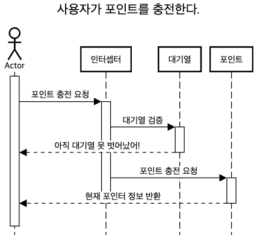
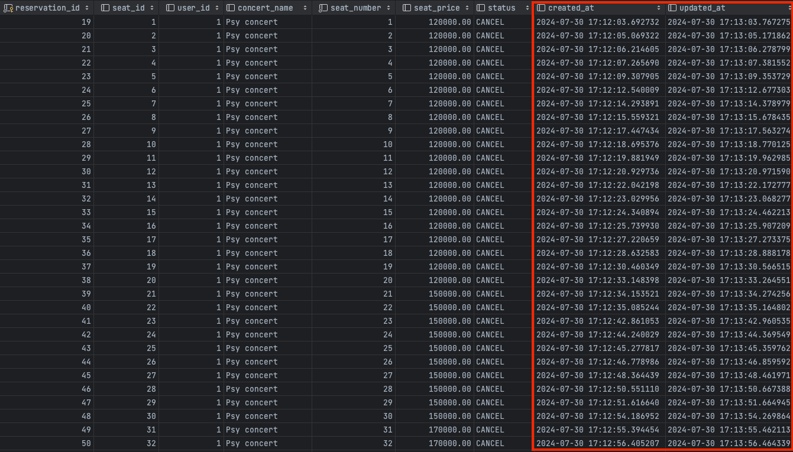

# [항해 플러스 백엔드 3주차] 서버 구축
### *시나리오 - 콘서트 예약 서비스*


### 목차

- [1. 요구사항 분석](##one)


---
<h2 id="one">1. 요구사항 분석</h2>

### Milestone & 요구사항 명세서 & API 명세서
[Google docs sheet ](https://docs.google.com/spreadsheets/d/1ARL1ZxmE_i0E6gUUF7H9PmBAEcioJcwOfM0VhmNDJx4/edit?gid=1675988926#gid=1675988926)

### 시퀀스 다이어그램
- ### 콘서트 목록 조회

- ### 포인트 충전

- ### 콘서트 좌석 예약 


### DB ERD


### Dummy Data - Postman
- **좌석 조회**

- **좌석 예약**

- **결제**

- **토큰 발급**

- **대기열 조회**

- **충전**

---
## Swagger

---
## Lock 비교
[Lock 비교 글](https://feel2.tistory.com/100)

---

## 캐시

### 캐시란?

캐시는 **자주 액세스하거나** **계산 비용이 많이 드는 데이터**를 일시적으로 저장하는 데 사용된다. 데이터에 액세스하는 데 걸리는 시간을 줄이고, 느린 리소스나 시스템의 로드를 줄여 **성능을 향상**시키는 데 도움이 된다.

그럼 캐시를 사용하기 위한 적절한 데이터의 판단 기준은 무엇일까?

- 데이터가 변경에 민감한지?
- 데이터의 연산에 드는 비용이 비싼지?
- 데이터의 변경이 전파가 되는지?

→ 요약하자면, “**잘 바뀌지 않으면서 접근할 일이 많은 데이터**, 변경되더라도 다른 서비스에 큰 영향을 미치지 않는 데이터” 가 캐시에 저장하여 활용하기 적절하다.

그럼 DB에서 계산 비용이 많이 드는(쿼리를 날렸을 때 시간이 오래 걸리는) 경우는 어떤 경우들이 있을까?

- **조인이 복잡할 경우**
  - 복잡한 조인 조건이 있는 여러 테이블과 관련된 쿼리, 특히 테이블에 컬럼이 많은 경우 상당한 시간이 오래 걸릴 수 있다.
- **적절한 인덱싱이 없는 경우**
  - 기본적으로 pk에 인덱싱이 걸려 있지만, 여러 테이블에 조인이 발생할 경우 적절한 인덱스가 안걸려 있다면 시간이 오래 걸릴 수 있다.
- **한번에 대량의 데이터를 가져오는 경우**
  - 가져오는 데이터가 수백만 데이터의 경우, 시간이 오래 걸릴 수 있다.

지금 나의 시나리오(콘서트 대기열)에서 조회가 오래 걸리는 부분은 어디서 발생할 수 있을까?

CASE1) **콘서트 정보 조회**
실제 콘서트 예약 페이지를 들어가서 확인해봤지만, 한번에 가져오는 콘서트 정보는 기껏해야 최대 50개 정도 밖에 안되는 것 같다. 다만 콘서트 예약을 위해서 자주 조회되며, **실시간으로 데이터 변동이 거의 없을 것 같다.**

CASE2) **예약 가능한 좌석 정보 조회**

이 경우에는 의미가 그래도 있을 것 같다. 올림픽 경기장만 해도 좌석이 5만건이 넘으니, 한번에 조회를 하려면 5만건 이상의 데이터를 한번에 조회를 해야한다. 다만, 실시간으로 좌석 정보가 변경이 되므로, 아까 처음에 얘기했던 ‘**잘 바뀌지 않으면서’** 라는 조건에는 해당하지는 않는다.

무엇보다 좌석 점유 상태의 경우 **중요한 정보**이다. 캐시의 경우 휘발성이기 때문에 날아가도 중요하지 않은 정보를 활용해야 한다.(ex) 인스타그램 좋아요 기능) 좌석 점유의 경우, 데이터의 정합성이 안 맞을  경우 여러 테이블에 영향이 가기 때문에(ex) 예약 테이블) 조심해야 한다.

그래서 나는 **콘서트 정보 조회**에 캐시를 한번 적용해 보기로 했다.

### Local Cache + Gloal Cache

먼저 `application level` 적용해 볼 수 있는 Local Cache를 알아보자. 스프링 진영에서는 크게 **Ehcache** 와 **Caffeine cache** 를 Local cache 로 활용할 수 있다.

두 캐시의 차이는

[https://medium.com/naverfinancial/니들이-caffeine-맛을-알아-f02f868a6192](https://medium.com/naverfinancial/%EB%8B%88%EB%93%A4%EC%9D%B4-caffeine-%EB%A7%9B%EC%9D%84-%EC%95%8C%EC%95%84-f02f868a6192)

여길 참조해보면 좋을 것 같다. 대략적으로 차이점을 살펴보자면

- Ehcache 가 Caffeine에 비해 제공되는 기능이 더 많다. (multi-level cache, distributed cache, cahce listener …)
- 단순 메모리 캐시 사용하고 높은 퍼포먼스를 원하면 Caffeine이 좋다. (Ehcache에 비해 제거 알고리즘이 우월함)
  - Window TinyLfu eviciton policy로 near-optimal hit rate
  - Caffeine이 ehcache에 비해 writing 퍼포먼스가 좋다고 함
- Eviction strategy
  - Caffeine (size-based, time-based, reference-based)
  - Ehcache (LRU, LFU, FIFO) — 메모리 관련만 가능
- ehcache는 메모리 + 디스크 용량까지 사용 가능
  - caffeine 도 post-eviction strategy로 커스텀 하게 구출할 수 있음
  - 최근 삭제 캐시를 잡아서 로드 시점에 다시 살리도록 가능(DB가 죽는것 같은 경우)

단순 캐시 용도의 경우, Caffeine 을 쓰는것이 성능적으로 우수하다고 하니, 한번 Caffeine 을 이용하여 캐시 기능을 써보자.

거기에 더해서 캐시도 계층형으로 구성이 가능하다는 것을 깨달았다. 따라서 Redis 활용하여 Global Cache까지 같이 적용해 볼 것이다.

클라이언트가 콘서트 목록을 조회하면

처음에는 L1 과 L2 모두 캐시가 없기 때문에 DB에서 데이터를 가져온 후, L1과 L2 에 캐시를 할 것이다.

그 다음 요청부터는 L1 캐시부터 hit 하여 정보를 가져오고, L1이 만료되면 L2를 hit하여 데이터를 가져올 것이다.

설정 정보와 적용 정보는 다음과 같다.

- CacheConfig

```java
@Configuration
public class CacheConfig {

    @Bean
    public List<CaffeineCache> caffeineCaches() {
        return Arrays.stream(CacheType.values())
                .map(cache -> new CaffeineCache(cache.getCacheName(), Caffeine.newBuilder().recordStats()
                        .expireAfterWrite(cache.getExpiredAfterWrite(), TimeUnit.SECONDS)
                        .maximumSize(cache.getMaximumSize())
                        .build()))
                .toList();
    }

    @Primary
    @Bean(name = "l1LocalCacheManager")
    public CacheManager caffeineCacheManager(List<CaffeineCache> caffeineCaches) {
        SimpleCacheManager cacheManager = new SimpleCacheManager();
        cacheManager.setCaches(caffeineCaches);
        return cacheManager;
    }

    @Bean(name = "l2RedisCacheManager")
    public RedisCacheManager redisCacheManager(RedisConnectionFactory redisConnectionFactory) {
        ObjectMapper objectMapper = new ObjectMapper();
        objectMapper.activateDefaultTyping(
                BasicPolymorphicTypeValidator.builder().allowIfBaseType(Object.class).build(),
                ObjectMapper.DefaultTyping.EVERYTHING,
                JsonTypeInfo.As.PROPERTY
        );

        RedisSerializationContext.SerializationPair<Object> serializer = RedisSerializationContext.SerializationPair
                .fromSerializer(new GenericJackson2JsonRedisSerializer(objectMapper));

        RedisCacheConfiguration cacheConfig = RedisCacheConfiguration.defaultCacheConfig()
                .serializeKeysWith(RedisSerializationContext.SerializationPair.fromSerializer(new StringRedisSerializer()))
                .serializeValuesWith(serializer)
                .entryTtl(Duration.ofSeconds(120)); // expiration time (sec)

        return RedisCacheManager.builder(redisConnectionFactory)
                .cacheDefaults(cacheConfig)
                .build();
    }

    @Bean
    public RedisTemplate<String, Object> redisTemplate(RedisConnectionFactory redisConnectionFactory) {
        RedisTemplate<String, Object> template = new RedisTemplate<>();
        template.setConnectionFactory(redisConnectionFactory);
        template.setKeySerializer(new StringRedisSerializer());
        template.setValueSerializer(new GenericJackson2JsonRedisSerializer());
        return template;
    }

    @Getter
    @RequiredArgsConstructor
    public enum CacheType {
        CONCERTS_PROFILE("concerts", 60, 10000); // Cache name, expiration time (sec), maximum entry size

        private final String cacheName;
        private final int expiredAfterWrite;
        private final int maximumSize;
    }
}

```


L1 의 TTL을 더 짧게 잡았기 때문에 L1이 먼저 캐시가 사라지고, L2가 다음으로 캐시 정보가 사라질 것이다. L1 캐시가 L2 캐시보다 성능이 더 좋기 때문에 이렇게 설정하였다.

- ConcertService

```java
@Service
@RequiredArgsConstructor
public class ConcertService {

		...
		
    /**
     * 콘서트 정보를 요청하면 콘서트 정보를 반환한다.
     *
     * @return 콘서트 정보를 반환한다.
     */
    @Caching(cacheable = {
            @Cacheable(cacheManager = "l1LocalCacheManager", cacheNames = "concerts", value = "concerts"),
            @Cacheable(cacheManager = "l2RedisCacheManager", cacheNames = "concerts", value = "concerts")
    })
    @Transactional(readOnly = true)
    public List<Concert> getConcerts() {
        List<Concert> concerts = concertRepository.getConcerts();

        return concerts.stream()
                .map(concert -> {
                    List<ConcertDate> concertDates = concertRepository.getConcertDates(concert.getConcertId());
                    return Concert.builder()
                            .concertId(concert.getConcertId())
                            .name(concert.getName())
                            .concertDates(concertDates)
                            .build();
                }).toList();
    }
    
    ...

```

실제로 처음에는 쿼리가 나가지만, 다음부터는 쿼리  없이 데이터를 조회하는 걸 볼 수 있다.

- 처음 캐시가 없을 경우

```java
2024-08-02 05:41:49.730 [http-nio-8080-exec-2]  INFO com.hhplus.hhplusconcert.support.aop.TraceLogAspect - [TRACE_LOG] Incoming request: [GET /api/v1/concerts] from [0:0:0:0:0:0:0:1]
Hibernate: 
    select
        ce1_0.concert_id,
        ce1_0.created_at,
        ce1_0.name,
        ce1_0.updated_at 
    from
        concert ce1_0
Hibernate: 
    select
        cde1_0.concert_date_id,
        cde1_0.concert_date,
        cde1_0.concert_id,
        ci1_0.concert_id,
        ci1_0.created_at,
        ci1_0.name,
        ci1_0.updated_at,
        cde1_0.created_at,
        cde1_0.place_id,
        pi1_0.place_id,
        pi1_0.created_at,
        pi1_0.name,
        pi1_0.total_seat,
        pi1_0.updated_at,
        cde1_0.updated_at 
    from
        concert_date cde1_0 
    join
        concert ci1_0 
            on ci1_0.concert_id=cde1_0.concert_id 
    join
        place pi1_0 
            on pi1_0.place_id=cde1_0.place_id 
    where
        cde1_0.concert_id=? 
        and cde1_0.concert_date>?
[TRACE_LOG] Outgoing response: [GET /api/v1/concerts] took [71] ms
```

- 캐시가 적용되면

```java
024-08-02 05:41:51.897 [http-nio-8080-exec-4]  INFO com.hhplus.hhplusconcert.support.aop.TraceLogAspect - [TRACE_LOG] Incoming request: [GET /api/v1/concerts] from [0:0:0:0:0:0:0:1]
[TRACE_LOG] Outgoing response: [GET /api/v1/concerts] took [1] ms
```

속도도  **71 ms → 1ms** 로 줄어든 것을 볼 수 있다.

실제로 redis에 접속하면 데이터가 value로 저장되있는걸 볼 수 있다.

간단하게 test 를 해보면 속도가 더 빠른 걸 볼 수 있다.

- 캐싱테스트

```java
		@Test
    @DisplayName("캐싱된 데이터를 가져오는게 더 속도가 빠르다.")
    void GetConcertsWithCache() {
        // given
        long startTimeWithoutCache = System.nanoTime();
        concertService.getConcerts();
        long endTimeWithoutCache = System.nanoTime();
        long durationWithoutCache = endTimeWithoutCache - startTimeWithoutCache;

        // when
        long startTimeWithCache = System.nanoTime();
        concertService.getConcerts();
        long endTimeWithCache = System.nanoTime();
        long durationWithCache = endTimeWithCache - startTimeWithCache;

        // then
        assertThat(durationWithCache).isLessThan(durationWithoutCache);
    }
```
---

## Redis를 통한 성능 개선

캐시 기능 말고 ‘**Redis 를 이용한 로직 이관을 통해 성능 개선할 수 있는 로직’** 할만한 게 있을까?

그중에 하나 생각해볼만한 것이 예약 후, 5분이 지나도록 결제를 안하면 좌석 점유가 해지되야 하는 부분이 생각이 났다.

지금은 스케줄러를 통해 5초마다 좌석을 점유한지 5분이 지났는지 확인 후, 좌석 점유를 해지하고 있다.이게 과연 맞는 로직일까? 정확히 좌석을 점유한지 5분이 됐을 때 좌석 점유를 해지할 수는 없을까?

- 기존 로직

```java
@Component
@RequiredArgsConstructor
@Slf4j
public class SeatScheduler { //좌석 관련 스케줄러

    private final ReservationFacade reservationFacade;

    /**
     * 5초마다 좌석 점유 여부 확인 후 점유 해제 하는 스케줄링 실행
     */
    @Scheduled(fixedRate = 5000)
    public void checkOccupiedSeat() {
        reservationFacade.checkOccupiedSeat();
    }
}
```

```java
@Component
@RequiredArgsConstructor
public class ReservationFacade {

    private final ConcertService concertService;
    private final PaymentService paymentService;
    private final UserService userService;

    ...
		
    /**
     * 좌석을 계속 점유할 수 있는지 확인하는 유즈케이스를 실행한다.
     */
    public void checkOccupiedSeat() {
        concertService.checkOccupiedSeat();
    }
}
```

```java
    
@Service
@RequiredArgsConstructor
public class ConcertService {
	
	...
	
    @Transactional
    public void cancelOccupiedSeat() {  
      // 임시 예약인 모든 예약 조회
      List<ConcertReservationInfo> allTempReservation = concertRepository.getAllTempReservation();

      allTempReservation.forEach(reservation -> {
          LocalDateTime createdAtTime = reservation.getCreatedAt();
          Duration duration = Duration.between(createdAtTime, LocalDateTime.now());

          if (duration.toSeconds() > 5 * 60) { //정해진 시간을 넘었는지 (default:5분)
              // 1. 예약 취소
              reservation.cancel();
              concertRepository.saveReservation(reservation);
              // 2. 좌석 점유 취소(다시 예약 가능 상태로 변경)
              Optional<Seat> seat = concertRepository.getSeat(reservation.getSeatId());
              Seat seatInfo = concertValidator.checkExistSeat(seat, "좌석 정보가 존재하지 않습니다");
              seatInfo.cancel();
              concertRepository.saveSeat(seatInfo);
          }
      });
    }
}
```

기존에는 스케줄러를 통해 5초 마다 예약 상태가 `*TEMPORARY_RESERVED`*  인 모든 예약을 조회하여 예약을 취소하고, 좌석 점유를 해지하였다.

이 방식에는 여러 문제가 있다.

- 5초 마다 스케줄러 실행
    - 만약 4분 59초에 스케줄러가 확인을 한다면, 다음 스케줄러가 돌 동안 이 좌석은 점유가 불가능하게 된다.
- 모든 임시 예약 조회
    - 만약 예약건의 데이터가 많다면 5초 마다 대량의 조회 쿼리가 발생한다….(임시 예약이 한건도 없더라도…)

이런 문제를 해결하기 위해 이것저것 찾아보다 Redisson Queue 중에 `RDelayedQueue`  와 `RBlockingQueue`  를 활용하면 이 문제를 해결할 수 있을 것 처럼 보였다.

먼저 `RDelayedQueue` 에 `destinationQueue` 를 설정해준다. 내가 설정해준 만큼의 시간이 지나면 `destinationQueue` 로 데이터를 넣어준다.

구현 코드는 다음과 같다.

```java
@Service
@RequiredArgsConstructor
public class ConcertService {
    
    private final ConcertRepository concertRepository;
    private final ConcertValidator concertValidator;
    private RBlockingQueue<ConcertReservationInfo> tempReservationQueue;
    private RDelayedQueue<ConcertReservationInfo> delayedReservationQueue;
    private final RedissonClient redissonClient;

    @PostConstruct
    public void init() {
        cancelOccupiedSeatListener();

        tempReservationQueue = redissonClient.getBlockingQueue("tempReservationQueue");
        delayedReservationQueue = redissonClient.getDelayedQueue(tempReservationQueue);
    }
    
     /**
     * 좌석 예약을 요청하면 예약 완료 정보를 반환한다.
     *
     * @param command concertId, concertDateId, seatNumber, userId 정보
     * @return 예약 완료 정보를 반환한다.
     */
    @Transactional
    public ConcertReservationInfo reserveSeat(ReservationCommand.Create command) {
	      
	      ...
	      
        // 4. 예약 테이블 저장
        ConcertReservationInfo reservationInfo = command.toReservationDomain(seat, concertDate);
        ConcertReservationInfo savedReservation = concertValidator.checkSavedReservation(concertRepository.saveReservation(reservationInfo), "예약에 실패하였습니다");
        
        // 5. 예약에 성공하면 delayedReservationQueue 에 임시 저장
        delayedReservationQueue.offer(savedReservation, 1, TimeUnit.MINUTES);

        return savedReservation;
    }
    
    ...
    
	  /**
     * 좌석을 계속 점유할 수 있는지 확인한다.
     */
    @Transactional
    public void checkOccupiedSeat(Long reservationId) {
        Optional<ConcertReservationInfo> reservation = concertRepository.getReservation(reservationId);
        //
        if ((reservation.isPresent() && reservation.get().getStatus().equals(TEMPORARY_RESERVED))) {
            // 예약 상태 취소로 변경
            reservation.get().cancel();
            concertRepository.saveReservation(reservation.get());
            // 좌석 점유 취소(다시 예약 가능 상태로 변경)
            Optional<Seat> seat = concertRepository.getSeat(reservation.get().getSeatId());
            Seat seatInfo = concertValidator.checkExistSeat(seat, "좌석 정보가 존재하지 않습니다");
            seatInfo.cancel();

            concertRepository.saveSeat(seatInfo);
        }
    }

  private void cancelOccupiedSeatListener() {
    new Thread(() -> {
      while (!Thread.currentThread().isInterrupted()) {
        try {
          // 내가 설정한 시간이 지나서 요소를 사용할 수 있을 때 까지 대기
          if (tempReservationQueue != null) {
            Object item = tempReservationQueue.take();
            if (item instanceof ConcertReservationInfo reservationInfo) {
              // 예약 상태가 임시 예약이면 예약 취소
              checkOccupiedSeat(reservationInfo.getReservationId());
            }
          }
        } catch (InterruptedException e) {
          Thread.currentThread().interrupt();
        }
      }
    }).start();
  }
}
```

이렇게 하면 내가 원하는 시간이 지난 순간 `tempReservationQueue`  활성화 되면서 예약 상태를 취소 하는 로직이 실행된다.

결과를 보면 다음과 같다.





### 결론


created_at 과 updated_at 의 시간 차이가 내가 설정한 1분인 것을 볼 수 있다. 기존의 스케줄러를 써서 하는 방식과 비교하면 계속해서 의미없는 조회 쿼리를 **주기적으로 날릴 필요도 없으며**, 딱 **내가 원하는 시간 뒤에 취소가 되는 것**을 알 수 있다.

---
### 대기열 구현

대기열에 부하를 통해 최대 몇명까지 들어올 수 있는지 테스트 해보았다.

부하테스트를 통해 **N초당 M명**의 유저를 active 할 것인지를 구할 것이다.

일단 Locust 을 통해 부하테스트를 진행해보았다.

매초 100명씩 1000명까지 증가하게 설정해두었다.


이 이상으로 증가하는 사람 수를 늘리면 fail 횟수가 계속해서 증가하는 것 같아 적정선을 위와 같이 정하였다.


redis나 db 가 받는 부하도 합쳐서 60 % 넘지 않는 것으로 보였다.

결과는 다음과 같다.


위 결과를 요약하면 다음과 같다.

- **총 요청 수:** 299,518
- **총 실패 수:** 39
- **중앙값 응답 시간 (Median):** 380 ms
- **95th 백분위수 응답 시간 (95th Percentile):** 560 ms
- **99th 백분위수 응답 시간 (99th Percentile):** 680 ms
- **평균 응답 시간 (Average):** 393.94 ms
- **최소 응답 시간 (Min):** 3 ms
- **최대 응답 시간 (Max):** 10,009 ms
- **응답 크기 평균 (Average Size):** 291.23 bytes
- **현재 초당 요청 수 (RPS):** 2,577.1
- **현재 초당 실패 수 (Failures/s):** 0

실패율이  0.01%로 낮은편이며, 최소 응답 시간과 최대 응답 시간의 차이가 엄청 크다. 그래도 RPS 2500 에도 거뜬히 버텨내는 것을 볼 수 있다. 또한 95 퍼센트 정도가 0.5 초만에 응답을 받으니 대부분이 빠르게 응답을 받는편이다.

위의 부하테스트 결과를 바탕으로 한번 N과 M을 구해보자!

- 적절한 동시 접속자를 유지하기 위해서는?
  1. 한 유저가 콘서트 조회를 시작한 이후에 하나의 예약을 완료할 때까지 걸리는 시간을 파악
    - 평균 1분정도
  2. DB에 동시에 접근할 수 있는 트래픽의 최대치를 계산
    - 약 2,000(보정해서) TPS(초당 트랜잭션 수) ⇒ 1분당 120,000
  3. 1분간 유저가 호출하는 API
    - 2(콘서트 좌석을 조회하는 API, 예약 API) * 1.5 ( 동시성 이슈에 의해 예약에 실패하는 케이스를 위한 재시도 계수(예측치)) = 3
  4. 분당 처리할 수 있는 동시접속자 수 = 12,0000/3 = 40,000명
    - N = **10**초마다 M = **6,000**명씩 유효한 토큰으로 전환
    - 나의 대기열 순번이 180,000 번이라면 잔여 예상대기시간은 5분!!

→ 위 내용을 바탕으로 나는 10초에 6,000명씩 대기열 유저를 활성화시키기로 했다!

---
## 회고

---
## 기술 스택
- Spring boot
- Jpa
- Mysql
