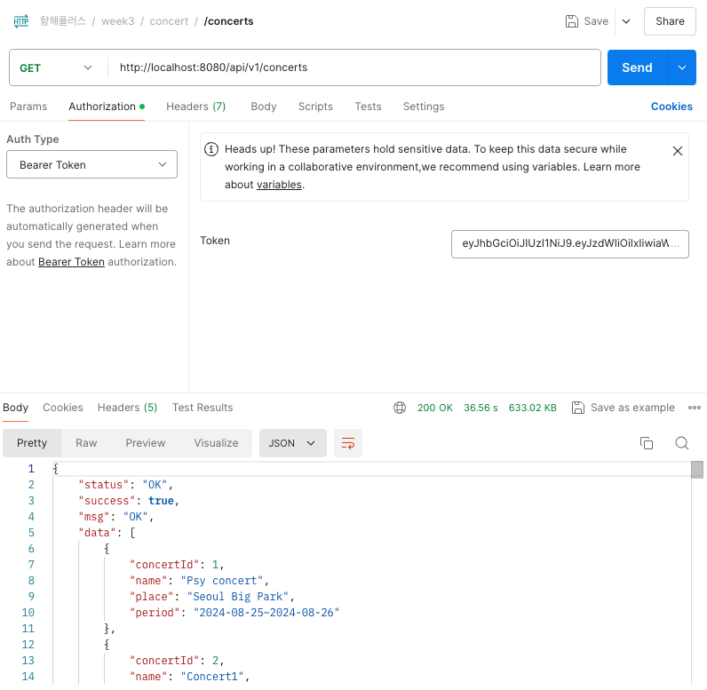
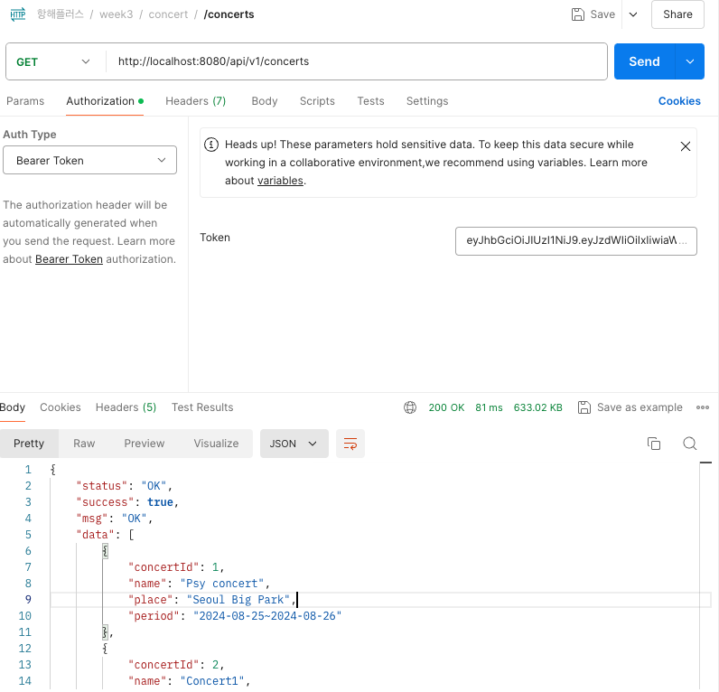
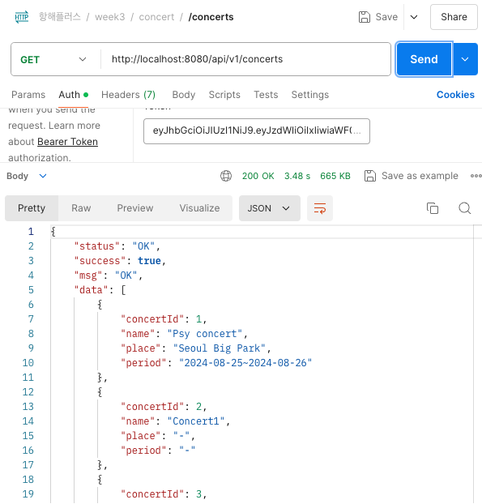

## 부하 테스트

### 목적

서비스의 기본적인 성능 테스트 및 예상치 못한 병목 현상이나 장애 상황에 대비하기 위해서 진행한다.

### 대상 API

`콘서트 대기열 시나리오` 에 있는 **모든 API를** 대상으로 테스트를 진행한다.

- GET
    - api/v1/concerts
    - api/v1/concerts/{concertId}
    - api/v1/concerts/{concertId}/dates
    - api/v1/concerts/dates/{concertDateId}/seats
    - api/v1/users/{userId}/balance
    - api/v1/reservations/{userId}

- POST
    - api/v1/payments/pay
    - api/v1/reservations
    - api/v1/queues/token

- PATCH
    - api/v1/{userId}/charge

- DELETE
    - api/v1/reservations/{reservationId}

→ 여기서 11개를 부하테스트 대상으로 선정하였다.

### 목표

- 레이턴시 평균 **500ms** 이하를 보장한다.
- p99기준으로 **1000ms** 이하를 보장한다.
- **DAU**(Daily Active Users) 를 **10만명**을 목표로 한다.
    - 콘서트 좌석이 평균 5만좌석이라고 가정했을 때, 2배정도 보정값을 뒀다.
    - **10시간** 정도에 **10만명** 정도 콘서트 예약을 위해 들어온다고 가정
      1시간에 1만명 → 1분당 166 → **2.8/s** TPS → 3배 보정 → **8.4/s** TPS로 결정!!
    - 진짜 인기 있는 콘서트다!
      1시간에 10만명! → 1분당 1666 → **27.78/s** TPS → 3배 보정 → **83.33/s** TPS로 결정!
- 평시 TPS : **8.4/s**
- 피크 TPS:  **83.33/s**

- **GET:api/v1/concerts**

지금 그냥 한번 조회해보니 36s 나왔다.(mock 데이터로 concert 1만건, concertData 1만건, place 1만건, seat 1000만건을 넣어둔 상태)



데이터를 1만건 조회하는데 응답속도가 너무 느리다.

해당 서비스 코드를 보면

```java
    @Caching(cacheable = {
            @Cacheable(cacheManager = "l1LocalCacheManager", cacheNames = "concerts", value = "concerts"),
            @Cacheable(cacheManager = "l2RedisCacheManager", cacheNames = "concerts", value = "concerts")
    })
    @Transactional(readOnly = true)
    public List<Concert> getConcerts() {
        List<Concert> concerts = concertRepository.getConcerts();

        return concerts.stream()
                .map(concert -> {
                    List<ConcertDate> concertDates = concertRepository.getConcertDates(concert.getConcertId());
                    return Concert.builder()
                            .concertId(concert.getConcertId())
                            .name(concert.getName())
                            .concertDates(concertDates)
                            .build();
                }).toList();
    }
```

콘서트 목록을 조회한 후, map을 돌면서 콘서트 날짜를 조회해서 결과를 리턴하고 있다.

캐시를 설정해두었기 때문에 첫 조회 이후로는 빠르게 데이터를 가져온다.



### 개선

우선 `index`가 concert_date에 없는 것을 알았다.

그래서 `index`부터 걸기로 했다.

```sql
CREATE INDEX IDX_CONCERT_DATE ON concert_date (concert_id, concert_date);
```

`index` 만 걸었는데 조회 속도 차이가 **3.4s**로,  **10배**나 증가하였다.



이제 한번 부하테스트를 진행해보겠다.

- 테스트 스크립트

```jsx
import http from 'k6/http';
import {check, sleep} from 'k6';

export const options = {
    summaryTrendStats: ["avg", "min", "med", "max", "p(90)", "p(95)", "p(99)", "p(99.50)"],
    max_vus: 1000, // 최대 가상 유저 수
    stages: [
        {duration: '10s', target: 200},  // Ramp up
        {duration: '30s', target: 1000},  // Stay
        {duration: '10s', target: 0},   // Ramp down
    ],
};

// Global variable to store the token
let token;

function getToken() {
    const url = 'http://host.docker.internal:8080/api/v1/queues/token';
    const payload = JSON.stringify({ userId: 1 });

    const params = {
        headers: {
            'Content-Type': 'application/json',
        },
    };

    // Perform the HTTP POST request to fetch the token
    const res = http.post(url, payload, params);

    // Check if the status is 200
    check(res, {
        'status is 200': (r) => r.status === 200,
    });

    // Extract the token from the JSON response
    token = JSON.parse(res.body).data.token;
}

// Setup function to run before the test execution
export function setup() {
    getToken();
    return { token };  // Return the token to be used in default function
}

export default function(data) {
    // Get the token
    const token = data.token;  // Use the token from setup()

    // Use the token in your test scenarios
    getConcerts(token);

    sleep(1);
}

function getConcerts(token) {
    const url = 'http://host.docker.internal:8080/api/v1/concerts';
    const params = {
        headers: {
            'Authorization': `Bearer ${token}`,
        },
    };

    const res = http.get(url, params);

    check(res, {
        'status is 200': (r) => r.status === 200,
    });
}

```

- 결과

```sql
k6-1  |      checks.........................: 100.00% ✓ 9795       ✗ 0     
k6-1  |      data_received..................: 6.7 GB  131 MB/s
k6-1  |      data_sent......................: 2.5 MB  49 kB/s
k6-1  |      http_req_blocked...............: avg=867.68µs min=500ns   med=2.58µs   max=1s     p(90)=658.83µs p(95)=2.73ms   p(99)=7.17ms   p(99.50)=9.16ms  
k6-1  |      http_req_connecting............: avg=856.79µs min=0s      med=0s       max=1s     p(90)=588.28µs p(95)=2.66ms   p(99)=7.1ms    p(99.50)=9.07ms  
k6-1  |      http_req_duration..............: avg=1.59s    min=10.88ms med=1.53s    max=9.74s  p(90)=2.88s    p(95)=3.04s    p(99)=3.71s    p(99.50)=5.89s   
**k6-1  |        { expected_response:true }...: avg=1.59s    min=10.88ms med=1.53s    max=9.74s  p(90)=2.88s    p(95)=3.04s    p(99)=3.71s    p(99.50)=5.89s**   
k6-1  |      http_req_failed................: 0.00%   ✓ 0          ✗ 9795  
k6-1  |      http_req_receiving.............: avg=152.77ms min=104.2µs med=162.44ms max=3.28s  p(90)=267.45ms p(95)=294.01ms p(99)=414.87ms p(99.50)=451.26ms
k6-1  |      http_req_sending...............: avg=20.08µs  min=2.25µs  med=10.04µs  max=2.78ms p(90)=34.2µs   p(95)=51.26µs  p(99)=116.5µs  p(99.50)=192.72µs
k6-1  |      http_req_tls_handshaking.......: avg=0s       min=0s      med=0s       max=0s     p(90)=0s       p(95)=0s       p(99)=0s       p(99.50)=0s      
k6-1  |      http_req_waiting...............: avg=1.43s    min=8.48ms  med=1.35s    max=9.73s  p(90)=2.69s    p(95)=2.82s    p(99)=3.65s    p(99.50)=5.88s   
**k6-1  |      http_reqs......................: 9795    192.234148/s**
k6-1  |      iteration_duration.............: avg=2.59s    min=16.55ms med=2.53s    max=10.74s p(90)=3.89s    p(95)=4.04s    p(99)=4.76s    p(99.50)=6.9s    
k6-1  |      iterations.....................: 9794    192.214522/s
k6-1  |      vus............................: 1       min=1        max=997 
k6-1  |      vus_max........................: 1000    min=1000     max=1000
k6-1  | 
k6-1  | 
k6-1  | running (0m51.0s), 0000/1000 VUs, 9794 complete and 0 interrupted iterations
k6-1  | default ✓ [ 100% ] 0000/1000 VUs  50s
k6-1 exited with code 0

```

`TPS` 가 **192.234148/s**

`http_req_duration`의 p(99)도 5.88s

- **GET:api/v1/concerts/{concertId}**


- 테스트 스크립트

```jsx
import http from 'k6/http';
import {check, sleep} from 'k6';
import {randomIntBetween} from 'https://jslib.k6.io/k6-utils/1.2.0/index.js';

export const options = {
    summaryTrendStats: ["avg", "min", "med", "max", "p(90)", "p(95)", "p(99)", "p(99.50)"],
    stages: [
        {duration: '10s', target: 200},  // Ramp up
        {duration: '30s', target: 1000},  // Stay
        {duration: '10s', target: 0},   // Ramp down
    ],
};

// Global variable to store the token
let token;

function getToken() {
    const url = 'http://host.docker.internal:8080/api/v1/queues/token';
    const payload = JSON.stringify({ userId: 1 });

    const params = {
        headers: {
            'Content-Type': 'application/json',
        },
    };

    // Perform the HTTP POST request to fetch the token
    const res = http.post(url, payload, params);

    // Check if the status is 200
    check(res, {
        'status is 200': (r) => r.status === 200,
    });

    // Extract the token from the JSON response
    token = JSON.parse(res.body).data.token;
}

// Setup function to run before the test execution
export function setup() {
    getToken();
    return { token };  // Return the token to be used in default function
}

export default function(data) {
    // Get the token
    const token = data.token;  // Use the token from setup()

    // Use the token in your test scenarios
    getConcertDetail(token);

    sleep(1);
}

function getConcertDetail(token) {
    // concertId를 1부터 10000 사이에서 랜덤으로 생성
    let concertId = randomIntBetween(1, 10000);

    const url = `http://host.docker.internal:8080/api/v1/concerts/${concertId}`;
    const params = {
        headers: {
            'Authorization': `Bearer ${token}`,
        },
    };

    const res = http.get(url, params);

    check(res, {
        'status is 200': (r) => r.status === 200,
    });
}
```

- 결과

```jsx
k6-1  |      checks.........................: 100.00% ✓ 24195      ✗ 0     
k6-1  |      data_received..................: 6.4 MB  125 kB/s
k6-1  |      data_sent......................: 6.3 MB  124 kB/s
k6-1  |      http_req_blocked...............: avg=35.65µs min=541ns  med=1.45µs  max=11.44ms  p(90)=3.75µs  p(95)=10.16µs  p(99)=882.77µs p(99.50)=1.3ms   
k6-1  |      http_req_connecting............: avg=31.35µs min=0s     med=0s      max=11.31ms  p(90)=0s      p(95)=0s       p(99)=819.03µs p(99.50)=1.21ms  
k6-1  |      http_req_duration..............: avg=11.25ms min=2.72ms med=6.78ms  max=260.98ms p(90)=21.04ms p(95)=36.26ms  p(99)=83.45ms  p(99.50)=104.83ms
**k6-1  |        { expected_response:true }...: avg=11.25ms min=2.72ms med=6.78ms  max=260.98ms p(90)=21.04ms p(95)=36.26ms  p(99)=83.45ms  p(99.50)=104.83ms**
k6-1  |      http_req_failed................: 0.00%   ✓ 0          ✗ 24195 
k6-1  |      http_req_receiving.............: avg=34.66µs min=4.29µs med=19.95µs max=7.27ms   p(90)=64.79µs p(95)=108.51µs p(99)=273.58µs p(99.50)=384.03µs
k6-1  |      http_req_sending...............: avg=9.41µs  min=2.16µs med=5.91µs  max=1.83ms   p(90)=15.2µs  p(95)=23.91µs  p(99)=65.59µs  p(99.50)=100.92µs
k6-1  |      http_req_tls_handshaking.......: avg=0s      min=0s     med=0s      max=0s       p(90)=0s      p(95)=0s       p(99)=0s       p(99.50)=0s      
k6-1  |      http_req_waiting...............: avg=11.21ms min=2.69ms med=6.73ms  max=260.91ms p(90)=20.96ms p(95)=36.2ms   p(99)=83.44ms  p(99.50)=104.79ms
**k6-1  |      http_reqs......................: 24195   475.610189/s**
k6-1  |      iteration_duration.............: avg=1.01s   min=9.84ms med=1s      max=1.26s    p(90)=1.02s   p(95)=1.03s    p(99)=1.08s    p(99.50)=1.1s    
k6-1  |      iterations.....................: 24194   475.590532/s
k6-1  |      vus............................: 60      min=19       max=998 
k6-1  |      vus_max........................: 1000    min=1000     max=1000
k6-1  | 
k6-1  | 
k6-1  | running (0m50.9s), 0000/1000 VUs, 24194 complete and 0 interrupted iterations
k6-1  | default ✓ [ 100% ] 0000/1000 VUs  50s
k6-1 exited with code 0

```

`TPS` 가 475.610189/s

`http_req_duration`의 p(99)도 104.79ms

- **GET:api/v1/concerts/{concertId}/dates**

- 테스트 스크립트

```jsx
import http from 'k6/http';
import {check, sleep} from 'k6';
import {randomIntBetween} from 'https://jslib.k6.io/k6-utils/1.2.0/index.js';

export const options = {
    summaryTrendStats: ["avg", "min", "med", "max", "p(90)", "p(95)", "p(99)", "p(99.50)"],
    stages: [
        {duration: '10s', target: 200},  // Ramp up
        {duration: '30s', target: 1000},  // Stay
        {duration: '10s', target: 0},   // Ramp down
    ],
};

// Global variable to store the token
let token;

function getToken() {
    const url = 'http://host.docker.internal:8080/api/v1/queues/token';
    const payload = JSON.stringify({ userId: 1 });

    const params = {
        headers: {
            'Content-Type': 'application/json',
        },
    };

    // Perform the HTTP POST request to fetch the token
    const res = http.post(url, payload, params);

    // Check if the status is 200
    check(res, {
        'status is 200': (r) => r.status === 200,
    });

    // Extract the token from the JSON response
    token = JSON.parse(res.body).data.token;
}

// Setup function to run before the test execution
export function setup() {
    getToken();
    return { token };  // Return the token to be used in default function
}

export default function(data) {
    // Get the token
    const token = data.token;  // Use the token from setup()

    // Use the token in your test scenarios
    getConcertDates(token);

    sleep(1);
}

function getConcertDates(token) {
    // concertId를 1부터 10000 사이에서 랜덤으로 생성
    let concertId = randomIntBetween(1, 10000);

    const url = `http://host.docker.internal:8080/api/v1/concerts/${concertId}/dates`;
    const params = {
        headers: {
            'Authorization': `Bearer ${token}`,
        },
    };

    const res = http.get(url, params);

    check(res, {
        'status is 200': (r) => r.status === 200,
    });
}
```

- 결과

```jsx
k6-1  |      checks.........................: 100.00% ✓ 24277      ✗ 0     
k6-1  |      data_received..................: 7.7 MB  151 kB/s
k6-1  |      data_sent......................: 6.5 MB  127 kB/s
k6-1  |      http_req_blocked...............: avg=33.32µs min=500ns   med=1.45µs max=9.11ms   p(90)=3.16µs  p(95)=10.66µs p(99)=776.35µs p(99.50)=1.01ms  
k6-1  |      http_req_connecting............: avg=29.09µs min=0s      med=0s     max=9.06ms   p(90)=0s      p(95)=0s      p(99)=722.65µs p(99.50)=966.42µs
k6-1  |      http_req_duration..............: avg=8.21ms  min=2.47ms  med=6.41ms max=126.14ms p(90)=13.58ms p(95)=18.86ms p(99)=38.19ms  p(99.50)=46.79ms 
**k6-1  |        { expected_response:true }...: avg=8.21ms  min=2.47ms  med=6.41ms max=126.14ms p(90)=13.58ms p(95)=18.86ms p(99)=38.19ms  p(99.50)=46.79ms** 
k6-1  |      http_req_failed................: 0.00%   ✓ 0          ✗ 24277 
k6-1  |      http_req_receiving.............: avg=31.98µs min=4.33µs  med=20µs   max=1.78ms   p(90)=61.53µs p(95)=94.99µs p(99)=218.25µs p(99.50)=300.41µs
k6-1  |      http_req_sending...............: avg=8.99µs  min=2.12µs  med=5.75µs max=1.61ms   p(90)=14.08µs p(95)=23.25µs p(99)=62.83µs  p(99.50)=98.24µs 
k6-1  |      http_req_tls_handshaking.......: avg=0s      min=0s      med=0s     max=0s       p(90)=0s      p(95)=0s      p(99)=0s       p(99.50)=0s      
k6-1  |      http_req_waiting...............: avg=8.17ms  min=2.45ms  med=6.36ms max=126.12ms p(90)=13.54ms p(95)=18.82ms p(99)=38.15ms  p(99.50)=46.73ms 
**k6-1  |      http_reqs......................: 24277   476.895181/s**
k6-1  |      iteration_duration.............: avg=1s      min=11.54ms med=1s     max=1.12s    p(90)=1.01s   p(95)=1.01s   p(99)=1.03s    p(99.50)=1.04s   
k6-1  |      iterations.....................: 24276   476.875537/s
k6-1  |      vus............................: 61      min=19       max=997 
k6-1  |      vus_max........................: 1000    min=1000     max=1000
k6-1  | 
k6-1  | 
k6-1  | running (0m50.9s), 0000/1000 VUs, 24276 complete and 0 interrupted iterations
k6-1  | default ✓ [ 100% ] 0000/1000 VUs  50s
k6-1 exited with code 0

```

`TPS` 가 476.895181/s

`http_req_duration`의 p(99)도 46.73ms

- **GET:api/v1/concerts/dates/{concertDateId}/seats**

- 테스트 스크립트

```jsx
import http from 'k6/http';
import {check, sleep} from 'k6';
import {randomIntBetween} from 'https://jslib.k6.io/k6-utils/1.2.0/index.js';

export const options = {
    summaryTrendStats: ["avg", "min", "med", "max", "p(90)", "p(95)", "p(99)", "p(99.50)"],
    stages: [
        {duration: '10s', target: 200},  // Ramp up
        {duration: '30s', target: 1000},  // Stay
        {duration: '10s', target: 0},   // Ramp down
    ],
};

let token;

function getToken() {
    const url = 'http://host.docker.internal:8080/api/v1/queues/token';
    const payload = JSON.stringify({ userId: 1 });

    const params = {
        headers: {
            'Content-Type': 'application/json',
        },
    };

    // Perform the HTTP POST request to fetch the token
    const res = http.post(url, payload, params);

    // Check if the status is 200
    check(res, {
        'status is 200': (r) => r.status === 200,
    });

    // Extract the token from the JSON response
    token = JSON.parse(res.body).data.token;
}

// Setup function to run before the test execution
export function setup() {
    getToken();
    return { token };  // Return the token to be used in default function
}

export default function(data) {
    // Get the token
    const token = data.token;  // Use the token from setup()

    // Use the token in your test scenarios
    getAvailableSeats(token);

    sleep(1);
}

function getAvailableSeats(token) {
    // concertId를 1부터 10000 사이에서 랜덤으로 생성
    let concertDateId = randomIntBetween(1, 10000);

    const url = `http://host.docker.internal:8080/api/v1/concerts/dates/${concertDateId}/seats`;
    const params = {
        headers: {
            'Authorization': `Bearer ${token}`,
        },
    };

    const res = http.get(url, params);

    check(res, {
        'status is 200': (r) => r.status === 200,
    });

}
```

- 결과

```jsx
k6-1  |      checks.........................: 100.00% ✓ 16237      ✗ 0     
k6-1  |      data_received..................: 621 MB  12 MB/s
k6-1  |      data_sent......................: 4.4 MB  84 kB/s
k6-1  |      http_req_blocked...............: avg=93.52µs  min=500ns   med=2.33µs   max=23.38ms p(90)=6.08µs  p(95)=669.78µs p(99)=2.11ms  p(99.50)=2.89ms 
k6-1  |      http_req_connecting............: avg=86.44µs  min=0s      med=0s       max=23.11ms p(90)=0s      p(95)=622.69µs p(99)=2.03ms  p(99.50)=2.83ms 
k6-1  |      http_req_duration..............: avg=550.06ms min=2.96ms  med=422.78ms max=3.09s   p(90)=1.24s   p(95)=1.4s     p(99)=2.39s   p(99.50)=2.55s  
**k6-1  |        { expected_response:true }...: avg=550.06ms min=2.96ms  med=422.78ms max=3.09s   p(90)=1.24s   p(95)=1.4s     p(99)=2.39s   p(99.50)=2.55s**  
k6-1  |      http_req_failed................: 0.00%   ✓ 0          ✗ 16237 
k6-1  |      http_req_receiving.............: avg=585.11µs min=4.87µs  med=38.79µs  max=28.34ms p(90)=1.7ms   p(95)=4.64ms   p(99)=8.69ms  p(99.50)=10.14ms
k6-1  |      http_req_sending...............: avg=15.31µs  min=2.25µs  med=9.54µs   max=1.51ms  p(90)=25.12µs p(95)=40.11µs  p(99)=98.49µs p(99.50)=146.1µs
k6-1  |      http_req_tls_handshaking.......: avg=0s       min=0s      med=0s       max=0s      p(90)=0s      p(95)=0s       p(99)=0s      p(99.50)=0s     
k6-1  |      http_req_waiting...............: avg=549.46ms min=2.94ms  med=422.27ms max=3.09s   p(90)=1.24s   p(95)=1.4s     p(99)=2.38s   p(99.50)=2.55s  
**k6-1  |      http_reqs......................: 16237   307.178413/s**
k6-1  |      iteration_duration.............: avg=1.52s    min=11.74ms med=1.41s    max=3.48s   p(90)=2.21s   p(95)=2.35s    p(99)=2.64s   p(99.50)=2.73s  
k6-1  |      iterations.....................: 16236   307.159495/s
k6-1  |      vus............................: 56      min=19       max=997 
k6-1  |      vus_max........................: 1000    min=1000     max=1000
k6-1  | 
k6-1  | 
k6-1  | running (0m52.9s), 0000/1000 VUs, 16236 complete and 0 interrupted iterations
k6-1  | default ✓ [ 100% ] 0000/1000 VUs  50s
k6-1 exited with code 0

```

`TPS` 가 307.178413/s

`http_req_duration`의 p(99) 2.55s

- **GET:api/v1/users/{userId}/balance**

- 테스트 스크립트

```jsx
import http from 'k6/http';
import {check, sleep} from 'k6';
import {randomIntBetween} from 'https://jslib.k6.io/k6-utils/1.2.0/index.js';

export const options = {
    summaryTrendStats: ["avg", "min", "med", "max", "p(90)", "p(95)", "p(99)", "p(99.50)"],
    stages: [
        {duration: '10s', target: 200},  // Ramp up
        {duration: '30s', target: 1000},  // Stay
        {duration: '10s', target: 0},   // Ramp down
    ],
};

export default function() {
    // Use the token in your test scenarios
    getBalance();

    sleep(1);
}

function getBalance() {
    // userId를 1부터 30 사이에서 랜덤으로 생성
    let userId = randomIntBetween(1, 30);

    const url = `http://host.docker.internal:8080/api/v1/users/${userId}/balance`;
    const res = http.get(url);

    check(res, {
        'status is 200': (r) => r.status === 200,
    });
}
```

- 결과

```jsx
k6-1  |      checks.........................: 100.00% ✓ 24393      ✗ 0     
k6-1  |      data_received..................: 4.9 MB  97 kB/s
k6-1  |      data_sent......................: 2.8 MB  55 kB/s
k6-1  |      http_req_blocked...............: avg=43.25µs min=500ns    med=1.29µs max=21.3ms  p(90)=4.91µs  p(95)=13.39µs  p(99)=1.12ms   p(99.50)=1.88ms  
k6-1  |      http_req_connecting............: avg=38.05µs min=0s       med=0s     max=21.15ms p(90)=0s      p(95)=0s       p(99)=1.03ms   p(99.50)=1.74ms  
k6-1  |      http_req_duration..............: avg=3.16ms  min=978.61µs med=2.86ms max=30.8ms  p(90)=4.91ms  p(95)=5.98ms   p(99)=9.24ms   p(99.50)=11.19ms 
**k6-1  |        { expected_response:true }...: avg=3.16ms  min=978.61µs med=2.86ms max=30.8ms  p(90)=4.91ms  p(95)=5.98ms   p(99)=9.24ms   p(99.50)=11.19ms** 
k6-1  |      http_req_failed................: 0.00%   ✓ 0          ✗ 24393 
k6-1  |      http_req_receiving.............: avg=37.25µs min=3.79µs   med=16µs   max=2.54ms  p(90)=79.91µs p(95)=135.25µs p(99)=334.04µs p(99.50)=456.63µs
k6-1  |      http_req_sending...............: avg=9.7µs   min=1.7µs    med=4.75µs max=1.57ms  p(90)=18.7µs  p(95)=29.18µs  p(99)=89.96µs  p(99.50)=119.13µs
k6-1  |      http_req_tls_handshaking.......: avg=0s      min=0s       med=0s     max=0s      p(90)=0s      p(95)=0s       p(99)=0s       p(99.50)=0s      
k6-1  |      http_req_waiting...............: avg=3.12ms  min=954.4µs  med=2.82ms max=30.73ms p(90)=4.82ms  p(95)=5.88ms   p(99)=9.14ms   p(99.50)=11.1ms  
**k6-1  |      http_reqs......................: 24393   479.542621/s**
k6-1  |      iteration_duration.............: avg=1s      min=1s       med=1s     max=1.04s   p(90)=1s      p(95)=1s       p(99)=1.01s    p(99.50)=1.01s   
k6-1  |      iterations.....................: 24393   479.542621/s
k6-1  |      vus............................: 53      min=20       max=998 
k6-1  |      vus_max........................: 1000    min=1000     max=1000
k6-1  | 
k6-1  | 
k6-1  | running (0m50.9s), 0000/1000 VUs, 24393 complete and 0 interrupted iterations
k6-1  | default ✓ [ 100% ] 0000/1000 VUs  50s
k6-1 exited with code 0

```

`TPS` 가 479.542621/s

`http_req_duration`의 p(99) 11.1ms

- **GET:api/v1/reservations/{userId}**

- 테스트 스크립트

```jsx
import http from 'k6/http';
import {check, sleep} from 'k6';
import {randomIntBetween} from 'https://jslib.k6.io/k6-utils/1.2.0/index.js';
import getAvailableSeats from "./test4";

export const options = {
    summaryTrendStats: ["avg", "min", "med", "max", "p(90)", "p(95)", "p(99)", "p(99.50)"],
    stages: [
        {duration: '10s', target: 200},  // Ramp up
        {duration: '30s', target: 1000},  // Stay
        {duration: '10s', target: 0},   // Ramp down
    ],
};

let token;

function getToken() {
    const url = 'http://host.docker.internal:8080/api/v1/queues/token';
    const payload = JSON.stringify({ userId: 1 });

    const params = {
        headers: {
            'Content-Type': 'application/json',
        },
    };

    // Perform the HTTP POST request to fetch the token
    const res = http.post(url, payload, params);

    // Check if the status is 200
    check(res, {
        'status is 200': (r) => r.status === 200,
    });

    // Extract the token from the JSON response
    token = JSON.parse(res.body).data.token;
}

// Setup function to run before the test execution
export function setup() {
    getToken();
    return { token };  // Return the token to be used in default function
}

export default function(data) {
    // Get the token
    const token = data.token;  // Use the token from setup()

    // Use the token in your test scenarios
    getMyReservations(token);

    sleep(1);
}

function getMyReservations(token) {
    // userId를 1부터 30 사이에서 랜덤으로 생성
    let userId = randomIntBetween(1, 30);

    const url = `http://host.docker.internal:8080/api/v1/reservations/${userId}`;
    const params = {
        headers: {
            'Authorization': `Bearer ${token}`,
        },
    };

    const res = http.get(url, params);

    check(res, {
        'status is 200': (r) => r.status === 200,
    });
}
```

- 결과

```jsx
k6-1  |      checks.........................: 100.00% ✓ 24029      ✗ 0     
k6-1  |      data_received..................: 4.2 MB  83 kB/s
k6-1  |      data_sent......................: 6.3 MB  123 kB/s
k6-1  |      http_req_blocked...............: avg=37.04µs min=500ns  med=1.5µs   max=10.34ms  p(90)=3.58µs  p(95)=13.19µs p(99)=873.52µs p(99.50)=1.34ms  
k6-1  |      http_req_connecting............: avg=32.41µs min=0s     med=0s      max=10.26ms  p(90)=0s      p(95)=0s      p(99)=829.6µs  p(99.50)=1.24ms  
k6-1  |      http_req_duration..............: avg=18.82ms min=2.71ms med=6.51ms  max=475.45ms p(90)=46.93ms p(95)=82.35ms p(99)=193.64ms p(99.50)=249.17ms
**k6-1  |        { expected_response:true }...: avg=18.82ms min=2.71ms med=6.51ms  max=475.45ms p(90)=46.93ms p(95)=82.35ms p(99)=193.64ms p(99.50)=249.17ms**
k6-1  |      http_req_failed................: 0.00%   ✓ 0          ✗ 24029 
k6-1  |      http_req_receiving.............: avg=32.2µs  min=4.75µs med=19.79µs max=2.52ms   p(90)=61.66µs p(95)=95.61µs p(99)=226.72µs p(99.50)=308.68µs
k6-1  |      http_req_sending...............: avg=9.71µs  min=2.25µs med=5.95µs  max=2.35ms   p(90)=15.91µs p(95)=25.25µs p(99)=70.5µs   p(99.50)=103.79µs
k6-1  |      http_req_tls_handshaking.......: avg=0s      min=0s     med=0s      max=0s       p(90)=0s      p(95)=0s      p(99)=0s       p(99.50)=0s      
k6-1  |      http_req_waiting...............: avg=18.78ms min=2.68ms med=6.47ms  max=475.31ms p(90)=46.86ms p(95)=82.21ms p(99)=193.6ms  p(99.50)=249.15ms
**k6-1  |      http_reqs......................: 24029   469.066538/s**
k6-1  |      iteration_duration.............: avg=1.01s   min=1s     med=1s      max=1.47s    p(90)=1.04s   p(95)=1.08s   p(99)=1.18s    p(99.50)=1.22s   
k6-1  |      iterations.....................: 24029   469.066538/s
k6-1  |      vus............................: 1       min=1        max=998 
k6-1  |      vus_max........................: 1000    min=1000     max=1000
k6-1  | 
k6-1  | 
k6-1  | running (0m51.2s), 0000/1000 VUs, 24029 complete and 0 interrupted iterations
k6-1  | default ✓ [ 100% ] 0000/1000 VUs  50s
k6-1 exited with code 0

```

`TPS` 가 469.066538/s

`http_req_duration`의 p(99) 249.15ms

- **POST:api/v1/reservations**

- 테스트 스크립트

```jsx
import http from 'k6/http';
import {check, sleep} from 'k6';
import {randomIntBetween} from 'https://jslib.k6.io/k6-utils/1.2.0/index.js';
export const options = {
    summaryTrendStats: ["avg", "min", "med", "max", "p(90)", "p(95)", "p(99)", "p(99.50)"],
    stages: [
        {duration: '10s', target: 200},  // Ramp up
        {duration: '30s', target: 1000},  // Stay
        {duration: '10s', target: 0},   // Ramp down
    ],
};

// Global variable to store the token
let token;

function getToken() {
    const url = 'http://host.docker.internal:8080/api/v1/queues/token';
    const payload = JSON.stringify({ userId: 1 });

    const params = {
        headers: {
            'Content-Type': 'application/json',
        },
    };

    // Perform the HTTP POST request to fetch the token
    const res = http.post(url, payload, params);

    // Check if the status is 200
    check(res, {
        'status is 200': (r) => r.status === 200,
    });

    // Extract the token from the JSON response
    token = JSON.parse(res.body).data.token;
}

// Setup function to run before the test execution
export function setup() {
    getToken();
    return { token };  // Return the token to be used in default function
}

export default function(data) {
    // Get the token
    const token = data.token;  // Use the token from setup()

    // Use the token in your test scenarios
    reserveSeat(token);

    sleep(1);
}

function reserveSeat(token) {
    let concertId = randomIntBetween(1, 10) * 10;
    let concertDateId = randomIntBetween(1, 40);
    let seatNumber = randomIntBetween(1, 50000);

    const url = 'http://host.docker.internal:8080/api/v1/reservations';
    const payload = JSON.stringify({
        "concertId" : concertId,
        "concertDateId" : concertDateId,
        "seatNumber" : seatNumber,
        "userId" : 1

    });
    const params = {
        headers: {
            'Authorization': `Bearer ${token}`,
            'Content-Type': 'application/json'

        },
    };

    const res = http.post(url, payload, params);

    check(res, {
        'status is 200': (r) => r.status === 200,
    });
}

```

- 결과

```jsx
k6-k6-1  |      checks.........................: 90.82% ✓ 12480      ✗ 1261  
k6-k6-1  |      data_received..................: 3.8 MB 53 kB/s
k6-k6-1  |      data_sent......................: 5.1 MB 71 kB/s
k6-k6-1  |      http_req_blocked...............: avg=187.24µs min=0s      med=2.83µs   max=19.6ms  p(90)=943.58µs p(95)=1.22ms   p(99)=2.03ms   p(99.50)=2.51ms  
k6-k6-1  |      http_req_connecting............: avg=171.31µs min=0s      med=0s       max=19.3ms  p(90)=867.37µs p(95)=1.14ms   p(99)=1.89ms   p(99.50)=2.38ms  
k6-k6-1  |      http_req_duration..............: avg=761.06ms min=0s      med=647.35ms max=3.09s   p(90)=1.67s    p(95)=1.84s    p(99)=2.17s    p(99.50)=2.28s   
**k6-k6-1  |        { expected_response:true }...: avg=750.3ms  min=6.8ms   med=640.87ms max=3.09s   p(90)=1.65s    p(95)=1.83s    p(99)=2.13s    p(99.50)=2.27s**   
k6-k6-1  |      http_req_failed................: 9.17%  ✓ 1261       ✗ 12480 
k6-k6-1  |      http_req_receiving.............: avg=76.97µs  min=0s      med=45.33µs  max=7.12ms  p(90)=159.12µs p(95)=243.12µs p(99)=501.47µs p(99.50)=654.59µs
k6-k6-1  |      http_req_sending...............: avg=29.85µs  min=0s      med=15.87µs  max=11.78ms p(90)=53.12µs  p(95)=83.79µs  p(99)=242.83µs p(99.50)=340.68µs
k6-k6-1  |      http_req_tls_handshaking.......: avg=0s       min=0s      med=0s       max=0s      p(90)=0s       p(95)=0s       p(99)=0s       p(99.50)=0s      
k6-k6-1  |      http_req_waiting...............: avg=760.96ms min=0s      med=647.29ms max=3.09s   p(90)=1.67s    p(95)=1.84s    p(99)=2.17s    p(99.50)=2.28s   
**k6-k6-1  |      http_reqs......................: 13741  188.411717/s**
k6-k6-1  |      iteration_duration.............: avg=1.95s    min=26.51ms med=1.65s    max=31.01s  p(90)=2.69s    p(95)=2.87s    p(99)=3.36s    p(99.50)=31s     
k6-k6-1  |      iterations.....................: 13739  188.384293/s
k6-k6-1  |      vus............................: 1      min=1        max=997 
k6-k6-1  |      vus_max........................: 1000   min=1000     max=1000
k6-k6-1  | 
k6-k6-1  | 
k6-k6-1  | running (1m12.9s), 0000/1000 VUs, 13739 complete and 1 interrupted iterations
k6-k6-1  | default ✓ [ 100% ] 0000/1000 VUs  50s
k6-k6-1 exited with code 0

```

`TPS` 가 188.384293/s

`http_req_duration`의 p(99) 2.28s

- **POST:api/v1/payments/pay**

- 테스트 스크립트

```jsx
import http from 'k6/http';
import {check, sleep} from 'k6';
import {randomIntBetween} from 'https://jslib.k6.io/k6-utils/1.2.0/index.js';

export const options = {
    summaryTrendStats: ["avg", "min", "med", "max", "p(90)", "p(95)", "p(99)", "p(99.50)"],
    stages: [
        {duration: '10s', target: 200},  // Ramp up
        {duration: '30s', target: 1000},  // Stay
        {duration: '10s', target: 0},   // Ramp down
    ],
};

function getToken() {
    const url = 'http://host.docker.internal:8080/api/v1/queues/token';
    const payload = JSON.stringify({ userId: 1 });

    const params = {
        headers: {
            'Content-Type': 'application/json',
        },
    };

    // Perform the HTTP POST request to fetch the token
    const res = http.post(url, payload, params);

    // Check if the status is 200
    check(res, {
        'status is 200': (r) => r.status === 200,
    });

    // Extract the token from the JSON response
    const token = JSON.parse(res.body).data.token;

    return token;
}

export default function(data) {
    // Get the token
    const token = getToken();

    // Use the token in your test scenarios
    pay(token);

    sleep(1);
}

function pay(token) {
    // concertId를 1부터 10000 사이에서 랜덤으로 생성
    let concertId = randomIntBetween(1, 10000);

    const url = `http://host.docker.internal:8080/api/v1/payments/pay`;
    const payload = JSON.stringify({
        "token" : token,
        "reservationId" : randomIntBetween(1,100),
        "userId" : 1

    });
    const params = {
        headers: {
            'Authorization': `Bearer ${token}`,
            'Content-Type': 'application/json'
        },
    };

    const res = http.post(url, payload, params);

    check(res, {
        'status is 200': (r) => r.status === 200,
    });
}
```

- 결과

```jsx
k6-k6-1  |      checks.........................: 99.89% ✓ 12525      ✗ 13    
k6-k6-1  |      data_received..................: 3.8 MB 75 kB/s
k6-k6-1  |      data_sent......................: 4.1 MB 81 kB/s
k6-k6-1  |      http_req_blocked...............: avg=92.15µs min=583ns  med=2.58µs  max=7.98ms   p(90)=8.47µs   p(95)=906.46µs p(99)=1.3ms    p(99.50)=1.56ms  
k6-k6-1  |      http_req_connecting............: avg=83.91µs min=0s     med=0s      max=7.92ms   p(90)=0s       p(95)=842.01µs p(99)=1.22ms   p(99.50)=1.5ms   
k6-k6-1  |      http_req_duration..............: avg=1.59s   min=6.22ms med=1.57s   max=7.41s    p(90)=3.26s    p(95)=3.67s    p(99)=4.8s     p(99.50)=5.46s   
**k6-k6-1  |        { expected_response:true }...: avg=1.58s   min=6.22ms med=1.57s   max=7.2s     p(90)=3.25s    p(95)=3.66s    p(99)=4.71s    p(99.50)=5.37s**   
k6-k6-1  |      http_req_failed................: 0.10%  ✓ 13         ✗ 12525 
k6-k6-1  |      http_req_receiving.............: avg=66.87µs min=8.7µs  med=52.75µs max=1.1ms    p(90)=114.76µs p(95)=164.77µs p(99)=284.52µs p(99.50)=345.5µs 
k6-k6-1  |      http_req_sending...............: avg=21.33µs min=4.2µs  med=15.87µs max=483.08µs p(90)=38.04µs  p(95)=55.41µs  p(99)=97.44µs  p(99.50)=128.34µs
k6-k6-1  |      http_req_tls_handshaking.......: avg=0s      min=0s     med=0s      max=0s       p(90)=0s       p(95)=0s       p(99)=0s       p(99.50)=0s      
k6-k6-1  |      http_req_waiting...............: avg=1.59s   min=6.15ms med=1.57s   max=7.41s    p(90)=3.26s    p(95)=3.67s    p(99)=4.8s     p(99.50)=5.46s   
**k6-k6-1  |      http_reqs......................: 12538  245.901889/s**
k6-k6-1  |      iteration_duration.............: avg=4.18s   min=1.01s  med=4.23s   max=10.59s   p(90)=6.5s     p(95)=6.9s     p(99)=8.1s     p(99.50)=8.52s   
k6-k6-1  |      iterations.....................: 6269   122.950945/s
k6-k6-1  |      vus............................: 2      min=2        max=1000
k6-k6-1  |      vus_max........................: 1000   min=1000     max=1000
k6-k6-1  | 
k6-k6-1  | 
k6-k6-1  | running (0m51.0s), 0000/1000 VUs, 6269 complete and 0 interrupted iterations
k6-k6-1  | default ✓ [ 100% ] 0000/1000 VUs  50s
k6-k6-1 exited with code 0

```

`TPS` 가 **245.901/s**

`http_req_duration`의 p(99) **4.71s**

- **POST:api/v1/queues/token**

- 테스트 스크립트

```jsx
import http from 'k6/http';
import {check, sleep} from 'k6';
import {randomIntBetween} from 'https://jslib.k6.io/k6-utils/1.2.0/index.js';

export const options = {
    summaryTrendStats: ["avg", "min", "med", "max", "p(90)", "p(95)", "p(99)", "p(99.50)"],
    stages: [
        {duration: '10s', target: 200},  // Ramp up
        {duration: '30s', target: 1000},  // Stay
        {duration: '10s', target: 0},   // Ramp down
    ],
};

function getToken() {
    const url = 'http://host.docker.internal:8080/api/v1/queues/token';
    const payload = JSON.stringify({ userId: randomIntBetween(1,35) });

    const params = {
        headers: {
            'Content-Type': 'application/json',
        },
    };

    // Perform the HTTP POST request to fetch the token
    const res = http.post(url, payload, params);

    // Check if the status is 200
    check(res, {
        'status is 200': (r) => r.status === 200,
    });

    // Extract the token from the JSON response
    const token = JSON.parse(res.body).data.token;

    return token;
}

export default function() {
    // Get the token
    getToken();

    sleep(1);
}

```

- 결과

```jsx
k6-k6-1  |      checks.........................: 100.00% ✓ 7660       ✗ 0     
k6-k6-1  |      data_received..................: 2.9 MB  57 kB/s
k6-k6-1  |      data_sent......................: 1.3 MB  26 kB/s
k6-k6-1  |      http_req_blocked...............: avg=139.24µs min=1.12µs  med=3.45µs  max=14.58ms  p(90)=837.36µs p(95)=942.34µs p(99)=1.28ms   p(99.50)=1.71ms  
k6-k6-1  |      http_req_connecting............: avg=127.01µs min=0s      med=0s      max=14.53ms  p(90)=778.22µs p(95)=877.72µs p(99)=1.2ms    p(99.50)=1.6ms   
k6-k6-1  |      http_req_duration..............: avg=2.43s    min=8.16ms  med=2.95s   max=5.77s    p(90)=4.47s    p(95)=4.59s    p(99)=4.66s    p(99.50)=4.69s   
**k6-k6-1  |        { expected_response:true }...: avg=2.43s    min=8.16ms  med=2.95s   max=5.77s    p(90)=4.47s    p(95)=4.59s    p(99)=4.66s    p(99.50)=4.69s**   
k6-k6-1  |      http_req_failed................: 0.00%   ✓ 0          ✗ 7660  
k6-k6-1  |      http_req_receiving.............: avg=63.57µs  min=16.79µs med=53.54µs max=802.75µs p(90)=95.12µs  p(95)=134.29µs p(99)=252.21µs p(99.50)=303.5µs 
k6-k6-1  |      http_req_sending...............: avg=26.54µs  min=4.54µs  med=19.83µs max=2.61ms   p(90)=48.08µs  p(95)=63.79µs  p(99)=104.36µs p(99.50)=139.46µs
k6-k6-1  |      http_req_tls_handshaking.......: avg=0s       min=0s      med=0s      max=0s       p(90)=0s       p(95)=0s       p(99)=0s       p(99.50)=0s      
k6-k6-1  |      http_req_waiting...............: avg=2.43s    min=8.09ms  med=2.95s   max=5.77s    p(90)=4.47s    p(95)=4.59s    p(99)=4.66s    p(99.50)=4.69s   
**k6-k6-1  |      http_reqs......................: 7660    150.313092/s**
k6-k6-1  |      iteration_duration.............: avg=3.43s    min=1s      med=3.95s   max=6.77s    p(90)=5.47s    p(95)=5.59s    p(99)=5.66s    p(99.50)=5.69s   
k6-k6-1  |      iterations.....................: 7660    150.313092/s
k6-k6-1  |      vus............................: 8       min=8        max=1000
k6-k6-1  |      vus_max........................: 1000    min=1000     max=1000
k6-k6-1  | 
k6-k6-1  | 
k6-k6-1  | running (0m51.0s), 0000/1000 VUs, 7660 complete and 0 interrupted iterations
k6-k6-1  | default ✓ [ 100% ] 0000/1000 VUs  50s
k6-k6-1 exited with code 0
```

`TPS` 가 150.313092/s

`http_req_duration`의 p(99) 4.69s

- **FETCH:api/v1/{userId}/charge**

- 테스트 스크립트

```jsx
import http from 'k6/http';
import {check, sleep} from 'k6';
import {randomIntBetween} from 'https://jslib.k6.io/k6-utils/1.2.0/index.js';

export const options = {
    summaryTrendStats: ["avg", "min", "med", "max", "p(90)", "p(95)", "p(99)", "p(99.50)"],
    stages: [
        {duration: '10s', target: 200},  // Ramp up
        {duration: '30s', target: 1000},  // Stay
        {duration: '10s', target: 0},   // Ramp down
    ],
};

export default function () {
    charge();
    sleep(1);
}

function charge() {
    let userId = randomIntBetween(1, 35);

    const url = `http://host.docker.internal:8080/api/v1/users/${userId}/charge`;
    const payload = JSON.stringify({
        "balance": 100,
    });
    const params = {
        headers: {
            'Content-Type': 'application/json'
        },
    };

    const res = http.patch(url, payload, params);

    check(res, {
        'status is 200': (r) => r.status === 200,
    });
}
```

- 결과

```jsx
k6-1  |      checks.........................: 100.00% ✓ 24308      ✗ 0     
k6-1  |      data_received..................: 5.0 MB  99 kB/s
k6-1  |      data_sent......................: 4.4 MB  87 kB/s
k6-1  |      http_req_blocked...............: avg=29.43µs min=541ns  med=1.45µs  max=10.46ms  p(90)=3.54µs  p(95)=10.11µs  p(99)=689.25µs p(99.50)=863.25µs
k6-1  |      http_req_connecting............: avg=25.4µs  min=0s     med=0s      max=10.39ms  p(90)=0s      p(95)=0s       p(99)=636.22µs p(99.50)=797.29µs
k6-1  |      http_req_duration..............: avg=6.59ms  min=1.29ms med=4.37ms  max=170.57ms p(90)=10.01ms p(95)=16.08ms  p(99)=55.84ms  p(99.50)=73.51ms 
**k6-1  |        { expected_response:true }...: avg=6.59ms  min=1.29ms med=4.37ms  max=170.57ms p(90)=10.01ms p(95)=16.08ms  p(99)=55.84ms  p(99.50)=73.51ms** 
k6-1  |      http_req_failed................: 0.00%   ✓ 0          ✗ 24308 
k6-1  |      http_req_receiving.............: avg=36.86µs min=4.37µs med=20.08µs max=7.55ms   p(90)=70.7µs  p(95)=111.37µs p(99)=253.12µs p(99.50)=339.04µs
k6-1  |      http_req_sending...............: avg=11.24µs min=2.29µs med=6.95µs  max=10.37ms  p(90)=17.91µs p(95)=27.45µs  p(99)=64.94µs  p(99.50)=91.89µs 
k6-1  |      http_req_tls_handshaking.......: avg=0s      min=0s     med=0s      max=0s       p(90)=0s      p(95)=0s       p(99)=0s       p(99.50)=0s      
k6-1  |      http_req_waiting...............: avg=6.54ms  min=1.27ms med=4.33ms  max=170.52ms p(90)=9.94ms  p(95)=16ms     p(99)=55.58ms  p(99.50)=73.46ms 
**k6-1  |      http_reqs......................: 24308   477.749227/s**
k6-1  |      iteration_duration.............: avg=1s      min=1s     med=1s      max=1.17s    p(90)=1.01s   p(95)=1.01s    p(99)=1.05s    p(99.50)=1.07s   
k6-1  |      iterations.....................: 24308   477.749227/s
k6-1  |      vus............................: 50      min=20       max=998 
k6-1  |      vus_max........................: 1000    min=1000     max=1000
k6-1  | 
k6-1  | 
k6-1  | running (0m50.9s), 0000/1000 VUs, 24308 complete and 0 interrupted iterations
k6-1  | default ✓ [ 100% ] 0000/1000 VUs  50s
k6-1 exited with code 0

```

`TPS` 가 477.749227/s

`http_req_duration`의 p(99) 73.51ms

- **DELETE:api/v1/reservations/{reservationId}**

- 테스트 스크립트

```jsx
import http from 'k6/http';
import {check, sleep} from 'k6';
import {randomIntBetween} from 'https://jslib.k6.io/k6-utils/1.2.0/index.js';

export const options = {
    summaryTrendStats: ["avg", "min", "med", "max", "p(90)", "p(95)", "p(99)", "p(99.50)"],
    stages: [
        {duration: '10s', target: 200},  // Ramp up
        {duration: '30s', target: 1000},  // Stay
        {duration: '10s', target: 0},   // Ramp down
    ],
};

// Global variable to store the token
let token;

function getToken() {
    const url = 'http://host.docker.internal:8080/api/v1/queues/token';
    const payload = JSON.stringify({ userId: 1 });

    const params = {
        headers: {
            'Content-Type': 'application/json',
        },
    };

    // Perform the HTTP POST request to fetch the token
    const res = http.post(url, payload, params);

    // Check if the status is 200
    check(res, {
        'status is 200': (r) => r.status === 200,
    });

    // Extract the token from the JSON response
    token = JSON.parse(res.body).data.token;
}

// Setup function to run before the test execution
export function setup() {
    getToken();
    return { token };  // Return the token to be used in default function
}

export default function(data) {
    // Get the token
    const token = data.token;  // Use the token from setup()

    cancelReservation(token);

    sleep(1);
}

function cancelReservation(token) {
    let userId = randomIntBetween(1, 50);
    let reservationId = randomIntBetween(1, 100);

    const url = `http://host.docker.internal:8080/api/v1/reservations/${reservationId}?userId=${userId}`;

    const params = {

        headers: {
            'Authorization': `Bearer ${token}`,
        },
    };

    const res = http.del(url,null, params);

    check(res, {
        'status is 200': (r) => r.status === 200,
    });
}

```

- 결과

```jsx
k6-1  |      checks.........................: 99.99% ✓ 23467      ✗ 2     
k6-1  |      data_received..................: 5.8 MB 115 kB/s
k6-1  |      data_sent......................: 6.4 MB 127 kB/s
k6-1  |      http_req_blocked...............: avg=35.22µs min=0s      med=1.58µs  max=8.7ms  p(90)=4µs      p(95)=17.33µs  p(99)=926µs    p(99.50)=1.15ms  
k6-1  |      http_req_connecting............: avg=30.72µs min=0s      med=0s      max=8.64ms p(90)=0s       p(95)=0s       p(99)=862.52µs p(99.50)=1.08ms  
k6-1  |      http_req_duration..............: avg=42.46ms min=0s      med=9.86ms  max=1.11s  p(90)=129.43ms p(95)=201.37ms p(99)=375.31ms p(99.50)=459.93ms
**k6-1  |        { expected_response:true }...: avg=42.46ms min=2.56ms  med=9.86ms  max=1.11s  p(90)=129.47ms p(95)=201.37ms p(99)=375.31ms p(99.50)=459.94ms**
k6-1  |      http_req_failed................: 0.00%  ✓ 2          ✗ 23467 
k6-1  |      http_req_receiving.............: avg=41.54µs min=0s      med=22.08µs max=3.07ms p(90)=82µs     p(95)=135.15µs p(99)=349.3µs  p(99.50)=458.71µs
k6-1  |      http_req_sending...............: avg=11.17µs min=0s      med=6.58µs  max=1.62ms p(90)=18.08µs  p(95)=28.5µs   p(99)=76.88µs  p(99.50)=113.77µs
k6-1  |      http_req_tls_handshaking.......: avg=0s      min=0s      med=0s      max=0s     p(90)=0s       p(95)=0s       p(99)=0s       p(99.50)=0s      
k6-1  |      http_req_waiting...............: avg=42.41ms min=0s      med=9.79ms  max=1.11s  p(90)=129.4ms  p(95)=201.3ms  p(99)=375.26ms p(99.50)=459.91ms
**k6-1  |      http_reqs......................: 23469  462.630248/s**
k6-1  |      iteration_duration.............: avg=1.04s   min=13.79ms med=1.01s   max=31s    p(90)=1.13s    p(95)=1.2s     p(99)=1.37s    p(99.50)=1.46s   
k6-1  |      iterations.....................: 23468  462.610536/s
k6-1  |      vus............................: 50     min=19       max=998 
k6-1  |      vus_max........................: 1000   min=1000     max=1000
k6-1  | 
k6-1  | 
k6-1  | running (0m50.7s), 0000/1000 VUs, 23468 complete and 0 interrupted iterations
k6-1  | default ✓ [ 100% ] 0000/1000 VUs  50s
k6-1 exited with code 0

```

`TPS` 가 462.610536/s

`http_req_duration`의 p(99) 459.93ms

### 평가

| **Method** | `GET`  | `GET`  | `GET`  | `GET`  | `GET`  | `GET`  |
| --- | --- | --- | --- | --- | --- | --- |
| **API** | `api/v1/concerts` | `api/v1/concerts/{concertId}` | `api/v1/concerts/{concertId}/dates` | `api/v1/concerts/dates/{concertDateId}/seats` | `api/v1/users/{userId}/balance` | `api/v1/reservations/{userId}` |
| **TPS** | **192.23/s** | **475.59/s** | **476.89/s** | **307.17/s** | **479.54/s** | **469.06/s** |
| **res_time(mid)** | **1.53s** | **6.78ms** | **6.41ms** | **422.78ms** | **2.86ms** | **6.51ms** |
| **res_time(95)** | **3.04s** | **36.26ms** | **18.86ms** | **1.4s**  | **5.98ms** | **82.35ms** |
| **res_time(99)** | **3.71s** | **83.45ms** | **38.19ms** | **2.39s** | **9.24ms** | **193.64ms** |
| **res_time(avg)** | **1.59s** | **11.25ms** | **8.21ms** | **550.06ms** | **3.16ms** | **18.82ms** |

| **Method** | `POST` | `POST` | `POST` | `PATCH` | `DELETE` |
| --- | --- | --- | --- | --- | --- |
| **API** | `api/v1/reservations`  | `api/v1/payments/pay` | `api/v1/queues/token` | `api/v1/{userId}/charge` | `api/v1/reservations/{reservationId}` |
| **TPS** | **188.41/s** | **245.90/s** | **150.31/s** | **477.74/s** | **462.63/s** |
| **res_time(mid)** | **640.87ms** | **1.57s** | **2.95s** | **4.37ms** | **9.86ms** |
| **res_time(95)** | **1.83s** | **3.66s** | **4.59s** | **16.08ms** | **201.37ms** |
| **res_time(99)** | **2.13s** | **4.71s** | **4.66s** | **55.84ms** | **375.31ms** |
| **res_time(avg)** | **750.3ms** | **1.58s** | **2.43s** | **6.59ms** | **42.46ms** |

모든 결과에 대한 TPS 가 내가 생각한 피크 타임 TPS 보다 크다!

여기서 내가 처음에 가정한 `레이턴시 평균 **500ms** 이하를 보장한다.` , `p99기준으로 **1000ms** 이하를 보장한다.`  를 만족 못하는 API는 다음과 같다.

- GET: `api/v1/concerts`
- GET: `api/v1/concerts/dates/{concertDateId}/seats`
- POST: `api/v1/reservations`
- POST: `api/v1/payments/pay`
- POST: `api/v1/queues/token`

→ 총 5개의 API가 내가 가정한 조건을 만족하지 못했다.

### 개선

- GET: `api/v1/concerts`

이 API의 경우 caching 도 해두었는데도 불구하고 res_time 이 오래걸린다. 아마도 내생각엔

```java
  @Caching(cacheable = {
            @Cacheable(cacheManager = "l1LocalCacheManager", cacheNames = "concerts", value = "concerts"),
            @Cacheable(cacheManager = "l2RedisCacheManager", cacheNames = "concerts", value = "concerts")
    })
    @Transactional(readOnly = true)
    public List<Concert> getConcerts() {
        List<Concert> concerts = concertRepository.getConcerts();

/////////////////////////////////////////////////////////////////////////
        **return concerts.stream()
                .map(concert -> {
                    List<ConcertDate> concertDates = concertRepository.getConcertDates(concert.getConcertId());
                    return Concert.builder()
                            .concertId(concert.getConcertId())
                            .name(concert.getName())
                            .concertDates(concertDates)
                            .build();
                }).toList();**
/////////////////////////////////////////////////////////////////////////
    }
```

저 부분에서 for문을 돌면서 조회를 하기 때문에 시간이 오래 걸리는 것 같다…

이미 concert_date 테이블에 인덱스를 걸어 둔 상태였기 때문에 성능 개선을 더 어떻게 해야 할지 모르겠다….

- GET: `api/v1/concerts/dates/{concertDateId}/seats`

이 API 는 저번 과제 때 인덱스와 커버링 인덱스까지 생성했던 API다.

- POST: `api/v1/reservations`

예약 하는 로직은 일단 트랜잭션 자체가 길다..

```java
   @Transactional
    public ConcertReservationInfo reserveSeat(ReservationCommand.Create command) {
        // 1 이미 예약이 있는지 확인
        boolean checkedReservation = concertRepository.checkAlreadyReserved(command.concertId(), command.concertDateId(),
                command.seatNumber());
        concertValidator.checkAlreadyReserved(checkedReservation, command.concertDateId(), command.seatNumber());
        // 2. concertDate 정보 조회
        Optional<ConcertDate> availableDates = concertRepository.getAvailableDates(command.concertDateId(),
                command.concertId());
        ConcertDate concertDate = concertValidator.checkExistConcertDate(availableDates, command.concertDateId());
        // 3. 좌석 점유
        Optional<Seat> availableSeats = concertRepository.getAvailableSeats(command.concertDateId(),
                command.seatNumber());
        Seat seat = concertValidator.checkExistSeat(availableSeats, "예약 가능한 좌석이 존재하지 않습니다.");
        seat.occupy();
        concertRepository.saveSeat(seat);
        // 4. 예약 테이블 저장
        ConcertReservationInfo reservationInfo = command.toReservationDomain(seat, concertDate);
        ConcertReservationInfo savedReservation = concertValidator.checkSavedReservation(concertRepository.saveReservation(reservationInfo), "예약에 실패하였습니다");
        // 5. 예약에 성공하면 delayedReservationQueue 에 임시 queue 저장
        delayedReservationQueue.offer(savedReservation, 5, TimeUnit.MINUTES);

        return savedReservation;
    }
```

트랜잭션을 더 짧게 가져가지 않는 이상 응답 시간을 줄일 수는 없을 것 같다…(그럼 로직을 바꿔야 하는데.. 이미 한번 리팩토링한 상태이다..)

→ 해결 방법: MSA 로 모듈을 각각의 서비스로 쪼개서 이벤트 드리븐으로 통신한다면 트랜잭션 자체가 짧아져서 응답시간이 줄어들 것이다.

- POST: `api/v1/payments/pay`

이 API도 트랜잭션 자체가 길다… (트랜잭션이 긴 서비스는 대체적으로 응답 지연 시간이 길다)

→ 해결 방법: MSA 로 모듈을 각각의 서비스로 쪼개서 이벤트 드리븐으로 통신한다면 트랜잭션 자체가 짧아져서 응답시간이 줄어들 것이다.