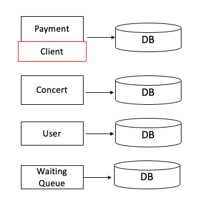
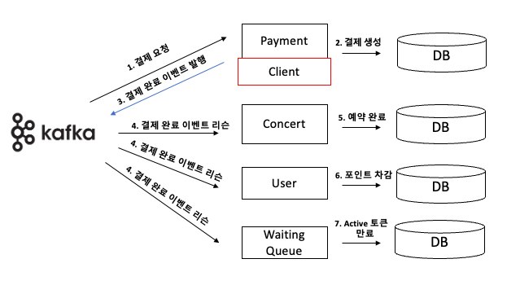
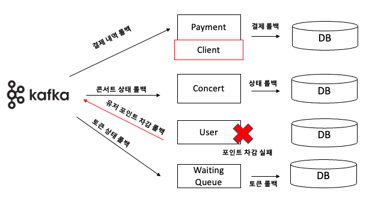

## MSA 형태로 서비스 분리 설계

만약 지금의 서비스를 MSA로 분리한다면 어떻게 설계가 되어야 할까?

### 서비스 분리

일단 지금의 서비스가 MSA로 분리된다면, 4개의 서비스와 하나의 부가 모듈로 총 5개로 나눠질 것이다.

- **Payment Service**: 결제 처리와 관련된 처리
- **User Service**: 사용자 관리 및 포인트 처리
- **Concert Service**: 공연, 좌석 예약 관리
- **Waiting Queue Service**: 대기열 관리 및 토큰 처리
- **Client Module** : 외부 서비스와의 통신을 위한 모듈

### 분산 트랜잭션의 한계

이렇게 MSA로 서비스로 분리하면 트랜잭션도 하나로 관리되는 것이 아니라 분산되어 관리가 된다. 그럼 어떤 문제점들이 발생할까?

- MSA에서 트랜잭션이 여러 서비스에 걸쳐 있을 때, ACID 트랜잭션 보장이 어렵다. 특히, 데이터 일관성과 원자성 유지에 문제가 발생할 수 있다.
- 서비스 간 통신에 네트워크 지연이 발생할 수 있으며, 이는 전체 트랜잭션 생명 주기를 늘릴 수 있다.
- 한 서비스에서 실패가 발생할 경우, 다른 서비스에 대한 롤백 처리 또는 보상 트랜잭션 구현이 필요하다.

### 해결 방안

여러가지 해결방안이 있지만, `Saga`  패턴을 활용하면 분산 트랜잭션을 관리할 수 있다고 한다.

### Saga 패턴

그럼 Saga 패턴이란 무엇일까?

- Saga Pattern은 마이크로 서비스에서 데이터 일관성을 관리하는 방법이다.
- 각 서비스는 **로컬** **트랜잭션을** 가지고 있으며, 해당 서비스 데이터를 업데이트하며 **메시지 또는 이벤트를 발행**해서, 다음 단계 트랜잭션을 호출하게 된다.
- 만약, 해당 프로세스가 실패하게 되면 데이터 정합성을 맞추기 위해 이전 트랜잭션에 대해 **보상 트랜잭션**을 실행한다.
- NoSQL 같이 분산 트랜잭션 처리를 지원하지 않거나, 각기 다른 서비스에서 다른 DB 밴더사를 이용할 경우에도 Saga Pattenrn을 이용해서 데이터 일관성을 보장 받을 수 있다.

→ 결국 정리하자면, Saga 패턴을 이용하면 각기 다른 분산 서베에 다른 DB 벤더사를 이용하고 있더라도 **데이터 일관성**을 보장받을 수 있다. 또한 트랜잭션 실패 시, 보상 트랜잭션을 통해 데이터 정합성을 보장할 수 있다.

Saga 패턴은 크게 `Choreography` 방식과 `Orchestration`  방식이 있다고 한다.

`Orchestration`  방식의 경우, 따로 트랜잭션을 관리하는 Saga 인스턴스가 별도로 존재해야 하기 때문에 좀 더 구현이 간단한 `Choreography`  방식으로 설계를 해보려고 한다.

Choreography 방식이란?

- Choreography 방식은 서비스끼리 직접적으로 통신하지 않고, 이벤트 **Pub/Sub을 활용해서** 통신하는 방식을 말한다.
- 프로세스를 진행하다가 여러 서비스를 거쳐 서비스(Payment, User)에서 실패(예외처리 혹은 장애)가 난다면 **보상 트랜잭션 이벤트**를 발행한다.
- 장점으론, 간단한 workflow에 적합하며 추가 서비스 구현 및 유지관리가 필요하지 않다.
- 단점으론, 트랜잭션을 시뮬레이션하기 위해 모든 서비스를 실행해야하기 때문에 통합테스트와 디버깅이 어려운 점이 있다.

**Kafka**를 도입하여 결제 프로세스를 진행한다면 아마 이런식으로 진행 될 것이다.

- **정상적인 분산 트랜잭션 프로세스**

1. 사용자가 결제 요청
2. 결제 내역 생성
3. 결제 완료 이벤트 발행
4. 결제 완료 이벤트 리슨
5. 콘서트 예약 완료
6. 유저 포인트 차감
7. Active 토큰 만료

- **실패 분산 트랜잭션 프로세스**

만약 포인트 차감에서 실패가 발생한다면

- 생성된 결제 내역 삭제
- 콘서트 상태 변경
- 토큰 상태 변경

이렇게 하면 보상 트랜잭션을 통해 주요로직에 문제가 발생하더라도, 모두 롤백이 되어 **데이터의 일관성**을 보장할 수 있다.