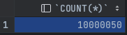
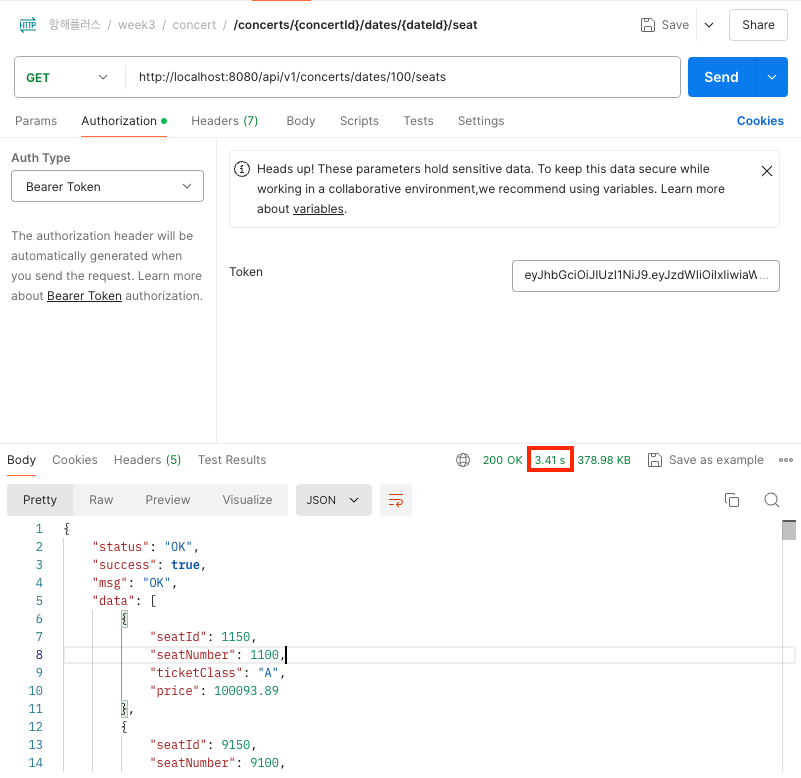
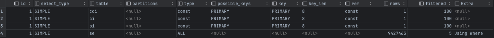
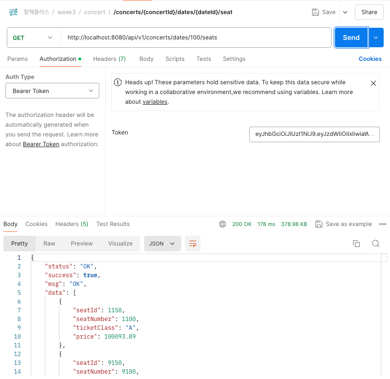
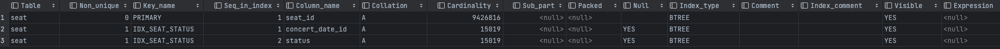
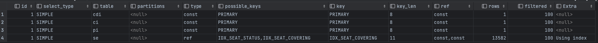
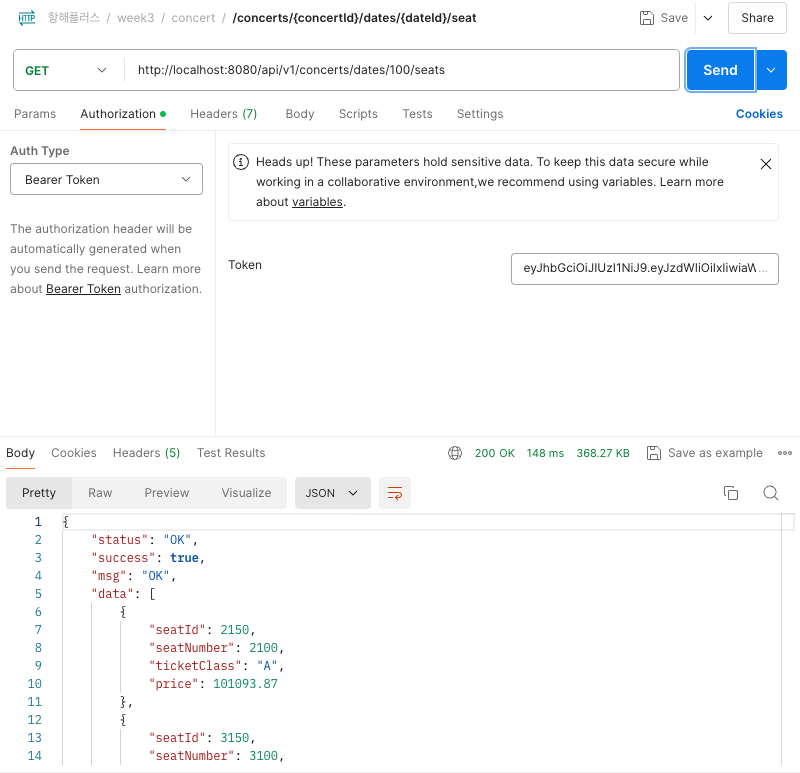
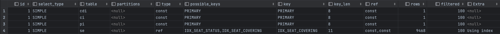
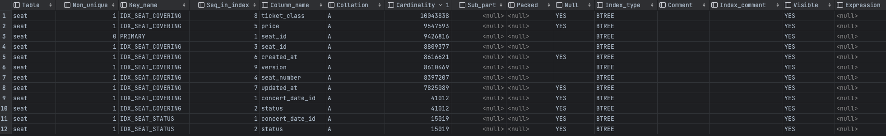

## Query 분석 및 DB Index 설계

조회를 할 때 데이터가 얼마 없을 때는 상관없지만, 데이터가 수천, 수만 건의 경우 인덱스가 있냐 없냐의 따라 성능 차이가 엄청 크다고 한다.

보통 인덱스는 카디널리티가 높은(중복도가 낮은) 컬럼으로 설정한다고 한다. (참고로 **pk는 기본으로 인덱스로 설정되어 있음**)

예를 들어 주민등록번호의 경우 카디널리티가 높다고 할 수 있다.(Unique 하기 때문에)

지금 나의 시나리오(콘서트 대기열)에서 인덱스 추가를 통해 성능을 개선할 수 있는 부분이 있는지 알아보자.

### 문제

`콘서트 예약 가능한 좌석을 조회하는 API` 의 경우, 실제로 하나의 콘서트장에 5만명이 앉을 수 있는 대형 장소에서 하는 경우가 많다. 콘서트가 1만개만 있어도, 콘서트 좌석 조회하는 데이터는 5억개의 자리의 데이터가 들어가 있을 것이다.

### 원인

테스트로 좌석 데이터를 1000만건을 넣어서 조회를 했을 때, 원하는 날짜의 좌석을 조회하는데 응답속도가 **3~3.5s** 정도 나왔다.(하나의 콘서트가 **5만~10만** 개의 좌석을 가진다고 했을 때)

```sql
select COUNT(*) from seat
```



postman을 통해서 API 조회를 해보면



약 **3~3.5s** 사이로 응답시간이 나온다.

이렇게 응답 지연이 생기는 이유는 따로 인덱스를 추가 안했기 때문에 DB에 풀스캔이 발생하여 그렇다.



### 해결 방법

인덱스를 추가함으로써 문제를 해결해 볼 수 있을 것이다. 실제 예약 가능한 좌석 조회의 쿼리는 다음과 같다.

```java
Hibernate: 
    select
        se1_0.seat_id,
        se1_0.concert_date_id,
        cdi1_0.concert_date_id,
        cdi1_0.concert_date,
        cdi1_0.concert_id,
        ci1_0.concert_id,
        ci1_0.created_at,
        ci1_0.name,
        ci1_0.updated_at,
        cdi1_0.created_at,
        cdi1_0.place_id,
        pi1_0.place_id,
        pi1_0.created_at,
        pi1_0.name,
        pi1_0.total_seat,
        pi1_0.updated_at,
        cdi1_0.updated_at,
        se1_0.created_at,
        se1_0.price,
        se1_0.seat_number,
        se1_0.status,
        se1_0.ticket_class,
        se1_0.updated_at,
        se1_0.version 
    from
        seat se1_0 
    join
        concert_date cdi1_0 
            on cdi1_0.concert_date_id=se1_0.concert_date_id 
    join
        concert ci1_0 
            on ci1_0.concert_id=cdi1_0.concert_id 
    join
        place pi1_0 
            on pi1_0.place_id=cdi1_0.place_id 
    where
        se1_0.concert_date_id=? 
        and se1_0.status=?
```

여기서 where 절에 `concert_date_id` 와 `status`  조건을 거는 걸 볼 수 있다.

그래서 저 컬럼들을 인덱스로 걸면서 테스트를 진행해 볼 예정이다.

1) **(status) 인덱스 설정 했을 경우**

다음 쿼리를 실행하여 `status` 에 대한 인덱스 설정을 하였다.

```sql
CREATE INDEX IDX_SEAT_STATUS ON seat (status);
```

그리고 API를 조회해보니


50~55s 결과가 나왔다.

2) **(concert_date_id) 를 인덱스 설정 했을 경우**

```sql
CREATE INDEX IDX_SEAT_STATUS ON seat (concert_date_id);
```

결과는


190 ~ 210 ms 정도 나온다.

3) **(concert_date_id, status) 를 인덱스 설정 했을 경우**

```sql
CREATE INDEX IDX_SEAT_STATUS ON seat (concert_date_id, status);
```

- 결과는


150 ~ 170 ms 가 나왔다!!!

4) **(status, concert_date_id) 를 인덱스 설정 했을 경우**

```sql
CREATE INDEX IDX_SEAT_STATUS ON seat (status, concert_date_id);
```

- 결과



160 ~ 180 ms

결과를 정리하면 다음과 같다.

| idx | x | (status) | (concert_date_id) | (concert_date_id, status) | (status, concert_date_id) |
| --- | --- | --- | --- | --- | --- |
| 속도(sec) | 3.2~3.5s | 50~55s | 0.19~0.21s | 0.15~0.17s | 0.16~0.18s |
| 증가율 |  | -16배 | +17배 | +21배 | +20배 |

이걸 통해서 알 수 있는 점은

- 잘못된 인덱스 설정은 오히려 **성능을 떨어트릴 수 있다.**
- 인덱스 설정을 통해 최대 **약 20배 이상**의 성능 향상을 경험할 수 있다.
- 보통은 **카디널리티가 높은**(중복도가 낮은) 인덱스부터 인덱스를 걸어주는 것이 좋다.

복합 인덱스의 카디널리티는 다음과 같다.

SHOW 명령어를 사용하면 해당 테이블의 카디널리티를 구할 수 있다.

```sql
SHOW index from seat;
```



### 커버링 인덱스

**커버링 인덱스(Covering Index)**는 쿼리에 필요한 모든 컬럼을 포함하는 인덱스로, 데이터베이스가 실제 테이블 데이터를 조회할 필요 없이 인덱스만으로 쿼리를 효과적으로 조회가 가능하다.

커버링 인덱스를 잘 쓰면(특히, 대용량 데이터 처리 시), **조회 성능을 상당 부분 높일 수 있다.**

성능 향상을 위해 한번 커버링 인덱스를 생성해 보았다.

```sql
CREATE INDEX IDX_SEAT_COVERING ON seat (concert_date_id, status, seat_id, seat_number, price, created_at, updated_at, ticket_class, version)
```

이걸 실행하면 제대로 커버링 인덱스를 사용하고 있는지 알 수 있다.

```sql
EXPLAIN SELECT se.seat_id,
       se.concert_date_id,
       cdi.concert_date_id,
       cdi.concert_date,
       cdi.concert_id,
       ci.concert_id,
       ci.created_at,
       ci.name,
       ci.updated_at,
       cdi.created_at,
       cdi.place_id,
       pi.place_id,
       pi.created_at,
       pi.name,
       pi.total_seat,
       pi.updated_at,
       cdi.updated_at,
       se.created_at,
       se.price,
       se.seat_number,
       se.status,
       se.ticket_class,
       se.updated_at,
       se.version
FROM seat se
         JOIN
     concert_date cdi ON cdi.concert_date_id = se.concert_date_id
         JOIN
     concert ci ON ci.concert_id = cdi.concert_id
         JOIN
     place pi ON pi.place_id = cdi.place_id
WHERE se.concert_date_id = 100
  AND se.status = 'AVAILABLE';
```

결과를 보면



Extra컬럼의 값이 `Using index` 가 있는 걸 알 수있다.

제일 성능이 좋았던 때랑 비교해보면



**0.14~0.15** s 로, 0.01초 정도 더 단축된 것을 볼 수 있다!

혹시 조인 되는 테이블에도 커버링 인덱스를 걸면 성능 향상이 있을 것같아서 다음과 같이 걸어보았다.

```sql
CREATE INDEX IDX_PLACE_COVERING ON place (place_id, name, created_at, updated_at, total_seat);
CREATE INDEX IDX_CONCERT_COVERING ON concert (concert_id, name, created_at, updated_at);
CREATE INDEX IDX_CONCERT_DATE_COVERING ON concert_date (concert_date_id, concert_date, created_at, updated_at);
```

하지만 결과는 Extra에 null로 위의 실행결과와 같았다.



커버링 인덱스를 걸었을 때 카디널리티를 보면 다음과 같다.



결과로 봤을때도 커버링 인덱스를 사용했을 때 카디널리티가 더 높아서, 쿼리 성능이 더 좋아질 수 있다는 것을 볼 수 있다.