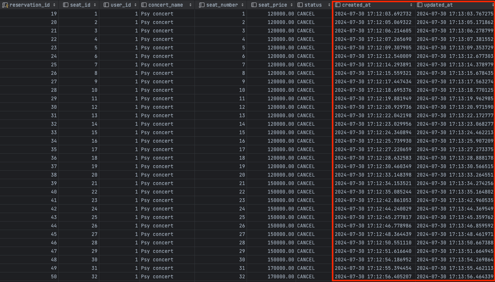

## Redis를 통한 성능 개선

캐시 기능 말고 ‘**Redis 를 이용한 로직 이관을 통해 성능 개선할 수 있는 로직’** 할만한 게 있을까?

그중에 하나 생각해볼만한 것이 예약 후, 5분이 지나도록 결제를 안하면 좌석 점유가 해지되야 하는 부분이 생각이 났다.

지금은 스케줄러를 통해 5초마다 좌석을 점유한지 5분이 지났는지 확인 후, 좌석 점유를 해지하고 있다.이게 과연 맞는 로직일까? 정확히 좌석을 점유한지 5분이 됐을 때 좌석 점유를 해지할 수는 없을까?

- 기존 로직

```java
@Component
@RequiredArgsConstructor
@Slf4j
public class SeatScheduler { //좌석 관련 스케줄러

    private final ReservationFacade reservationFacade;

    /**
     * 5초마다 좌석 점유 여부 확인 후 점유 해제 하는 스케줄링 실행
     */
    @Scheduled(fixedRate = 5000)
    public void checkOccupiedSeat() {
        reservationFacade.checkOccupiedSeat();
    }
}
```

```java
@Component
@RequiredArgsConstructor
public class ReservationFacade {

    private final ConcertService concertService;
    private final PaymentService paymentService;
    private final UserService userService;

    ...
		
    /**
     * 좌석을 계속 점유할 수 있는지 확인하는 유즈케이스를 실행한다.
     */
    public void checkOccupiedSeat() {
        concertService.checkOccupiedSeat();
    }
}
```

```java
    
@Service
@RequiredArgsConstructor
public class ConcertService {
	
	...
	
    @Transactional
    public void cancelOccupiedSeat() {  
      // 임시 예약인 모든 예약 조회
      List<ConcertReservationInfo> allTempReservation = concertRepository.getAllTempReservation();

      allTempReservation.forEach(reservation -> {
          LocalDateTime createdAtTime = reservation.getCreatedAt();
          Duration duration = Duration.between(createdAtTime, LocalDateTime.now());

          if (duration.toSeconds() > 5 * 60) { //정해진 시간을 넘었는지 (default:5분)
              // 1. 예약 취소
              reservation.cancel();
              concertRepository.saveReservation(reservation);
              // 2. 좌석 점유 취소(다시 예약 가능 상태로 변경)
              Optional<Seat> seat = concertRepository.getSeat(reservation.getSeatId());
              Seat seatInfo = concertValidator.checkExistSeat(seat, "좌석 정보가 존재하지 않습니다");
              seatInfo.cancel();
              concertRepository.saveSeat(seatInfo);
          }
      });
    }
}
```

기존에는 스케줄러를 통해 5초 마다 예약 상태가 `*TEMPORARY_RESERVED`*  인 모든 예약을 조회하여 예약을 취소하고, 좌석 점유를 해지하였다.

이 방식에는 여러 문제가 있다.

- 5초 마다 스케줄러 실행
    - 만약 4분 59초에 스케줄러가 확인을 한다면, 다음 스케줄러가 돌 동안 이 좌석은 점유가 불가능하게 된다.
- 모든 임시 예약 조회
    - 만약 예약건의 데이터가 많다면 5초 마다 대량의 조회 쿼리가 발생한다….(임시 예약이 한건도 없더라도…)

이런 문제를 해결하기 위해 이것저것 찾아보다 Redisson Queue 중에 `RDelayedQueue`  와 `RBlockingQueue`  를 활용하면 이 문제를 해결할 수 있을 것 처럼 보였다.

먼저 `RDelayedQueue` 에 `destinationQueue` 를 설정해준다. 내가 설정해준 만큼의 시간이 지나면 `destinationQueue` 로 데이터를 넣어준다.

구현 코드는 다음과 같다.

```java
@Service
@RequiredArgsConstructor
public class ConcertService {
    
    private final ConcertRepository concertRepository;
    private final ConcertValidator concertValidator;
    private RBlockingQueue<ConcertReservationInfo> tempReservationQueue;
    private RDelayedQueue<ConcertReservationInfo> delayedReservationQueue;
    private final RedissonClient redissonClient;

    @PostConstruct
    public void init() {
        cancelOccupiedSeatListener();

        tempReservationQueue = redissonClient.getBlockingQueue("tempReservationQueue");
        delayedReservationQueue = redissonClient.getDelayedQueue(tempReservationQueue);
    }
    
     /**
     * 좌석 예약을 요청하면 예약 완료 정보를 반환한다.
     *
     * @param command concertId, concertDateId, seatNumber, userId 정보
     * @return 예약 완료 정보를 반환한다.
     */
    @Transactional
    public ConcertReservationInfo reserveSeat(ReservationCommand.Create command) {
	      
	      ...
	      
        // 4. 예약 테이블 저장
        ConcertReservationInfo reservationInfo = command.toReservationDomain(seat, concertDate);
        ConcertReservationInfo savedReservation = concertValidator.checkSavedReservation(concertRepository.saveReservation(reservationInfo), "예약에 실패하였습니다");
        
        // 5. 예약에 성공하면 delayedReservationQueue 에 임시 저장
        delayedReservationQueue.offer(savedReservation, 1, TimeUnit.MINUTES);

        return savedReservation;
    }
    
    ...
    
	  /**
     * 좌석을 계속 점유할 수 있는지 확인한다.
     */
    @Transactional
    public void checkOccupiedSeat(Long reservationId) {
        Optional<ConcertReservationInfo> reservation = concertRepository.getReservation(reservationId);
        //
        if ((reservation.isPresent() && reservation.get().getStatus().equals(TEMPORARY_RESERVED))) {
            // 예약 상태 취소로 변경
            reservation.get().cancel();
            concertRepository.saveReservation(reservation.get());
            // 좌석 점유 취소(다시 예약 가능 상태로 변경)
            Optional<Seat> seat = concertRepository.getSeat(reservation.get().getSeatId());
            Seat seatInfo = concertValidator.checkExistSeat(seat, "좌석 정보가 존재하지 않습니다");
            seatInfo.cancel();

            concertRepository.saveSeat(seatInfo);
        }
    }

  private void cancelOccupiedSeatListener() {
    new Thread(() -> {
      while (!Thread.currentThread().isInterrupted()) {
        try {
          // 내가 설정한 시간이 지나서 요소를 사용할 수 있을 때 까지 대기
          if (tempReservationQueue != null) {
            Object item = tempReservationQueue.take();
            if (item instanceof ConcertReservationInfo reservationInfo) {
              // 예약 상태가 임시 예약이면 예약 취소
              checkOccupiedSeat(reservationInfo.getReservationId());
            }
          }
        } catch (InterruptedException e) {
          Thread.currentThread().interrupt();
        }
      }
    }).start();
  }
}
```

이렇게 하면 내가 원하는 시간이 지난 순간 `tempReservationQueue`  활성화 되면서 예약 상태를 취소 하는 로직이 실행된다.

결과를 보면 다음과 같다.





### 결론


created_at 과 updated_at 의 시간 차이가 내가 설정한 1분인 것을 볼 수 있다. 기존의 스케줄러를 써서 하는 방식과 비교하면 계속해서 의미없는 조회 쿼리를 **주기적으로 날릴 필요도 없으며**, 딱 **내가 원하는 시간 뒤에 취소가 되는 것**을 알 수 있다.