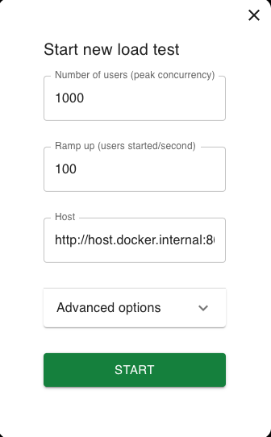
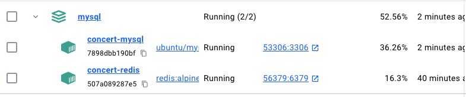
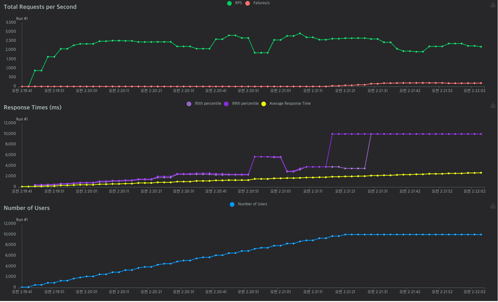
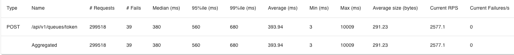

## 대기열 구현

대기열에 부하를 통해 최대 몇명까지 들어올 수 있는지 테스트 해보았다.

부하테스트를 통해 **N초당 M명**의 유저를 active 할 것인지를 구할 것이다.

일단 Locust 을 통해 부하테스트를 진행해보았다.

매초 100명씩 1000명까지 증가하게 설정해두었다.

이 이상으로 증가하는 사람 수를 늘리면 fail 횟수가 계속해서 증가하는 것 같아 적정선을 위와 같이 정하였다.

redis나 db 가 받는 부하도 합쳐서 60 % 넘지 않는 것으로 보였다.

결과는 다음과 같다.

위 결과를 요약하면 다음과 같다.

- **총 요청 수:** 299,518
- **총 실패 수:** 39
- **중앙값 응답 시간 (Median):** 380 ms
- **95th 백분위수 응답 시간 (95th Percentile):** 560 ms
- **99th 백분위수 응답 시간 (99th Percentile):** 680 ms
- **평균 응답 시간 (Average):** 393.94 ms
- **최소 응답 시간 (Min):** 3 ms
- **최대 응답 시간 (Max):** 10,009 ms
- **응답 크기 평균 (Average Size):** 291.23 bytes
- **현재 초당 요청 수 (RPS):** 2,577.1
- **현재 초당 실패 수 (Failures/s):** 0

실패율이  0.01%로 낮은편이며, 최소 응답 시간과 최대 응답 시간의 차이가 엄청 크다. 그래도 RPS 2500 에도 거뜬히 버텨내는 것을 볼 수 있다. 또한 95 퍼센트 정도가 0.5 초만에 응답을 받으니 대부분이 빠르게 응답을 받는편이다.

위의 부하테스트 결과를 바탕으로 한번 N과 M을 구해보자!

- 적절한 동시 접속자를 유지하기 위해서는?
    1. 한 유저가 콘서트 조회를 시작한 이후에 하나의 예약을 완료할 때까지 걸리는 시간을 파악
    - 평균 1분정도
    2. DB에 동시에 접근할 수 있는 트래픽의 최대치를 계산
    - 약 2,000(보정해서) TPS(초당 트랜잭션 수) ⇒ 1분당 120,000
    3. 1분간 유저가 호출하는 API
    - 2(콘서트 좌석을 조회하는 API, 예약 API) * 1.5 ( 동시성 이슈에 의해 예약에 실패하는 케이스를 위한 재시도 계수(예측치)) = 3
    4. 분당 처리할 수 있는 동시접속자 수 = 12,0000/3 = 40,000명
    - N = **10**초마다 M = **6,000**명씩 유효한 토큰으로 전환
    - 나의 대기열 순번이 180,000 번이라면 잔여 예상대기시간은 5분!!

→ 위 내용을 바탕으로 나는 10초에 6,000명씩 대기열 유저를 활성화시키기로 했다!